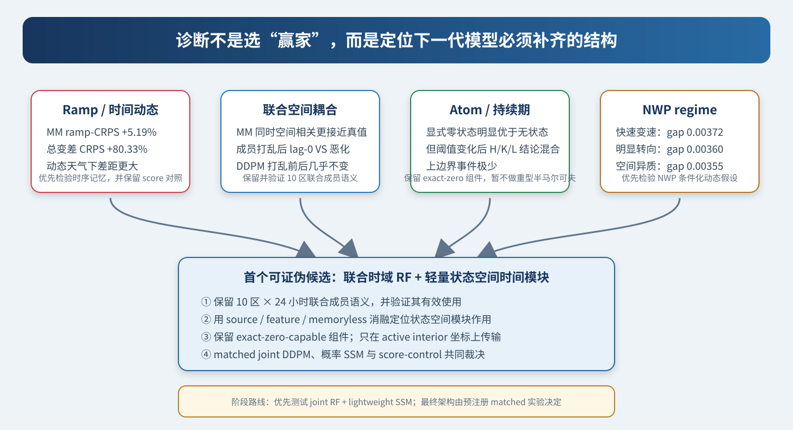

# 风电场景生成跨模型诊断与下一阶段架构路线

> 基于冻结场景档案的 ramp、Cross-lag、Atom duration 与 NWP regime 机制审计  
> 生成日期：2026-08-14｜证据性质：已见内部 confirmation 上的探索性架构诊断｜不构成新模型最终测试

这份文档回答一个具体问题：**下一阶段应优先验证 diffusion、flow，还是状态空间架构？**

它不是简单比较两个总分，也不默认必须在 MM-JDWind 上继续“雕花”。我们把当前仓库中能够严格对齐的冻结场景重新拆开，分别检查模型在哪里做对、在哪里做错，再把错误结构映射到下一代模型的必要组件。

---

## 0. 结论先行

### 0.1 一句话路线

> 下一阶段优先验证“联合时域 Rectified Flow + 轻量状态空间时间模块 + 显式边界状态头”。不要继续把 MM-JDWind 当唯一底座；joint diffusion 与纯概率状态空间模型作为同预算否证基线。这里选定的是首个可证伪的工作假设，不是宣告一种尚未实测的新架构已经胜出。

这不是含糊的“三者都要”，而是把三个概念放回正确层级：

| 架构层 | 下一轮优先候选 | 为什么 |
|---|---|---|
| 场景生成/传输机制 | **优先复现 Rectified Flow** | 第二面板的干净 time-domain joint flow 在当前档案中是 Pareto-competitive 起点，说明 MM 的 ramp 问题不是 flow 家族的必然缺陷；效率优势尚无本地 wall-time 证据，必须实测。 |
| 时间动态结构 | **优先检验轻量状态空间模块** | 当前 joint flow 在 lag-1 时间相关与动态 NWP 天气下反复失效；这定位了时间依赖缺口，但尚不能唯一确定缺口位于随机源、网络记忆还是训练目标，必须用位置消融验证。 |
| 多区域结构 | **保留并验证 10 区联合成员语义** | MM 与多个 joint flow 的同时空间相关优于逐区 DDPM；成员打乱会破坏其有效信息。原生 joint 生成是默认实现，但不是理论上唯一构造。 |
| 边界混合分布 | **保留 exact-zero-capable 分布组件** | MM 的精确零状态计数与最长持续期优于 DDPM 和 no-state 控制；当前默认实现为显式状态模块，但不能退回只有连续输出裁剪。 |
| 暂不作为默认主线 | 纯 joint diffusion；重型 semi-Markov duration 主模型；graph/frequency 堆叠 | joint diffusion 尚无同预算证据，因而保留为必要强基线；duration 结论随阈值变化；STGF 与 time-frequency 在本地均值上放大粗糙 ramp。 |

### 0.2 四条最重要的实证

1. **总体水平分布几乎打平，动态明显没打平。** MM_mass 的 level-CRPS 为 `0.079431`，DDPM 为 `0.079151`，差值置信区间跨 0；但 ramp-CRPS 差 `+0.002527`，即相对差 `+5.19%`，95% 日期 bootstrap 区间 `[+0.002122,+0.002959]`。
2. **MM 生成得过于抖动。** 总变差 CRPS 比 DDPM 高 `80.33%`，最大 ramp CRPS 高 `57.13%`；平均绝对 ramp 是真值的约 `1.278` 倍，DDPM 约 `1.099` 倍。
3. **联合空间信息不是假的。** 同时刻 level correlation RMSE：MM `0.0222`，DDPM `0.1266`；同时刻 increment correlation RMSE：MM `0.0396`，DDPM `0.1893`。将每个区域的成员轨迹独立打乱后，MM 的 lag-0 cross-zone variogram 恶化，DDPM 几乎不变。
4. **最突出的可观测缺口是 lag-1 时间依赖。** lag-1 increment cross-zone correlation RMSE：MM `0.0837`，DDPM `0.0438`；同一区域 lag-1 相关误差：MM `0.3002`，DDPM `0.0149`。快速变速、明显转向、空间异质的 NWP 日上，MM 的 ramp gap 分别扩大到约 `0.00372`、`0.00360`、`0.00355`；“缺少合适的动态记忆机制”是下一轮待验证解释，不是本轮已证明的原因。



### 0.3 对复审 HTML 的实质性修订

之前的复审把 sampler-matched level–ramp score adaptation 放在 P0。新诊断说明它可以作为**低成本对照**，但不再适合作为下一阶段主路线：

- MM 的问题不只是平均 ramp 分数，而是总变差、最大 ramp、lag-1 时间关系与动态天气条件下同时失效；
- MM 已经学到有用的联合空间耦合，因此“先上完整相关源”也不是最直接答案；
- 第二面板的 time-domain joint flow 在该面板均值上优于复杂 STGF/time-frequency，说明值得先重建一个简洁的新基线，而不是继续给旧模型堆模块；不过该模型只有一个训练 seed，不能把均值排序当作显著性结论；
- 边界状态值得保留，但持续期证据并不足以支持把整篇论文改成 duration/semi-Markov 主线。

因此，本报告将原复审的 P0 改为：**从干净 joint time-domain flow 出发，做 state-space temporal module 的同预算架构实验；score adaptation 不作主线，但保留为同预算 S0 控制。**

---

## 1. “比较 ramp、cross-lag、atom duration、NWP regime”到底在比较什么

### 1.1 Ramp：相邻小时变化是否像真的

对每条 24 小时功率曲线，先做相邻差分：

```text
ramp[t] = power[t+1] - power[t]
```

然后用场景集合的 empirical/V-stat CRPS 评价每个区域、每个相邻小时的 ramp 分布。直观上，分数同时惩罚：

- 场景 ramp 离真实 ramp 太远；
- 所有场景挤成一条、缺少合理多样性；
- 场景过分抖动、虚构过多大幅跳变。

本轮没有只挑“真实发生极端 ramp 的日子”再评分，因为那会造成 forecaster’s dilemma。除普通 local ramp 外，还检查：

- 10 区平均后的 fleet ramp；
- 上升与下降 ramp；
- 每个成员的日最大上升、最大下降；
- 成员级、跨区域平均的日 total variation：先在每个区域对 23 个绝对 ramp 求和，再对 10 区取平均。

### 1.2 Cross-lag：区域之间是否同步，时间前后是否连贯

Cross-lag 不是一个分数，而是一组问题：

- `lag=0`：同一时刻，不同区域是否一起升降；
- `lag=1`：区域 A 当前变化与区域 B 下一小时变化是否有正确关系；
- `same-zone lag=1`：同一区域相邻 ramp 的反弹、持续或衰减关系是否正确。

本轮同时使用两类工具：

1. **Pearson cross-lag correlation RMSE**：容易看懂，专门显示相关结构，但不是 proper score；
2. **lagged variogram score，p=1**：把预测的成对差异与真实成对差异比较，更适合评价有限联合场景，但会同时受边际误差和依赖误差影响。

两者结论不完全一致并不是 bug：相关系数只看结构形状，variogram 还会受 ramp 幅度影响。正是这种分歧帮助我们区分“联合成员对齐有信息”与“整体动态仍然不准”。

### 1.3 Atom duration：零功率状态能否进入、保持并退出

这里的 atom 指精确边界状态，主要是功率 `0`。当前 36,000 个主面板真值中，精确零有 `2,652` 个，而精确一只有 `5` 个，所以上边界只能描述，不能单独推断。

对每条 24 小时路径检查：

- `H`：10 个区域一共出现多少个零功率小时；
- `K`：一共出现多少段零功率 run；
- `L`：最长一段连续零功率持续多久；
- 是否至少出现一次零功率；
- 进入零状态和退出零状态的逐时 Brier score。

必须分两种语义：

- MM 的 `states` 是显式结构状态；
- DDPM 的精确零主要来自最终 `clip(0,1)`，不能解释成学到了离散 atom。

因此同时报告 exact-zero、`0.001`、`0.01` 和训练数据固定阈值约 `0.001869` 的敏感性。

### 1.4 NWP regime：错误是否集中在某类天气预报条件下

Regime 只由预测时可用的 100 m NWP 风场定义，不使用真值、不使用模型误差，也不在这 150 个诊断日上重新调阈值。主面板阈值在共同安全的 481 个训练日上固定：

| 标签 | 定义 | 训练阈值 | 主面板日期数 |
|---|---|---:|---:|
| calm | 全天、全区域平均 WS100 不高于 q25 | `5.1483` | 36 |
| strong | 平均 WS100 不低于 q75 | `7.8965` | 31 |
| speed_volatile | 相邻小时 WS100 变化 RMS 不低于 q75 | `0.7261` | 48 |
| turning | 速度加权相邻风向向量夹角不低于 q75 | `0.1223 rad` | 38 |
| spatial_heterogeneous | 每小时跨区域 WS100 标准差的日均值不低于 q75 | `1.5566` | 43 |

这些是多标签切片，一天可以同时是 turning 和 spatial_heterogeneous。它们不是天气因果类别，也不能从 zone 编号推断天气传播方向。

---

## 2. 数据、模型与统计协议

### 2.1 主面板：严格逐日配对

| 模型 | 冻结档案 | 训练种子 | 语义 |
|---|---|---:|---|
| MM_mass | `flow_mass_preserving` | 0、1、2 | 原生 10 区联合 flow；显式状态与质量守恒成员分配 |
| MM_none | `flow_none` | 0、1、2 | 同类 joint flow 的无状态控制 |
| DDPM_product | `ddpm_seed0` | 0 | 每个 zone-day 独立生成后按成员序号拼接 |

三组 outer 各 50 天，共 150 个互斥日期；每个档案均为 `50 day × 100 member × 10 zone × 24 h`。MM 与 DDPM 的 `day` 和 `observations` 已逐元素校验完全相同。

主比较不是把 3 个 MM seed 分别与同一个 DDPM 重复比较，而是：

```text
每日期先平均 MM 的 3 个训练种子分数
→ 与该日期的 DDPM seed0 分数配对
→ 在 outer 内重采样日期
→ 合并三个 outer，做 5,000 次分层 paired bootstrap
```

因此置信区间反映的是日期不确定性，**不包含 DDPM 训练种子不确定性**。

### 2.2 第二面板：只作架构消融，不与主面板混合

第二组是另一批互斥的 150 天：

| 模型 | 作用 |
|---|---|
| Time_domain | 简洁 joint time-domain flow 基线 |
| Time_frequency | 增加频率路径 |
| Graph_only | 图结构组件 |
| STGF | 完整时空图频率 flow |
| DDPM_product | 同日期的逐区 DDPM 参照 |

这组日期与主面板完全不同，报告只比较第二面板内部均值，不把两个面板拼成 300 天做伪增样。

### 2.3 为什么不能直接宣布“flow 胜 diffusion”

当前比较同时混杂：

- joint 10-zone 与 zone-wise independent；
- 显式 atom 与输出裁剪；
- 不同网络、训练预算、采样器和步数；
- MM 3 seeds 与 DDPM 1 seed。

因此本轮能判定的是**当前实现的失败模式**和**下一模型需要的结构**，不能把某个总分解释为整个模型家族的因果胜负。

### 2.4 缺失值敏感性

仓库加载器在划分前对 TARGETVAR 做全时间序列 forward-fill。主面板有 12 个原始缺失 cell，涉及 8 天、10 个 zone-day 和 21 个相邻 ramp；第二面板有 26 个缺失 cell、31 个 ramp。

清除受影响 cell 后：

| 指标 | 全量 MM−DDPM | 清洁版本 MM−DDPM |
|---|---:|---:|
| level-CRPS | `+0.000280` | `+0.000283` |
| ramp-CRPS | `+0.002527` | `+0.002528` |

核心结论没有由测试评分中这 12 个填充值驱动。不过三个 outer 都各有一处 `validation→train` 跨角色 forward-fill，outer3 另有一处极小的 `test→train` forward-fill。这里的清洁敏感性只排除了测试评分里受影响的 cell，不能消除冻结 checkpoint 训练阶段已发生的跨角色影响，因此这些结果仍只能作为内部探索性诊断。

---

## 3. Ramp 诊断：问题不是“整体预测都差”，而是轨迹过抖


图中红色表示 MM 比 DDPM 更差，误差线是按 outer 分层的日期 bootstrap 95% 区间。主结果如下：

| 指标（越低越好） | MM_mass | DDPM_product | MM−DDPM | 95% CI | 相对差 |
|---|---:|---:|---:|---:|---:|
| level-CRPS | 0.079431 | 0.079151 | +0.000280 | [-0.000918,+0.001477] | +0.35% |
| local ramp-CRPS | 0.051174 | 0.048647 | **+0.002527** | **[+0.002122,+0.002959]** | **+5.19%** |
| fleet ramp-CRPS | 0.023752 | 0.021820 | +0.001932 | [+0.001493,+0.002371] | +8.86% |
| 最大绝对 ramp CRPS | 0.103203 | 0.065680 | +0.037523 | [+0.026787,+0.047975] | +57.13% |
| 最大上升 CRPS | 0.097583 | 0.064538 | +0.033045 | [+0.023595,+0.042580] | +51.20% |
| 最大下降 CRPS | 0.097942 | 0.067790 | +0.030152 | [+0.019135,+0.040618] | +44.48% |
| total variation CRPS | 0.296555 | 0.164449 | +0.132105 | [+0.097643,+0.166283] | **+80.33%** |

上升和下降方向都差，说明不是单一偏向；fleet 结果仍差，说明也不是只有个别区域噪声。三枚 MM seed 的 ramp-CRPS 范围是 `[0.051021,0.051365]`，全部高于 DDPM 的 `0.048647`。

另一个有用的反差是：

- MM 的 level-MAE 比 DDPM 好约 5.05%；
- MM 的 ramp-MAE 却比 DDPM差约 5.54%；
- MM 的 90% 区间更窄，但 coverage 与 DDPM 同样只有约 84%–85%。

这说明模型可以把平均水平预测得不错，却把“小时之间怎么走”生成错。继续只优化 level 分布或只做后验区间缩放，不会自动修好这类动态错误。

### 3.1 无状态控制告诉了什么

MM_none 的 level-CRPS `0.081897`、ramp-CRPS `0.051654`，都比 MM_mass 更差；因此显式状态机制不是 ramp gap 的唯一原因，删掉状态反而会损伤整体质量。

但是 MM_mass 的最大绝对 ramp、最大上升和最大下降 CRPS 分别为 `0.103203 / 0.097583 / 0.097942`，反而差于 MM_none 的 `0.092579 / 0.088253 / 0.089451`。也就是说，状态机制虽然改善 level、普通 ramp 与 total variation，却没有修好极端跳变，甚至可能将其放大；atom head 不能替代连续时间动态建模。

---

## 4. Cross-lag 诊断：当前实现的同时空间关系较好，lag-1 时间关系较差


### 4.1 相关结构的关键数字

| 诊断 | MM_mass | DDPM_product | 谁更接近真值 |
|---|---:|---:|---|
| level，cross-zone，lag 0 correlation RMSE | **0.0222** | 0.1266 | MM |
| increment，cross-zone，lag 0 correlation RMSE | **0.0396** | 0.1893 | MM |
| increment，cross-zone，lag 1 correlation RMSE | 0.0837 | **0.0438** | DDPM |
| increment，same-zone，lag 1 correlation MAE | 0.3002 | **0.0149** | DDPM |

这些 pooled correlation 会混入共同 NWP、日内均值和边际校准；逐区独立 DDPM 也可能因此出现非零跨区相关，所以它们不能单独证明 latent 依赖或定位网络内部原因。架构论证更重视 same-zone lag-1、proper lagged variogram、多 outer/seed 方向，以及下面的成员打乱负对照。

直观解释：

- MM 知道“十个区域此刻应该一起怎么动”；
- 但它不太知道“这一步之后下一步应该延续、反弹还是衰减”；
- DDPM 因为每个区域单独生成，没有真正的联合空间 latent，所以 lag 0 跨区结构差；但单区域时间轨迹更平顺。

### 4.2 Variogram 与成员打乱负对照


打乱操作在每个 `day × zone` 内对 100 条完整 24 小时轨迹做独立成员置换。它严格保留：

- 每个区域的边际分布；
- 每条本地 ramp 路径；
- 每条本地 atom duration；

只破坏不同区域之间“第 m 个成员与第 m 个成员”的对齐。

结果：

- MM level cross-zone lag-0 VS 从 `0.025339` 恶化到 `0.025883`，约 `+2.15%`；
- MM ramp cross-zone lag-0 VS 从 `0.009963` 恶化到 `0.010624`，约 `+6.63%`；
- DDPM 对应变化只有约 `0.01%`–`0.04%` 的数值噪声；
- same-zone 指标在打乱前后严格不变，这是负对照应满足的性质。

所以 MM 的 joint member coupling 确实携带信息。不能因为它的 lag-1 动态差，就说整个联合结构无效；也不能把“再造一个完整空间相关源”当成无需诊断的第一优先级。

另一方面，在 ramp cross-zone lags 1–6 上，DDPM 的 variogram 仍整体更低。这意味着 MM 的空间对齐虽然有效，却没有抵消错误的 ramp 幅度与时间演化。

### 4.3 Lag-1 缺口是否只是 atom 造成的

为避免把连续路径问题误归因给边界状态，本轮再按每个预测成员的连续三个时点分类：三点全为 interior，或至少一点涉及 atom。对相邻两个 increment 的标准化协方差贡献做精确可加分解，类别贡献严格重构当日 lag-1 Pearson correlation。它是机制诊断，不是 proper score，也不能识别因果位置。

精确边界口径下：

| 量 | 真值 | MM_mass | DDPM_product |
|---|---:|---:|---:|
| adjacent-ramp correlation | +0.1560 | -0.1469 | +0.1483 |
| signed gap：interior 三点贡献 | — | -0.26275 | -0.00189 |
| signed gap：atom-involving 贡献 | — | -0.04023 | -0.00585 |

MM 相对 DDPM 的逐日总绝对 correlation-error 差为 `+0.19919`，95% outer 分层日期 bootstrap 区间 `[+0.17379,+0.22239]`。MM 的 signed gap 中约 `86.7%` 来自连续三点路径；将真值与 DDPM 输出边界阈值放宽到 `0.01` 后仍约为 `83.3%`（MM 始终使用归档显式状态标签）。在这项 signed-gap 可加记账中，atom-involving 路径不是主要贡献类别，所以连续 interior 动态也必须被直接检查；这不能证明 atom 机制在因果上不重要，也不能区分问题究竟在随机源、速度网络、容量还是训练目标。DDPM 的类别只是按输出阈值划分，不能解释为潜在离散状态。

---

## 5. Atom duration 与状态归因：保留 exact-zero 能力，重型 duration 主线暂缓


### 5.1 精确零状态：MM 明显更好

| exact-zero 指标（越低越好） | MM_mass | DDPM_product | MM−DDPM | 95% CI |
|---|---:|---:|---:|---:|
| H：零小时总数 CRPS | 5.051 | 13.848 | **-8.797** | [-11.317,-6.583] |
| K：零 run 数 CRPS | 2.217 | 2.750 | **-0.532** | [-0.943,-0.127] |
| L：最长零 run CRPS | 1.932 | 3.866 | **-1.933** | [-2.391,-1.509] |
| any-zero Brier | 0.0787 | 0.1272 | **-0.0485** | [-0.0740,-0.0252] |
| 进入零状态 Brier | 0.01853 | 0.01745 | +0.00108 | [+0.00072,+0.00143] |
| 退出零状态 Brier | 0.01868 | 0.01758 | +0.00110 | [+0.00075,+0.00144] |

MM 对“一天有多少零、最长多久”明显更好，但逐时进入/退出概率略差。这正说明“状态总量”和“转移动态”不是一件事。

精确零率：真值 `7.37%`、MM `8.06%`、DDPM `1.36%`、MM_none `0%`。这支持保留显式边界状态头。

### 5.2 阈值敏感性：不能立即升级为 semi-Markov 主线

当“近零”放宽为 `<=0.01`：

| 指标 | MM_mass | DDPM_product | 判定 |
|---|---:|---:|---|
| H CRPS | 6.142 | 8.574 | MM 更好 |
| K CRPS | 2.057 | 1.600 | DDPM 更好 |
| L CRPS | 2.050 | 2.163 | 区间跨 0，未分胜负 |
| any-zero Brier | 0.0738 | 0.0786 | 区间跨 0，未分胜负 |
| entry/exit Brier | 0.02307/0.02356 | 0.02186/0.02254 | DDPM 更好 |

持续期分布图还显示，MM 生成了过多 1 小时短 run，较长 run 偏少。这个问题值得在新模型中留下“状态年龄/持续期”接口，但当前证据没有跨阈值一致到足以让重型 semi-Markov 结构成为主贡献。

### 5.3 新的精确可加和状态贡献分解

旧复审按**真实值的转移类别**分组，得到 I→I 占总正 gap 的约 95.99%。这主要反映真实 I→I 坐标占 90.85%，并不能回答模型成员究竟生成了什么状态。

本轮新增按**每个预测成员的两个端点状态**做 CRPS 精确加性分解，三类贡献严格相加回普通 local ramp-CRPS，最大重构误差约 `5.6e-17`。


| 生成成员转移 | MM 成员占比 | DDPM 成员占比 | MM 贡献 | DDPM 贡献 | 贡献差 |
|---|---:|---:|---:|---:|---:|
| interior→interior | 88.91% | 97.46% | 0.047688 | 0.047941 | -0.000252 |
| atom↔interior | 6.15% | 1.96% | 0.002864 | 0.000626 | **+0.002238** |
| atom→atom | 4.94% | 0.57% | 0.000621 | 0.000081 | **+0.000541** |
| 合计 | 100% | 100% | 0.051174 | 0.048647 | **+0.002527** |

原始贡献差主要出现在跨状态，是因为 MM 显式生成了更多 atom 成员，而 DDPM 很少精确落在零点。还可以对每类做一个**描述性的对称代数重加权**。令 `p[m,k]` 为模型 `m` 在类别 `k` 的成员份额，`c[m,k]` 为该类可加和贡献，`u[m,k]=c[m,k]/p[m,k]`；则：

```text
c[MM,k] - c[DDPM,k]
= 0.5*(p[MM,k]-p[DDPM,k])*(u[MM,k]+u[DDPM,k])       [composition]
+ 0.5*(u[MM,k]-u[DDPM,k])*(p[MM,k]+p[DDPM,k])       [conditional unit-share]
```

按这个恒等式求和：

- composition 部分合计约 `-0.002173`；
- conditional unit-share 部分合计约 `+0.004699`；
- 其中 I→I 的 conditional unit-share 部分约 `+0.004146`。

这里的 diversity 项会把某类别成员与**所有类别**成员的成对距离分配给该类别，所以 conditional unit-share 不是严格的“类内质量”，也不等价于因果意义上的“控制了状态频率”。若要回答真正的类内质量，还需另拆 within-class 与 between-class pair term。

所以两个看似矛盾的说法可以同时成立：

1. 原始、可加和 gap 的正项集中在 MM 多生成的跨状态成员；
2. 在这项代数重加权的条件贡献中，I→I 项仍是最大的正差，提示连续内部 ramp 也值得重点检查，但不能仅凭它完成因果归因。

这否定了两个极端结论：既不能冻结 jump 后假定一切只归 flow，也不能只做 duration 模型而忽略连续时间动态。

---

## 6. NWP regime 诊断：模型在“天气正在变”时更容易失效


| NWP 标签 | n | MM−DDPM gap | gap 的 95% CI | regime−complement 差中差 | 差中差 95% CI |
|---|---:|---:|---:|---:|---:|
| calm | 36 | +0.00186 | [+0.00143,+0.00229] | **-0.00088** | **[-0.00158,-0.00022]** |
| strong | 31 | +0.00229 | [+0.00122,+0.00348] | -0.00030 | [-0.00146,+0.00099] |
| speed_volatile | 48 | **+0.00372** | **[+0.00281,+0.00466]** | **+0.00175** | **[+0.00076,+0.00275]** |
| turning | 38 | **+0.00360** | **[+0.00258,+0.00471]** | **+0.00144** | **[+0.00030,+0.00265]** |
| spatial_heterogeneous | 43 | **+0.00355** | **[+0.00273,+0.00445]** | **+0.00143** | **[+0.00052,+0.00246]** |

差中差是在 `outer × regime membership` 六个固定层内重采样日历日。在尚未做 5 个标签多重比较校正的探索性 bootstrap 中，speed_volatile、turning、spatial_heterogeneous 与 calm 的区间不跨 0，strong 跨 0。这些标签相互重叠，结果只能解释为天气条件切片，不能当作独立或确认性的因果效应。

可检验的结构假设是：

- 固定或全局时间协方差不够；
- 模型需要让状态转移/创新随 NWP 的变速、转向和空间异质性改变；
- 但无需一开始就训练大型 MoE，因为只有 731 日数据，多专家容易不可辨识；
- 首版优先比较固定参数与连续 NWP 条件化的时间模块，并加入 shuffled-NWP 负对照；只有 regime-vs-complement 的差中差区间支持交互，才升级 gate。

---

## 7. 第二架构面板：复杂图频率结构没有赢，干净时域 flow 最有价值

| 模型 | level-CRPS | ramp-CRPS | TV-CRPS | 最大上升/下降 CRPS | 90% coverage |
|---|---:|---:|---:|---:|---:|
| **Time_domain joint flow** | **0.07995** | 0.04963 | **0.18041** | 0.07031 / 0.07254 | 78.69% |
| Graph_only | 0.08064 | 0.04987 | 0.20291 | 0.07636 / 0.08120 | 81.43% |
| Time_frequency | 0.08164 | 0.05125 | 0.44498 | 0.14182 / 0.15024 | 86.63% |
| STGF | 0.08314 | 0.05118 | 0.39785 | 0.11279 / 0.12104 | 87.22% |
| DDPM_product | 0.08319 | **0.04810** | 0.20027 | **0.06995 / 0.07215** | 85.96% |

这里最关键的不是 DDPM 又赢了 ramp，而是：

- 简洁 Time_domain joint flow 的 level-CRPS 在该面板均值上低于 DDPM；
- 它把 ramp gap 缩小到约 `0.00153`，total variation 甚至低于 DDPM；
- Graph_only 也尚可，但没有显示图结构不可替代；
- Time_frequency 和完整 STGF 的 TV 与极值 ramp 均值更高，提示这些复杂模块在当前实现中放大了路径粗糙度。

第二面板逐日配对区间进一步把“均值排序”分成可重复的日期差与未决项。下表均为模型减 DDPM；STGF 先按日平均 3 seeds，其余候选只有一个训练 seed：

| 模型 | level-CRPS 差 [95% CI] | ramp-CRPS 差 [95% CI] | TV-CRPS 差 [95% CI] |
|---|---:|---:|---:|
| Time_domain | **-0.00324 [-0.00534,-0.00122]** | +0.00153 [+0.00115,+0.00192] | -0.01986 [-0.04889,+0.00817] |
| Graph_only | **-0.00255 [-0.00458,-0.00056]** | +0.00177 [+0.00140,+0.00218] | +0.00264 [-0.02926,+0.03152] |
| Time_frequency | -0.00155 [-0.00349,+0.00040] | +0.00315 [+0.00275,+0.00358] | **+0.24471 [+0.18209,+0.30774]** |
| STGF | -0.00005 [-0.00197,+0.00181] | +0.00308 [+0.00271,+0.00346] | **+0.19759 [+0.14034,+0.25149]** |

因此 Time_domain 的 level 优于 DDPM 有日期级证据；ramp 则明确差于 DDPM。它的 ramp gap 在这些 flow 候选中数值最小，但本轮没有直接检验候选模型之间的差中差；TV 相对 DDPM 仍未裁决。再加上单 seed，这些结果仍不足以宣称它是最优 transport。

lag 1–6 的 variogram 均值也显示 Time_domain 与 DDPM 非常接近：

| 指标 | Time_domain | DDPM_product |
|---|---:|---:|
| level cross-zone VS | 0.02874 | 0.02971 |
| level same-zone temporal VS | 0.01651 | 0.01652 |
| ramp cross-zone VS | 0.01026 | 0.01018 |
| ramp same-zone temporal VS | 0.01118 | 0.01108 |

这组证据十分重要：**MM 的动态问题不能外推成“flow 不适合风电轨迹”。** 干净 time-domain joint flow 因而是更值得优先复现和验证的候选基座，而不是已经证实的最终胜者。

Time_domain 的弱点也很清楚：覆盖率只有 78.69%，Pearson lag-1 时间相关仍偏差较大。因此新模型需要干预时间依赖机制并改善可靠性，同时比较 source、velocity/denoiser network 与 training objective 三种位置，而不是简单复制现成 checkpoint。

---

## 8. 架构工作假设：为什么优先验证“Flow 主干 + State-space 时间模块”

### 8.1 候选路线逐项判决

| 候选 | 能解释当前哪条证据 | 当前硬伤 | 本轮判定 |
|---|---|---|---|
| 纯/联合 diffusion | 逐区 DDPM 的 ramp、最大 ramp、lag-1 时间关系较好 | 当前没有同容量 joint diffusion；计算更重；DDPM 的空间结构与 atom 语义不公平 | **强基线，不作默认主线** |
| 继续 MM-JDWind + score adapter | 改动小，可直接针对 ramp | 仍绑定已确认的 lag-1 与粗糙度问题；容易变成原模型雕花；文献碰撞强 | **低成本对照，非主线** |
| 完整 STGF/图频率 flow | 名义上同时建模时空频率 | 当前实现的 ramp/TV 均值更差；复杂度与小数据不匹配 | **不作首版** |
| 重型 semi-Markov 状态空间 | 可直接建模状态持续期与转移 | duration 结论阈值敏感；当前没有同面板概率 SSM 场景基线 | **备用，不作首版** |
| 干净 joint time-domain flow | 第二面板档案中的 Pareto-competitive 起点；保留联合成员 | 仅一个训练 seed，lag-1 Pearson 动态与 coverage 尚差 | **优先复现的 T0** |
| joint flow + 轻量状态空间时间模块 | 直接针对时间记忆，可保留空间创新和高效采样 | 尚未实测；需定位模块放在随机源还是速度场，并排除参数量收益 | **优先验证的工作假设** |

### 8.2 首个候选模型的最小结构

暂称 **JTSF：Joint Time-domain State-space Flow**。名称只是待验证原型的工作代号，不表示它已在当前数据上取得结果；投稿前还需专门做新颖性检索。

```text
NWP(10区×24h) + zone embedding
          │
          ▼
小型共享 NWP encoder
          │
          ├── boundary-state head → exact zero / interior（one 仅保留接口）
          │
          ▼
NWP-conditioned lightweight state-space module
  - 时间记忆：h[t] 依赖 h[t-1]
  - 空间创新：低秩共享因子 + 区域独立噪声
  - 参数随 NWP 变速/转向/异质程度连续改变
          │
          ▼
joint time-domain rectified flow
  - 一次生成完整 10×24 interior trajectory
  - 不加 frequency branch，不把 zone 编号当物理图
          │
          ▼
exact atom reconstruction + 100-member joint scenario set
```

### 8.3 第一版明确不做什么

- 不使用 full 240×240 条件 Cholesky；样本量不足以稳定辨识；
- 不上大型 regime MoE；先用连续条件化或至多 2–3 个小 gate；
- 不把图结构作为标题贡献，因为无地理邻接信息且 graph-only 未显示决定性优势；
- 不加入频率分支，已有本地负证据；
- 不用 Gaussian latent completion 填 atom；atom 坐标是结构状态，不是缺失连续变量；
- 不把 proper-score 后训练当主贡献；保留同预算 S0 控制，用来排除“只是训练目标错配”，但主原型先检验基础生成结构能否修复 cross-lag；
- 不把 state-space 做成庞大 semi-Markov duration 模型，首版只提供有限记忆与可选 state-age 特征。

### 8.4 为什么不是纯状态空间

简单的低秩 Gaussian/有限 mixture SSM 很适合表达时间记忆，但可能难以同时覆盖：

- 多峰、偏态的连续功率分布；
- 精确零原子；
- 10 区联合的非线性依赖；
- 100 条高质量场景的灵活采样。

神经或切换 SSM 本身并没有不能表达复杂分布的理论限制。这里选择简单 T3，只是为了检验是否有必要保留更复杂的非线性 transport。因此“让 state-space 候选模块表达记忆，让 flow 表达非线性联合分布”是当前最值得先证伪的结构假设。诊断只定位了时间依赖缺口，并未证明状态空间模块一定应放在随机源；首轮必须比较 source-side、velocity-network-side 与无记忆等容量控制。

---

## 9. 下一阶段最小实验：先把工作假设做成可裁决的对照

### 9.1 先固定共同外壳，避免“谁多一个模块谁就赢”

所有主原型先共享：`E = NWP encoder`、`A = 完整 atom 模块`。这里的 A 包含 state head、整条 state field 的采样/分配和 active-coordinate mask，不只是一个概率头；atom 位置不得被虚构成待补全的 Gaussian latent。各模型使用相同训练日期、NWP 特征、10×24 joint layout、校准方法和 `M=100`。

首轮机制比较冻结同一份 E/A，并让可配对的模型使用相同 sampled state masks；在数学上可行时采用 common random numbers。这样先比较 interior 轨迹的记忆/传输，再把 E/A 联合微调作为次级结果。每个原型至少 3 个训练 seed，并同时报告训练更新数、参数量、wall-time、网络前向次数和显存。

### 9.2 主原型与便宜的辨识控制

| 编号 | 原型 | 回答的问题 |
|---|---|---|
| R0 | 复现干净 Time_domain joint RF | 第二面板单 seed 结果能否稳定复现 |
| T0 | RF + A + 参数量匹配的 memoryless cell；复用同一 cell，但令 recurrent transition 为 0、断开 `h[t-1]` | T1 的收益是否只是参数变多 |
| T1-source | RF + A + 完整 NWP-conditioned SSM source，只作用于 sampled interior active coordinates | 有记忆的随机源能否修复 lag-1/ramp |
| T1-feature | RF + A + 同一 SSM 仅作 velocity conditioner，source 仍为 iid | 收益来自随机源相关，还是网络看到了历史特征 |
| S0 | T0 做同预算的 ramp/trajectory proper-score adaptation | 缺口来自架构，还是原训练目标错配 |
| T2 | joint DDPM + A + 与 T1 同接口、同参数的 SSM | transport 机制究竟应选 RF 还是 diffusion |
| T3 | 概率 SSM + A + 参数匹配的简单 mixture emission | 非线性 flow/diffusion emission 是否必要 |

再加一个 `T1-shuffle` 负对照：打乱时间状态或 NWP—轨迹配对；若性能不降，所谓“memory/conditioning”没有被有效使用。如果 SSM 无法在 RF 与 DDPM 中放在语义相同的位置，就不能硬称 T1/T2 已消除混杂，而应扩成 `F0/F1 × D0/D1` 的 2×2：RF/DDPM 各自比较无记忆与有记忆，再单列 T3。

### 9.3 必要消融

1. iid source vs 低秩空间创新；
2. 参数匹配的 memoryless cell vs state-space memory；
3. SSM 放在 source side vs 只放在 velocity/denoiser feature side；
4. 固定状态参数 vs NWP-conditioned 参数；
5. 完整 atom 模块关闭/开启，并单独报告 state frequency 与 active-coordinate 分数；
6. state-age 输入关闭/开启；
7. RF 与 joint DDPM 使用语义相同的时间模块接口；
8. 原始 joint members vs day-zone 轨迹成员打乱负对照；
9. 正常时序/NWP 配对 vs `T1-shuffle`。

### 9.4 预注册选择门

主优效端点：**overall local ramp-CRPS**。

关键门：

- T1 对 T0 的逐日 paired ramp-CRPS CI 上界小于 0，且预设的 increment-path lagged variogram score 也改善；Pearson cross-lag 只作机制诊断，不作唯一选择端点；
- 在看 selection 结果前锁定数值非劣界。第一版工程门暂定：level-CRPS 绝对恶化不超过 `0.0010`，joint ES 相对恶化不超过 `1.5%`，`|coverage90−0.90|` 不恶化超过 `0.01`，Winkler 相对恶化不超过 `2%`；正式运行前可在 training-only 重采样中校准一次，但之后不得移动；
- total variation、最大 up/down 不能用无差别扩宽换取改善；
- lag-1 same-zone 与 cross-zone 诊断至少一项明确改善，另一项不劣；
- exact-zero H/K/L 相对恶化均不超过 `2%`，entry/exit Brier 绝对恶化不超过 `0.001`；
- 用 `training seed × 连续时间块` 的分层/层级 bootstrap 表达不确定性；“3 个 seed 方向一致”只作稳健性检查，不能替代区间推断；
- 成员打乱应破坏 cross-zone coupling，否则“joint”结构没有被有效使用。

分支规则：

| 结果 | 决策 |
|---|---|
| T1 相对 T0 通过优效与非劣门；RF 相对 T2 通过预设非劣门，且采样延迟至少低 20% | 采用 **state-space flow** 主线 |
| T2 在 ramp proper score 上优效，并通过其余非劣门 | 切换为 **joint diffusion + 同一状态空间模块** |
| T1 与 T2 都未通过对方的优效/非劣条件 | 标记 **未决**，不能把“不显著”解释为 RF 胜出 |
| T3 对 T1 的 ramp-CRPS 通过预设 `±0.0005` 等效界、其余非劣，并至少少 25% 参数或延迟 | 以简洁性选择概率状态空间模型 |
| T1 只改善 ramp、破坏 level/joint/atom | No-Go，不通过继续堆 loss 掩盖 |
| 所有模型在动态 NWP 下都失败 | 先审计 encoder、目标、容量与优化；只有 regime 差中差 CI 支持交互才上 gate，只有 atom-duration 在相应 regime 恶化才上 duration |

### 9.5 数据协议必须重置

本报告的 150+150 天已经参与路线选择，必须永久标为 `R-SEEN / architecture diagnosis`。新模型最终论文需要：

- 新的外部风电数据集，或真正未触碰的锁定日期块；
- 在 split 内处理目标缺失，不能跨 role forward-fill；
- selection、calibration、final test 分离；
- 诊断阈值在训练期锁定；
- 若使用同一最终 test 比较多个主假设，预注册层级检验或多重比较控制。

---

## 10. 解释边界：结果能说什么、不能说什么

### 10.1 可以说

- 当前 MM_mass 与 DDPM 在 level-CRPS 上没有清晰差异，但 MM 的 ramp、极值 ramp 与 total variation 明显更差；
- MM 具备有效的跨区域成员耦合，逐区 DDPM 没有；
- MM 的主要动态缺口集中在 lag-1 时间关系，并在 NWP 快速变速、转向和空间异质日放大；
- 显式 exact-zero 状态机制有价值，但逐时进入/退出和近零 duration 仍需改进；
- 在另一独立日期面板的均值上，简洁 time-domain joint flow 比复杂图频率 flow 更稳健，但关键模型只有单 seed；
- 因此下一轮应把 joint time-domain flow + 轻量状态空间结构设为第一个可证伪候选，并由 matched joint DDPM 和概率 SSM 裁决。

### 10.2 不能说

- “flow 普遍优于 diffusion”或“diffusion 不会建模空间关系”；
- “状态空间一定会赢”，因为当前仓库没有同预算概率 SSM 场景档案；
- “MM 的 jump 已经完全正确”或“所有 ramp 差都来自 continuous flow”；
- “0.01 以下都是真正 atom”，阈值只是行为敏感性口径；
- “这 150 天是新的确认性 test”；
- “zone 1→zone 2 的 lag 是天气传播”，仓库没有物理拓扑；
- “5,000 次 bootstrap 消除了训练 seed 和时间依赖不确定性”。

### 10.3 仍然存在的统计限制

- 两个面板的 DDPM_product，以及第二面板的 Time_domain、Time_frequency、Graph_only 都只有一个训练 seed，无法估计其训练随机性；只有 MM_mass、MM_none 与 STGF 有 3 seeds；
- 日期 bootstrap 在 outer 内重采样，但没有完整建模季节序列相关；
- NWP regime 多标签重叠，分层比较是解释性而非因果；
- 第二面板只提供架构线索，不能与第一面板直接做 paired CI；
- Pearson、variogram、CRPS 各自识别不同分布性质，任何单项都不能代表完整联合路径分布；
- GEFCom 两年、731 天对于大型动态 mixture 或 full covariance 仍然偏小。

---

## 11. 组会怎么讲：10 分钟版本

### 第 1 分钟：先讲问题

“我们不是要看哪个模型总分高，而是要决定下一代模型到底缺空间联合、时间动态，还是边界状态持续期。”

### 第 2–3 分钟：讲公平边界

- 主面板 150 个同日、同真值档案；
- MM 三 seed 先按日平均，DDPM 不复制；
- DDPM 是逐区生成，所以不能用 cross-zone 差否定 diffusion 家族；
- 所有结果都是 seen-data 路线诊断。

### 第 4–5 分钟：展示 Ramp 图

核心句：“level 打平，ramp 差 5.19%，最大 ramp 差 57%，总变差差 80%；问题是轨迹太抖，不是平均水平预测全面失败。”

### 第 6 分钟：展示 Cross-lag 图

核心句：“MM 同时空间关系很好，但 lag-1 时间关系很差；它知道大家一起动，却不知道下一小时怎么接。”

### 第 7 分钟：展示 Atom 图

核心句：“必须保留 exact-zero-capable 分布组件；当前显式状态模块是默认方案，但进入退出 Brier 和近零持续期并未全胜，所以不应马上转成重型 duration 论文。”

### 第 8 分钟：展示 NWP 图

核心句：“快速变速、转向、空间异质时 gap 放大，支持下一轮优先比较固定参数与 NWP-conditioned 动态参数，但还不是因果证据。”

### 第 9 分钟：展示第二面板

核心句：“干净 time-domain flow 接近 DDPM，复杂图频率反而更抖，所以不是 flow 家族不行，而是结构选择不对。”

### 第 10 分钟：给出路线

“下一步不继续给 MM 雕花。我们做 joint time-domain flow，加轻量 state-space source，保留 atom head；joint DDPM 和纯 SSM 用同预算做否证基线。”

---

## 12. 可复现产物与运行方法

### 12.1 代码

- 基础指标：[core.py](../cross_model_diagnostics/core.py)
- 高级 ramp、variogram、atom 与精确分解：[advanced.py](../cross_model_diagnostics/advanced.py)
- NWP 与无泄漏 regime：[data.py](../cross_model_diagnostics/data.py)
- 完整运行器：[run_cross_model_diagnostics.py](../repro_scripts/run_cross_model_diagnostics.py)
- 基础测试：[test_cross_model_diagnostics.py](../tests/test_cross_model_diagnostics.py)
- 高级测试：[test_cross_model_advanced.py](../tests/test_cross_model_advanced.py)
- Lag-1 状态归因测试：[test_cross_model_lag1_state_attribution.py](../tests/test_cross_model_lag1_state_attribution.py)

### 12.2 主要输出

- [summary.json](../outputs/cross_model_diagnostics/summary.json)
- [逐日种子平均指标](../outputs/cross_model_diagnostics/per_day_metrics.csv)
- [主面板 paired bootstrap](../outputs/cross_model_diagnostics/primary_paired_bootstrap.csv)
- [NWP regime bootstrap](../outputs/cross_model_diagnostics/primary_regime_bootstrap.csv)
- [NWP regime 与补集的差中差 bootstrap](../outputs/cross_model_diagnostics/primary_regime_interaction_bootstrap.csv)
- [第二架构面板 paired bootstrap](../outputs/cross_model_diagnostics/secondary_paired_bootstrap.csv)
- [Pearson cross-lag 汇总](../outputs/cross_model_diagnostics/cross_lag_summary.csv)
- [Lag-1 状态归因 bootstrap](../outputs/cross_model_diagnostics/lag1_state_attribution_bootstrap.csv)
- [lagged variogram 汇总](../outputs/cross_model_diagnostics/lagged_variogram_summary.csv)
- [成员打乱负对照](../outputs/cross_model_diagnostics/lagged_variogram_shuffle_delta.csv)
- [atom duration 汇总](../outputs/cross_model_diagnostics/atom_duration_summary.csv)
- [atom H/K/L 与转移 bootstrap](../outputs/cross_model_diagnostics/atom_event_primary_bootstrap.csv)
- [精确状态贡献分解](../outputs/cross_model_diagnostics/generated_transition_decomposition_summary.csv)
- [SHA256SUMS](../outputs/cross_model_diagnostics/SHA256SUMS)

### 12.3 一键复跑

```bash
MPLCONFIGDIR=/tmp/mpl_crossdiag \
python \
repro_scripts/run_cross_model_diagnostics.py
```

完整运行读取 42 个冻结 NPZ，只用 CPU，不加载 checkpoint、不重新训练。正式输出共 34 个 artifact（其中 `SHA256SUMS` 校验其余 33 项）；所有清单哈希已通过 `sha256sum -c SHA256SUMS`。

### 12.4 测试

```bash
PYTHONPATH=. python \
tests/test_cross_model_advanced.py

PYTHONPATH=. python \
tests/test_cross_model_lag1_state_attribution.py
```

测试覆盖完美预测零分、成员置换不变性、synthetic lag、all-zero/interior/alternating run、三类 transition contribution 精确加回普通 ramp-CRPS，以及三时点 lag-1 状态贡献精确重构。

---

## 13. 下一阶段路线卡

| 项目 | 决定 |
|---|---|
| 研究问题 | 如何同时保留多区域联合耦合，并修复 NWP 条件下的小时级时间动态 |
| 首个候选生成主干 | **Joint time-domain rectified flow**；不是已定最终胜者 |
| 首个候选新增核心 | **NWP-conditioned lightweight state-space temporal module**；source/feature 位置待消融 |
| 边界处理 | 保留 exact-zero-capable 分布组件；显式状态模块为默认实现，上边界仅保留接口 |
| 首要指标 | overall local ramp-CRPS |
| 关键机制指标 | total variation、max up/down、lagged VS、lag-1 correlation、atom H/K/L 与 entry/exit Brier |
| 必要强基线 | 同骨干 joint DDPM、纯概率 SSM、干净 time-domain flow、MM_mass |
| 暂停主线 | graph/frequency 堆叠、full covariance、重型 duration；score adaptation 仅保留同预算控制 |
| 最终确认 | 外部数据或真正未触碰的 locked block |

> 阶段判断：本轮尚未选定最终架构。现有证据只支持三点：当前 flow 的主要可观测缺口是 lag-1 时间依赖；简洁 time-domain joint flow 说明 RF 仍是可行传输机制；exact-zero 建模与联合成员语义应保留。因此把 joint RF + lightweight SSM 设为第一个可证伪候选，同时由 matched joint DDPM 和概率 SSM 裁决。SSM 能否修复缺口、RF 是否优于 diffusion，都留给下一轮预注册实验。
