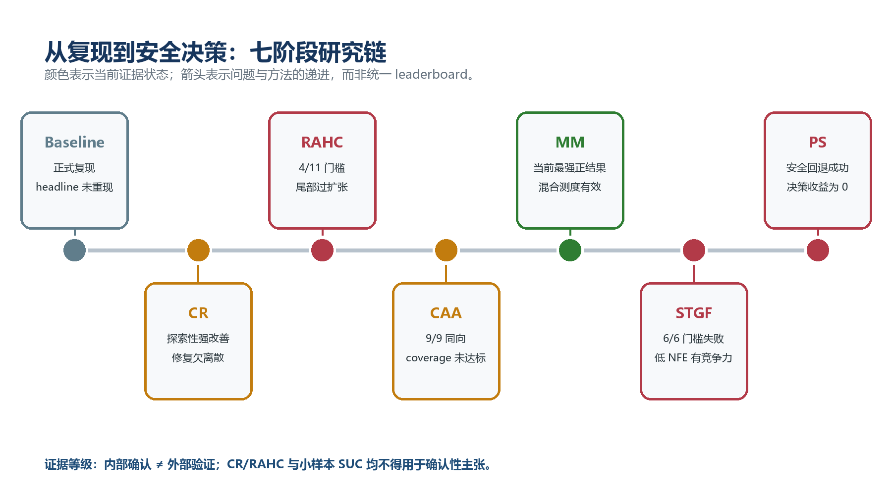
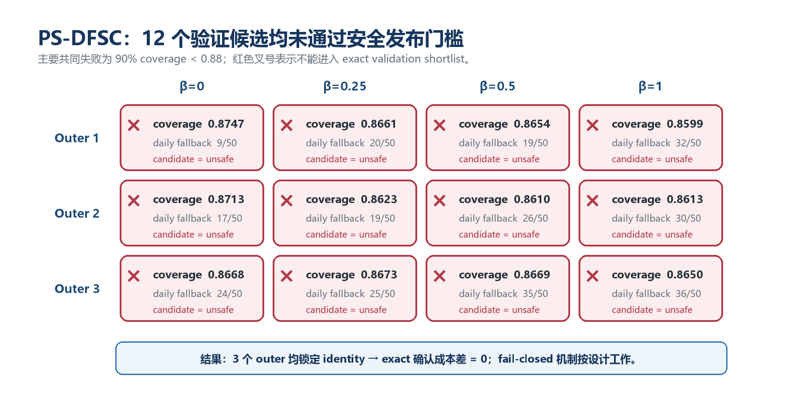

# MS-CADM 后续研究路线决策与实验蓝图

> 从“有哪些想法”推进到“下一步具体改什么、如何证明、何时停止”

**版本**：v1.0  
**整理日期**：2026-08-13  
**适用仓库**：`multi_scaleCADM`  
**任务对象**：GEFCom2014 Wind，10 个区域、24 小时日前联合风电场景生成  
**文档定位**：研究路线决策书 + 实验实施说明 + 论文论证边界  

> **一句话结论**：不要再从头换一个更大的生成模型。当前最值得投入的路线，是以已经确认有效的 MM-JDWind 为底座，冻结边界原子机制，专门修复连续内部轨迹的 ramp 动态，并用可稳定反传的轨迹级 proper score 对最终采样分布做后训练；动态图或完整轨迹条件协方差只作为第二主线，固定图、普通残差扩散、简单 bounded 变换、纯 flow replacement 和直接 decision-focused 微调均不应再作为独立主贡献。

---

## 0. 这份文档怎么用

这不是一份“idea 列表”。每个方向都按同一套问题展开：

1. 它要解决的可观测问题是什么；
2. 仓库里已有哪一条正证据或负证据；
3. 与 2023–2026 年相邻工作的碰撞有多强；
4. 最小可行模型如何定义；
5. 需要改哪些代码；
6. 需要哪些公平基线和消融；
7. 通过什么 Go/No-Go 门槛才值得继续；
8. 最终可以写什么，绝对不能写什么。

建议三种阅读方式：

- **5 分钟做决策**：读第 1、2、3、13 节；
- **组会上讨论立项**：读第 1、4、5、6、10、11 节；
- **真正开工**：完整阅读，并直接使用第 14–17 节的配置表、产物清单和检查表。

公式全部使用 UTF-8 普通文本和代码块，不依赖 Word/WPS 公式对象，也不依赖联网 MathJax。配套 HTML 是单文件离线版，可直接用本地浏览器打开。

---

## 1. 执行摘要：先做什么，暂时不做什么

### 1.1 推荐优先级

| 优先级 | 路线 | 当前判断 | 最直接的仓库证据 | 预期主收益 | 立项条件 |
|---:|---|---|---|---|---|
| P0 | **A. 混合测度联合流 + proper ramp dynamics** | **立即做** | MM-JDWind 相对 DDPM 的 ramp-CRPS 明显更差 `+0.002527`，95% CI 完全大于 0 | ramp、极端变化、时间依赖；同时保留原子优势 | 三种子稳定、ramp 至少改善 3%、其他核心指标基本非劣 |
| P1 | **B. 稳定的轨迹级 proper-score 后训练** | **与 A 合并推进** | 现有 loss 已能对完整 flow sampler 反传，但旧试验产生 87 个非有限参数 | 训练目标与最终概率评价对齐 | 先 CRPS-only 和 ramp-CRPS-only，冻结大部分参数并通过数值安全门 |
| P2 | **C. NWP 条件动态依赖 / 低秩轨迹协方差** | **条件立项** | 固定图 STGF 确认性恶化；训练期诊断显示相关结构随天气 regime 变化 | Joint ES、邻接 VS、跨提前期和跨区域依赖 | 必须优于同容量 time-domain joint flow，而不是只优于独立 DDPM |
| P3 | **D. 完整轨迹 structured whitening** | **作为 C 的组件** | CW-Gen 已覆盖逐时协方差；仍可能存在 `10×24=240` 维跨时滞结构空位 | 优化条件几何、减少 residual coupling 难度 | 只有 cross-lag 诊断强且低秩/带状近似有效时才升级为贡献 |
| P4 | **E. 原子冻结的 interior-only 校准** | **低风险工程线** | MM-JDWind coverage 约 84.5%，尚未达到 90% | coverage、Winkler、可靠性 | 不改变 0/1 原子概率，不牺牲 CRPS/ramp/宽度 |
| P5 | **F. regime / extreme 专项建模** | **先诊断后决定** | ramp 尾部存在，但“条件多峰”尚未被证明 | 极端 ramp、尾部可靠性 | regime 在不同 split/seed 稳定且能被 NWP 预测 |
| P6 | **G. structured CFG** | **只做廉价消融** | 已有条件遮蔽基础，但 CFG 会改变目标条件分布 | 可能调节条件依赖强度 | 半天级 sweep 有稳定收益才保留；不能作为论文主线 |
| P7 | **H. decision-focused 2.0** | **暂停** | PS-DFSC 的 12 个候选全部不安全，最终 identity，真实成本改善严格为 0 | 最终运行成本 | 先完成 weights-only、代理—exact 相关性及网络一致 surrogate 审计 |

### 1.2 推荐组合题目

最干净的论文故事不是把十个方向全堆在一起，而是把两个互补问题串起来：

```text
边界问题：风功率在 0/1 处存在离散原子
    → MM-JDWind 的 mixed measure + mass-preserving jump 已有效解决

连续内部问题：轨迹增量和 ramp 动态仍弱于 DDPM
    → 对最终联合采样分布做 proper increment-score 后训练

最终故事：边界原子与连续动态分别建模，但在一个联合低-NFE生成器中统一采样和评价
```

推荐暂定题目：

> **Ramp-Score Aligned Mixed-Measure Joint Flow for Wind Power Scenario Generation**  
> 中文：**面向风功率边界原子与爬坡动态的混合测度联合流生成**

可以成立的三项贡献草案：

1. 显式分离并守恒生成 0/1 边界原子与 `(0,1)` 连续内部，而不是用连续变换近似全部分布；
2. 在完整 `10 zone × 24 h` 最终 ensemble 上，以 proper increment score 对 ramp 分布后训练；
3. 以低 NFE 联合流同时评价边际校准、联合依赖、边界事件、ramp 和采样效率，并给出冻结外层 + 外部数据验证。

### 1.3 当前明确不建议作为独立论文的方向

| 方向 | 为什么不应单独立项 |
|---|---|
| conditional mean/variance residual diffusion | CR-MS-CADM 已实现；CLDM、TMDM、D3U 等也高度相邻。再做一遍很难形成新颖性。 |
| deterministic–uncertainty decoupling | CLDM 已直接在风电中做点预测 + 误差潜扩散；D3U 也明确拆分确定与不确定成分。残差不等于纯 aleatoric。 |
| 简单 bounded/logit diffusion | 连续单调变换不能表示 0/1 点质量；MM-JDWind 已用混合测度更完整地解决。 |
| 固定相关图 / GFT + DCT | STGF 已有确认性负结果：相对 time-domain flow 的 CRPS 恶化 3.99%，6/6 门槛失败。 |
| 仅把 DDPM 换成 flow matching | 仓库已有 16 NFE joint rectified flow，且与 250-step DDPM 有竞争力；“换采样器”本身已不是贡献。 |
| 直接优化逐样本 ramp L1 | 每个随机场景都被拉向唯一观测，会抑制 ensemble 离散度；应对增量分布使用 CRPS/ES/VS。 |
| 直接 decision-focused 端到端训练 | 当前安全门失败且 QP surrogate 与 exact network UC 不一致；继续投入之前需要先证明代理收益能转化为 exact 收益。 |

---

## 2. 决策所依赖的证据底座

### 2.1 证据等级

后续方向的判断按以下等级排序，不能把不同等级混写成同等确定性：

| 等级 | 含义 | 本仓库例子 | 可以支持的表述 |
|---|---|---|---|
| E0 | 论文或代码存在 | 某模型能运行 | 只能说“已实现” |
| E1 | 探索性单 split / 单 seed | proper-score pilot、诊断性 regime 分析 | 只能说“提示”“候选机制” |
| E2 | 多 seed、冻结验证或开发集 | CR-MS-CADM 的三 seed 结果 | 可以说“稳定探索性改善” |
| E3 | post-freeze 内部确认 | MM-JDWind 3 outers × 3 seeds、日级 bootstrap | 可以做严格的同数据域内部结论 |
| E4 | 外部数据或跨年份确认 | 当前尚缺 | 才能支持更广泛的泛化主张 |

重要边界：**internal confirmation 不等于 external validation**。现有 MM-JDWind 的 150 个新 test 日期虽然在生成场景前冻结，但仍来自同一个 GEFCom2014 数据域。

### 2.2 仓库已经走过的研究链



这条链表明，仓库已经不是“只有原论文复现”的状态：

1. MS-CADM 正式复现未复现 headline，主要表现为欠离散；
2. CR-MS-CADM 用条件残差与校准大幅修复，但强 DDPM 仍更优；
3. CAA 表明边界 atom 机制是主要收益来源；
4. MM-JDWind 把 atom、联合轨迹和低 NFE flow 统一起来，形成当前最强正结果；
5. STGF 证明固定图频域并非自动有效；
6. PS-DFSC 证明 fail-closed 安全发布机制有效，但 decision 收益为 0。

### 2.3 当前最关键的数值基线

#### MM-JDWind 冻结确认结果

| 模型 | CRPS ↓ | MAE ↓ | Coverage90 | Width90 ↓ | Joint ES ↓ | Zero Brier ↓ |
|---|---:|---:|---:|---:|---:|---:|
| MM no-jump | 0.081897 | 0.116217 | 0.744241 | 0.373927 | 1.728414 | 0.046215 |
| **MM mass-preserving** | **0.079431** | **0.111609** | **0.845259** | **0.386266** | **1.691450** | **0.046215** |
| DDPM seed0 | 0.079151 | 0.117547 | 0.842389 | 0.468872 | 1.688377 | 0.065053 |

MM mass-preserving 相对 no-jump：

- CRPS `-0.002466`，95% CI `[-0.003165, -0.001794]`；
- Joint ES `-0.036964`，95% CI `[-0.048759, -0.025258]`；
- coverage `+0.101019`；
- 9/9 outer-seed 改善，3/3 outer 同向。

MM mass-preserving 相对 DDPM：

- CRPS 和 Joint ES 无显著差异；
- MAE、邻接 VS、zero Brier、区间锐度更好；
- **ramp-CRPS 更差 `+0.002527`，95% CI `[+0.002125, +0.002951]`**。

这最后一条是后续主线最重要的“可观测靶点”：不是泛泛而谈“模型还能改”，而是一个已经跨日 bootstrap 确认、方向稳定、可直接优化和复核的缺口。

#### CR-MS-CADM 的归因证据

| 路径 | CRPS ↓ | Coverage90 |
|---|---:|---:|
| MS-CADM controlled raw | 0.109229 | 30.70% |
| 条件均值 + fixed-scale residual | 0.088691 | 62.14% |
| 条件异方差，w/o CRPS | 0.087050 | 65.23% |
| Full raw seed0 | 0.088369 | 66.83% |
| Full calibrated seed0 | 0.084585 | 84.34% |

结论不是“conditional whitening 尚未尝试”，而是：

- 条件残差分解已经是第一大收益来源；
- 异方差有增量，但幅度小于 residualization；
- 当前 CRPS 辅助头的必要性未被单 seed 消融证明；
- feature-wise mask 与校准贡献很大，不能把全部改善归因于 whitening。

#### STGF 的负证据

| 模型 | CRPS ↓ | Coverage90 | Joint ES ↓ | Adj. VS ↓ |
|---|---:|---:|---:|---:|
| Time-domain joint flow | **0.079947** | 0.786861 | **1.707561** | **0.043812** |
| Graph-only | 0.080638 | 0.814250 | 1.706967 | 0.044109 |
| Time-frequency | 0.081640 | 0.866278 | 1.708508 | 0.046481 |
| STGF all seeds | 0.083135 | 0.872185 | 1.731220 | 0.047690 |

STGF 相对 time-domain flow：CRPS 恶化 3.99%，Joint ES 恶化 1.39%，邻接 VS 恶化 8.85%；日级差值的 95% CI 为 `[+0.002281,+0.004099]`。因此，后续如果做空间依赖，**固定图不能再作为未经验证的默认正确先验**。

#### decision-focused 的负证据



12 个候选在三个 outer 上全部不安全，最终均锁定 identity fallback；150 日 exact confirmation 中 realized cost、CVaR 和风险事件的 paired difference 均严格为 0。这个结果不是系统失败：fail-closed 机制按设计工作了；但它清楚地说明 decision-focused 目前没有正收益证据。

### 2.4 训练期探索诊断：为什么动态图和 ramp 值得研究

以下统计只使用排除既有 150 个 MM outer-test 日期后的 581 天训练期数据，属于 **E1 探索性诊断**，不能当作确认结果：

- 全局区域间非对角绝对相关均值约 `0.5311`；
- 按风向分箱后绝对相关均值约为 `0.5442 / 0.5646 / 0.5847 / 0.4670`；
- 分箱相关矩阵相对全局矩阵的归一化 Frobenius 差异最高约 `0.1763`；
- 不同风速分位与风向 regime 的矩阵最大归一化差异约 `0.7908`；
- 绝对 ramp 的 P50/P75/P90/P95/P99 约为 `0.0394 / 0.0919 / 0.1661 / 0.2240 / 0.3741`；
- `|ramp| >= 0.2` 的比例约 6.65%，`>= 0.3` 约 2.14%。

它们支持两个“值得试”的假设，但不直接证明模型一定有效：

1. 空间/跨时依赖可能随 NWP regime 变化，固定全局相关图会把不同天气机制平均掉；
2. ramp 尾部事件虽然稀少，但数量足够形成分层评价，不能只看平均 ramp 指标。

---

## 3. 十个原始方向的碰撞矩阵

这里把早先讨论的十个方向，按 **文献碰撞、仓库完成度、剩余新颖性、当前动作** 重新判定。

| # | 原始方向 | 文献碰撞 | 仓库状态 | 还可保留的核心 | 判定 |
|---:|---|---|---|---|---|
| 1 | Conditional Whitening / non-stationary prior | 高：TMDM、NsDiff、CW-Gen | CR 已做 mean/scale residual；MM 也有 loc/scale | `10×24` 完整轨迹、跨提前期的结构化条件协方差 | **Conditional Go**，并入 C/D |
| 2 | Deterministic–uncertainty decoupling | 极高：CLDM、D3U、TMDM | CR 已做 residual diffusion | 进一步区分 epistemic/aleatoric 或 soft regime decomposition | **No-Go 独立立项** |
| 3 | Proper-score / joint loss | 中：JMLR scoring、DRaFT、Loss-Guided | 有完整 sampler loss，但一次数值爆炸 | 预训练联合风电生成器 + 最终轨迹 proper-score 后训练 | **Go** |
| 4 | Joint multi-zone graph diffusion | 中高：联合生成、图模型已有 | MM/STGF 已联合；固定图已失败 | weather-conditioned dynamic dependence / low-rank covariance | **Conditional Go** |
| 5 | nonlinear / bounded forward process | 高：CN-Diff 等 | MM 已做 atom + bounded interior | 无需重开；只做对照或理论说明 | **Done / No-Go** |
| 6 | dynamics / ramp-aware diffusion | 中 | MM、STGF ramp 均暴露短板 | proper increment score、lagged dependence、extreme stratification | **最高优先级 Go** |
| 7 | structured CFG | 高 | 条件 mask 基础已有 | 低成本 inference sweep | **Ablation only** |
| 8 | conditional flow matching | 高：Flow Matching、TSFlow、CW-Flow | joint rectified flow 已实现 | 仅作为低 NFE backbone | **Backbone only** |
| 9 | extreme / multi-mode scenario modeling | 中高 | 未证明条件多峰 | 可解释且可由 NWP 预测的稳定 regime | **Diagnose first** |
| 10 | decision-focused SUC-aware generation | 高且高风险 | PS-DFSC 已完成但收益为 0 | weights-only、安全约束与 exact-aligned surrogate | **Pause** |

### 3.1 三个最容易误判的边界

#### “残差”不等于“纯不确定性”

点预测误差同时包含：点模型能力不足、条件遗漏、有限样本估计误差和不可约随机性。把 residual 交给扩散模型，并不能自动声明它就是 aleatoric uncertainty。点模型越弱，residual 越宽，最终区间可能只是把 epistemic error 当成了随机性。

#### “联合生成”不等于“动态图有效”

MM-JDWind 已经一次生成 `10×24` 联合场景。动态图若要成为贡献，必须在同容量、同联合 backbone 下证明比 time-domain attention 更好，不能只拿 joint model 和逐 zone 独立 DDPM 比 Joint ES。

#### “score loss”不等于“对最终预测分布 proper”

在随机扩散时刻由 `x_t` 恢复一个 `x0_hat`，再对 `x0_hat` 算分数，并不自动等价于优化最终多步采样器的预测分布。主张“proper-score aligned generation”时，目标必须作用于最终或明确截断的 sampler 输出，并报告 sampler/步数绑定关系。

---

## 4. 主方案 A：混合测度联合流 + proper ramp dynamics

### 4.1 研究问题

在不破坏 MM-JDWind 已确认的边界原子、边际 CRPS、联合 ES 和低 NFE 优势的前提下，能否显式改善 24 小时连续内部轨迹的增量分布与极端 ramp 可靠性？

### 4.2 可检验假设

**H-A1：目标错配假设。** 当前 rectified flow 主要回归条件速度场；它能生成边际合理的轨迹，但没有直接惩罚最终 ensemble 的增量分布错位。对最终 sampler 加 increment-CRPS，会改善 ramp-CRPS。

**H-A2：原子—内部解耦假设。** 0/1 边界事件主要由 mixed-measure head 与 mass-preserving jump 决定；若冻结这两部分，只微调 interior flow，则 ramp 改善不应牺牲 zero Brier 和原子持续性。

**H-A3：依赖补充假设。** increment-CRPS 只约束每个 `(zone, hour)` 的增量边缘；再加入小权重 trajectory ES 或 lagged VS，才可能修复跨时和跨区域依赖。

### 4.3 模型结构

```text
NWP condition [B,10,24,F]
          │
          ├── frozen mixed-measure head
          │       ├── p(x=0 | c), p(x=1 | c)
          │       └── interior location / scale
          │
          ├── frozen mass-preserving categorical jump
          │       └── ensemble atom states [B,M,10,24]
          │
Gaussian base noise ──→ residual rectified flow ──→ interior residual
                              ▲
                              │ only adapter / last block trainable
                              ▼
             reconstruct with sigmoid + frozen atom states
                              │
                     final ensemble [B,M,10,24]
                              │
          CRPS + increment-CRPS + ES + lag-VS post-training
```

核心设计不是再造一个生成器，而是把“可安全微调的接口”加到现有生成器上：

- mixed-measure head 冻结；
- jump generator 冻结；
- 默认只训练 flow 最后一层、最后一个 axial block，或新增低秩 adapter；
- atom state 在单次 loss 内固定采样，避免离散状态梯度问题；
- score 作用于 `reconstruct()` 后的最终风功率场景，而不是 latent residual。

### 4.4 目标函数：先分开验证，再组合

#### 逐点 ensemble CRPS

```text
CRPS_hat(y, x_1...x_M)
  = mean_m |x_m - y|
    - 0.5 * mean_{m != n} |x_m - x_n|
```

注意实现选择：

- 训练时建议使用排除对角项的 U-statistic pair term；
- 当前代码的全 `M×M` 平均包含对角零项，会引入有限 ensemble 偏差；
- 推理评价必须保持独立实现，避免“用同一个 bug 训练又评价”。

#### 增量 CRPS

先定义一阶差分：

```text
delta_x[z,t] = x[z,t] - x[z,t-1],  t = 2...24
```

再对每个 zone-hour 的增量 ensemble 使用同样的 CRPS：

```text
RampCRPS = mean_{z,t} CRPS_hat(delta_y[z,t], delta_x_1...delta_x_M)
```

这与逐样本 `L1(delta_x_m, delta_y)` 的关键差别是：第二个 pairwise spread 项会奖励合理离散度，避免把所有场景拉向唯一观测。

#### 联合 Energy Score

将整个 `10×24` 轨迹展平为 240 维向量：

```text
ES_hat(y, X_1...X_M)
  = mean_m ||X_m - y||_2
    - 0.5 * mean_{m != n} ||X_m - X_n||_2
```

ES 在联合分布层面提供严格 proper 的锚，但高维下对特定依赖差异可能不敏感，所以不能只用 ES。

#### Lagged Variogram Score

建议只选有物理意义的 pair 集合，避免对 240 维全部成对计算：

- 同一区域：时间滞后 `1 / 3 / 6 / 12` 小时；
- 同一小时：预定义相邻区域或数据驱动的稀疏边；
- 跨区域跨时：只保留 `lag=1` 的少量 pair；
- 幂指数默认 `p=0.5`，并做 `p=1` 敏感性。

VS 是 proper 但通常不是 strictly proper；也不能识别所有分量共同平移。因此必须与 CRPS/ES 组合，而不能单独训练。

#### 推荐的组合方式

```text
Score_total
  = w_crps * zscore(CRPS)
  + w_ramp * zscore(RampCRPS)
  + w_es   * zscore(ES)
  + w_vs   * zscore(LagVS)
  + w_anchor * AnchorLoss
```

约束：

- `w_crps, w_ramp, w_es, w_vs >= 0`；
- 至少保留一个正权重的 strictly proper 组成，推荐 `w_es > 0`；
- score 标准化只解决优化量纲，不改变其理论 propriety；
- `AnchorLoss` 不是 proper score，而是防止后训练远离预训练模型的工程正则，因此论文中要单独说明。

理论依据：非负权重的 proper scores 加权和仍是 proper；若至少一个严格 proper score 的权重为正，则合成分数可保持严格性。实际实现中仍必须报告权重和尺度敏感性。

### 4.5 为什么必须“分阶段”，不能一开始全加

现有 `ensemble_proper_loss()` 已经同时加 CRPS、energy、variogram 和 ramp，旧配置约为：

```text
members=6, flow_steps=4
w_crps=1.0, w_energy=0.05, w_variogram=0.05, w_ramp=0.1
```

这次失败产生了 87 个非有限 flow 参数。它不能证明 proper-score 路线无效，却证明“一次性多分数 + 小 ensemble + 4-step Euler + 全 flow 更新”不够稳妥。新实验必须逐级定位：

1. sampler-only 前向复算是否有限；
2. CRPS-only 能否稳定；
3. RampCRPS-only 能否稳定；
4. CRPS + RampCRPS 是否同时改善；
5. 最后才加入 ES；
6. VS 只在前面稳定后加入。

### 4.6 数值稳定设计

#### 参数更新范围

优先级从稳到险：

1. 仅训练 flow output layer；
2. output layer + 最后一个 axial block；
3. 每层加入 rank-4/8 adapter，仅训练 adapter；
4. 最后两个 block；
5. 全 flow 微调——只有前四种都无法获得信号时才试。

不允许在首轮同时微调 head、jump 和 flow，因为这样无法判断 zero/ramp trade-off 来自哪里。

#### 梯度与精度

- proper-score 阶段默认 FP32，不启用不受控的 mixed precision；
- global gradient norm clip 从 `0.2 / 0.5 / 1.0` 三档试验；
- 每个 optimizer step 前后检查 parameter、gradient、loss 和 generated ensemble 是否 finite；
- nonfinite 发生一次即保存 batch、RNG state、checkpoint 和分数分量，回滚到上个安全 checkpoint；
- 同一 run 连续两次 nonfinite，立即终止，不允许静默跳 batch；
- 初始学习率建议 `1e-6 / 3e-6 / 1e-5`，不沿用 flow 预训练学习率；
- 使用短 warm-up 与 cosine decay；
- 可选 gradient checkpointing，但不能改变 eval sampler。

#### 采样器一致性

- 第一轮使用与确认阶段相同的 16 NFE sampler；
- 如果显存不足，可做 truncated backprop，但必须明确写成 `K=1/5/16` 的消融；
- 不能用 4-step 训练 sampler、16-step 验证 sampler，却把改善归因于“最终分布对齐”而不报告 mismatch；
- 训练与评价都至少记录 Euler/Heun，最终主结果锁定其中一种；
- score 后训练会绑定 sampler 和步数，所以必须评价 `NFE=8/16/32` 的迁移性。

#### ensemble 大小

- 调试：`M_train=4`，只验证代码和梯度；
- 稳定 pilot：`M_train=8`；
- 中等实验：`M_train=8/16`；
- 最终评价：保持 `M_eval=100`；
- 不能用“JMLR 单步天气实验中 2–3 个样本已不错”推断 240 维风电多步后训练也足够。

### 4.7 原子保护机制

必须把“冻结参数”升级为“显式安全断言”：

1. 保存后训练前 head/jump 的 state-dict hash；
2. 后训练结束再次计算 hash，要求逐字节一致；
3. 对同一 condition、同一 atom RNG，前后 state tensor 完全一致；
4. 解析 zero/one probabilities 完全一致；
5. finite ensemble 的 zero count 允许因 flow RNG 不同而变化的说法不成立——原子 count 由 mass-preserving allocation 决定，应在固定 atom RNG 下完全一致。

如果 zero Brier 变化，首先应视为实现污染或协议变化，而不是模型自动学到更好的 atom。

### 4.8 建议代码改动

| 文件 | 建议改动 | 原因 |
|---|---|---|
| `mm_jdwind/training.py` | 保留旧函数作失败复现；新增 `trajectory_score_components()` 和 U-stat pairwise estimator | 不修改历史结果，清楚区分 v1/v3 |
| `mm_jdwind/training_v2.py` | 不直接移除 `proper_steps=0` 锁；新建 v3 trainer | v2 是冻结确认协议，不能事后改写 |
| `mm_jdwind/training_v3.py` | 新增冻结策略、finite guard、adapter、score normalization、rollback | proper-score 后训练的核心入口 |
| `mm_jdwind/model.py` | 可选新增 `FlowAdapter`；提供 trainable parameter manifest | 精确证明更新范围 |
| `mm_jdwind/sampling.py` | 支持 differentiable chunk、Euler/Heun 与 fixed-noise replay | 减少显存并保证 paired comparison |
| `mm_jdwind/metrics.py` | 新增独立 ramp-CRPS、signed/absolute ramp stratification、lag-VS | 训练/评价实现分离 |
| `repro_configs/` | 新增 `mm_jdwind_ramp_score_pilot_v1.json` | 配置不可覆盖旧确认文件 |
| `outputs/` | 新目录 `mm_jdwind_ramp_score/`，保存 manifest、hash、failure bundle | 完整审计链 |

不要直接修改 `mm_jdwind_confirmation_v1.json` 或 v2 trainer 来“顺手支持”新方法。冻结确认产物必须保持可复核。

### 4.9 五阶段实验

#### A0：离线 score/梯度审计，不更新模型

目的：确定每个分数的量纲、有限 ensemble 方差和梯度数量级。

操作：

- 从开发 validation 固定 32–64 个完整日；
- 使用预训练模型生成 `M=4/8/16`；
- 分别反传 CRPS、RampCRPS、ES、LagVS；
- 记录 loss 均值/标准差、gradient norm、最大单参数梯度、显存、每 batch wall time；
- 计算各分数对同一 batch 的梯度 cosine similarity；
- 检查极端 ramp 日是否垄断梯度。

进入 A1 的门：所有 score 在至少 200 个 batch 上无 nonfinite；P99/P50 梯度范数比不超过预设阈值（建议先观察，再在新 run 前锁定）。

#### A1：CRPS-only 稳定性 pilot

目的：验证完整 sampler 后训练管线，不追求论文结果。

候选：output-only、last-block、rank-4 adapter。每个候选 3 seeds，小步数训练；与 continued flow-MSE 同预算对照。

进入 A2 的门：

- 3/3 seeds 为 0 nonfinite；
- validation CRPS 至少不劣；
- coverage、width、zero atom 指标无明显漂移；
- final sampler 上的改善方向与训练 proxy 一致。

#### A2：RampCRPS 单目标与双目标

候选：

```text
A2-0  frozen baseline
A2-1  continued flow-MSE, same budget
A2-2  CRPS-only
A2-3  RampCRPS-only
A2-4  CRPS + RampCRPS
A2-5  CRPS + RampCRPS + anchor
```

本阶段要回答：ramp 改善来自“多训练了一会儿”，还是来自 increment score；以及 ramp-only 是否通过收缩或放宽 ensemble 作弊。

#### A3：联合依赖增强

只在 A2 至少有一个安全候选时进入。依次尝试：

```text
A3-1  A2 winner + ES
A3-2  A2 winner + lag-VS
A3-3  A2 winner + ES + lag-VS
```

权重不做大网格。先用 A0 的分数标准差归一化，再只做低/中两档权重，避免 validation 多重试验。

#### A4：冻结确认与外部验证

- 锁定唯一结构、唯一 sampler、唯一权重；
- 新建未看过的 outer 或优先进入第二数据域；
- 3 outers × 3 seeds；
- `M_eval=100`；
- calendar-day paired stratified bootstrap，20,000 次；
- 报告所有预注册门，包括失败项；
- 不允许看 test 后重新选权重再沿用同一 test。

### 4.10 主指标与诊断指标

#### 必报主指标

- marginal CRPS；
- ramp-CRPS；
- Joint ES；
- adjacency / lagged VS；
- MAE；
- 90% coverage 与 width；
- zero/one Brier；
- aggregate CRPS；
- NFE、单日采样 wall time、峰值显存。

#### ramp 专项分层

- signed ramp：上爬坡与下爬坡分开；
- 绝对 ramp：`[0,.1), [.1,.2), [.2,.3), >=.3`；
- 连续 ramp run length；
- 日最大 ramp 的 CRPS / quantile coverage；
- 不同风速/风向 regime；
- hour-of-day；
- 区域分层，避免平均值掩盖少数 zone 退化。

#### 防止 reward hacking 的诊断

- ensemble spread 与 observation error 的关系；
- scenario duplication rate；
- pairwise distance 的分布；
- 极端分位是否通过整体放宽区间获得“改善”；
- atom count、atom run length；
- rank histogram/PIT；
- score 优化前后的相关结构差异。

### 4.11 Go/No-Go 门槛

建议在运行确认实验前锁定：

| 类别 | Go 门槛 |
|---|---|
| 数值安全 | 3/3 seeds，所有训练/验证 batch 均 0 nonfinite；无静默 batch skip |
| 主靶点 | ramp-CRPS 相对冻结 MM baseline 至少改善 3%，paired day-bootstrap 95% CI 完全小于 0 |
| 总体质量 | marginal CRPS、Joint ES、VS、zero Brier 任一恶化不超过 1% |
| 校准 | coverage 下降不超过 1 个百分点；width 不能通过无界膨胀换分 |
| 稳定性 | 至少 2/3 outer 同向，最好 3/3；seed 间方向一致 |
| 原子保护 | head/jump hash 不变；固定 atom RNG 下 state/count 完全一致 |
| 效率 | 训练可变慢，但最终采样仍保持锁定 NFE；报告真实 wall time |

No-Go 条件包括：

- 任何重复出现的 nonfinite；
- ramp 改善主要来自 coverage/width 大幅扩大；
- marginal CRPS 或 atom 指标明显退化；
- 只在优化过的 score 上变好，未优化的 reliability/rank/ramp tail 变差；
- 改善只存在于 4-step 训练 sampler，16-step 最终 sampler 不复现；
- 只在一个 outer 或一个 seed 有效。

### 4.12 预期结果与解释树

```text
RampCRPS 改善且其他指标非劣
  └─ Go：进入外部验证，形成主论文路线

RampCRPS 改善，但 width 明显增大 / CRPS 变差
  └─ 说明模型通过“变宽”而非“学对动态”获益
     → 加 anchor 或降低 ramp 权重；只允许一次预注册迭代

CRPS 改善，RampCRPS 不变
  └─ proper 后训练管线有效，但主瓶颈不由 marginal score 解决
     → 保留为方法组件，不足以支撑 ramp 主张

LagVS 改善，ES/CRPS 变差
  └─ dependence loss 权重过强或 pair 设计不合理
     → 不把 VS-only 结果作为成功

再次数值爆炸
  └─ 若 output-only、FP32、低 LR、clip、M=8 仍失败，则正式 No-Go
     → 转向不可反传的 calibration/guidance 或方案 C
```

### 4.13 可以写与不能写

可以写：

- “在冻结边界混合测度的前提下，轨迹增量 proper-score 后训练改善了最终 ensemble 的 ramp 可靠性”；
- “低 NFE 联合流在边际、联合、边界和动态指标间取得可审计的平衡”；
- 如果外部数据成立，可写跨数据域泛化。

不能写：

- “首次用 proper score 训练生成网络”——JMLR 等已有 scoring-rule minimization；
- “首次对扩散模型做可微 reward 微调”——DRaFT 已覆盖；
- “所有指标全面超过 DDPM”——除非新确认结果真的支持；
- “residual 是纯 aleatoric uncertainty”；
- “VS 保证识别完整联合分布”；
- 只根据训练 loss 下降声称概率分布更准确。

---

## 5. 次主方案 B：NWP 条件动态依赖与低秩轨迹源分布

### 5.1 研究问题

在逐位置 location/scale 标准化以后，剩余的 `10 zone × 24 h = 240` 维 residual dependence 是否仍随 NWP 条件系统变化？如果变化存在，使用条件相关的源分布，能否降低 flow 从 source 到 target 的运输难度，并改善联合依赖或低 NFE 表现？

这个问题与“做一张 10×10 相关图”不同：

- 10×10 只表示同一时刻的区域相关；
- 真实联合轨迹还包括同一区域跨 1/3/6/12 小时相关；
- 也包括区域 A 在时刻 `t` 与区域 B 在 `t+1` 的 cross-lag；
- 完整协方差理论上是 240×240，而不是 10×10。

### 5.2 为什么固定图失败不代表动态依赖无效

STGF 的负结果能否定的是“训练期全局固定图 + 固定频域变换在当前实现中有效”，不能否定所有条件依赖模型。可能的失败原因包括：

- 天气 regime 变化被一张全局图平均；
- 固定 GFT 同时变换均值、方差和尾部，使 interval 被整体放宽；
- time-domain axial attention 已能隐式建模依赖，固定图只增加约束；
- 图结构只表示空间同期相关，忽略 24 小时 cross-lag；
- DCT/GFT 的重构几何与 mixed-measure atom 不完全兼容。

因此，新的科学假设必须更窄：**不是“图神经网络能提高指标”，而是“条件 residual covariance 可由 NWP 预测，并能作为 source geometry 帮助 flow”。**

### 5.3 推荐第一版：条件低秩 + 对角协方差

将完整 residual 轨迹展平为 `r ∈ R^240`，定义：

```text
Sigma(c) = diag(d(c)) + B diag(a(c)) B^T
```

其中：

- `B ∈ R^(240×rank)`：训练集上学习的共享轨迹基；
- `a(c) > 0`：由当日 NWP 决定的各低秩模态强度；
- `d(c) > 0`：条件对角噪声；
- `rank << 240`，首轮只试 2、4、8。

条件源噪声可以不用显式 Cholesky：

```text
epsilon_c = sqrt(d(c)) ⊙ xi + B [sqrt(a(c)) ⊙ eta]
xi  ~ N(0, I_240)
eta ~ N(0, I_rank)
```

Rectified flow 的训练路径必须同步修改：

```text
x_t = (1-t) * epsilon_c + t * r
u_t = r - epsilon_c
```

**不能**只在推理阶段把标准高斯换成相关高斯，因为那会造成训练源分布与部署源分布错配。

### 5.4 为什么先做 source covariance，而不是动态图层

条件相关 source 有三个优势：

1. 它直接对应“条件终端几何”假设，因果问题更清楚；
2. 可以与现有 time-domain axial flow 保持相同 denoiser/velocity backbone；
3. 能用 held-out covariance likelihood 在训练生成器之前做低成本可证伪诊断。

动态图 attention bias 可作为 B 的第二实现，但不应与 source covariance 同时首发，否则即使涨点也无法归因。

### 5.5 必须先做的条件可预测性诊断

直接对训练 residual 拟合协方差容易泄漏，因为 head 本身也在同一日期训练。建议做 5-fold time-blocked cross-fitting：

1. 把训练日期切成 5 个连续时间块；
2. 每次用 4 个块训练或加载 head；
3. 对留出块生成 out-of-fold location/scale residual；
4. covariance 只从 OOF residual 学习；
5. 原子位置只在双方均为 interior 的 pair 上进入 covariance 估计；
6. 禁止直接拟合无约束 240×240 样本协方差。

离线比较：

```text
B-D0  diagonal
B-D1  global low-rank
B-D2  discrete NWP-regime low-rank
B-D3  continuous conditional low-rank
```

诊断指标：

- held-out covariance/composite Gaussian NLL；
- lag-1/3/6 residual covariance error；
- cross-zone same-hour covariance error；
- effective rank；
- condition number；
- 条件模型对 global 模型的日级 paired improvement。

进入生成模型实验的门：

- conditional 对 global low-rank 的 held-out NLL 至少改善 2%；
- lag covariance/variogram error 至少改善 5%；
- 至少 3/5 时间 fold 改善；
- effective rank 不贴住最大候选值；
- condition number 的 P99 小于 `1e3`。

如果只证明“存在相关”，却不能证明“相关可由当前 NWP 预测”，就停止 dynamic 路线。此时最多保留 global structured source 作为工程对照。

### 5.6 必需消融矩阵

| 编号 | 模型 | 科学问题 |
|---|---|---|
| B0 | 当前 isotropic-source MM-JDWind | 统一基线 |
| B1 | global low-rank source | 任意相关源几何是否有用 |
| B2 | conditional diagonal source | 收益是否只是更多异方差 |
| B3 | conditional low-rank source | 条件跨维依赖是否有净增益 |
| B4 | B3，但日期间随机打乱 `a(c)` | 正确的 NWP—协方差匹配是否必要 |
| B5 | 参数量匹配的额外 condition MLP | 收益是否只来自增加参数 |
| B6 | B3 的 NFE=4/8/16 | 是否降低运输复杂度 |
| B7 | 静态 graph attention bias | 与已失败固定图的公平复核 |
| B8 | 动态 graph attention bias | 如果动态图层确实比 source 参数化更好 |

关键对比不是只有 `B3 vs B0`：

- `B3 vs B1` 检验条件动态性；
- `B3 vs B2` 检验跨维依赖；
- `B3 vs B4` 检验 NWP 与 covariance 的正确配对；
- `B3@8 NFE vs B0@16 NFE` 检验运输效率；
- `B8 vs B7` 检验动态图，而不是“有图比没图”。

### 5.7 顺序超参数选择

不要对所有参数做笛卡尔积。

第一步，离线 covariance：

```text
rank ∈ {2,4,8}
eigenvalue_floor = 1e-3
covariance_head_lr = 3e-4
weight_decay = 1e-4
steps = 2000–4000
```

第二步，生成 pilot 使用 shrinkage：

```text
Sigma_gamma(c) = (1-gamma) I + gamma Sigma(c)
gamma ∈ {0.25,0.5,1.0}
```

只对离线最优 rank 运行三档 gamma；pilot flow 4,000 steps。锁定 gamma 后再跑 global、conditional、shuffled 三个机制消融。正式 flow 延续 12,000 steps、`lr=1e-4`，除非开发阶段预注册改变。

这样 flow 级候选控制在 5–7 个，而不是 27 个。

### 5.8 阶段与门槛

| 阶段 | 规模 | 任务 | Go 门 |
|---|---:|---|---|
| B0 诊断 | 5-fold OOF | 条件 covariance 是否可预测 | NLL ≥2%、依赖误差 ≥5% |
| B1 pilot | 1 outer × seed0，5–7 候选 | 排 rank/gamma/机制 | lag-VS 对 B0 ≥2%，对 B1 ≥1% |
| B2 稳定性 | top-2 × 3 seeds | 随机种子与有限性 | 3/3 finite，至少 2/3 同向 |
| B3 开发确认 | winner × 3 outer × 3 seeds | 锁定模型 | 至少 2/3 outer 改善 |
| B4 新 locked test | 1 个锁定候选 | 最终论文证据 | 满足下表 |

最终 Go 门：

- lagged VS 相对 B0 改善至少 3%，95% CI 完全小于 0；
- 相对 global low-rank 至少改善 1.5%；
- Joint ES 不恶化超过 1%；
- marginal CRPS 不恶化超过 1%；
- coverage 下降不超过 1 个百分点；
- shuffled-conditioning 保留的改善不超过真实 conditional 改善的 25%；
- 至少 2/3 test blocks 同向；
- condition head、source sampler、flow 全程 finite。

如果 B3 只超过 isotropic B0、不能超过 global B1，正确结论只能是“相关 prior 有帮助”，不能声称“天气条件动态依赖有效”。

### 5.9 新颖性边界

与 CW-Gen 的核心区别需要明确：CW-Gen 已覆盖条件 mean 与逐时 multivariate covariance 估计，并给出 CW-Diff/CW-Flow；本方案若只做逐时 10×10 covariance，碰撞很强。可保留的新颖性必须来自：

- 完整 240 维 zone-time trajectory；
- 结构化 cross-lead / cross-zone covariance；
- mixed-measure atom 相容；
- low-NFE joint wind flow；
- 对 dynamic vs global vs shuffled 的可证伪设计。

NeurIPS 2024 的 correlated-errors 工作已覆盖同时相关与 cross-lag 的自回归高斯误差，所以不能宣称首次考虑 cross-lag；可以强调它未将该结构用于非自回归 mixed-measure flow 的条件 source geometry。

---

## 6. 高风险方案 C：完整轨迹 structured whitening

### 6.1 与方案 B 的区别

方案 B 只改变 flow 的条件源分布，target residual 坐标不变。

方案 C 显式改变数据空间：

```text
z = W(c) r
r = inverse(W(c)) z
```

它的潜在故事更完整，但风险也更高：whitening 必须稳定可逆，还必须解释原子位置没有连续 residual 时如何处理。

### 6.2 新颖性最低要求

当前 MM-JDWind 已经完成逐位置 diagonal standardization：

```text
r = [logit(y) - location(c)] / scale(c)
```

所以再做 conditional mean/variance 不能算新贡献。C 的新意至少要包含：

- 240 维联合轨迹 whitening，而不是逐时 10×10；
- 跨区域与跨提前期结构；
- 与 0/1 离散原子的兼容；
- 在 8/16 NFE flow 上证明建模或效率收益；
- 对 global / conditional / shuffled 做机制归因。

### 6.3 推荐结构：可分离 zone-time whitening

把 residual 写成 `R ∈ R^(10×24)`：

```text
Sigma_zone(c) = L_zone(c) L_zone(c)^T
Sigma_time(c) = L_time(c) L_time(c)^T

Z     = inverse(L_zone(c)) R inverse(L_time(c))^T
R_hat = L_zone(c) Z_hat L_time(c)^T
```

最后再通过已有 head 反变换：

```text
Y_hat_continuous = sigmoid(location(c) + scale(c) ⊙ R_hat)
Y_hat = atom_state_override(Y_hat_continuous)
```

第一版结构约束：

- `L_zone`：完整 10×10 下三角；
- `L_time`：带宽 `b=3/6` 的 banded Cholesky；
- conditional factor 只允许作为 train-only global factor 的小扰动；
- 加 identity shrinkage；
- 禁止直接预测任意 240×240 Cholesky。

### 6.4 原子位置是最容易被忽略的技术问题

当前 `MMJDWind.residual()` 在 atom state 处返回 0。这是为了 flow loss 屏蔽原子，不代表对应的连续潜变量真实等于 0。若直接把含大量 0 的矩阵拿去估计 covariance 或 whitening，会把“缺失的连续潜变量”误当作确定零残差。

两种实现：

#### C-naive：原子位置填零

优点是简单；缺点是 covariance 偏置明显。只能作为消融。

#### C-state-aware：条件潜变量补全

将 interior 位置记为 `O`、atom 位置记为 `A`。在拟合 covariance 下：

```text
r_A | r_O ~ Normal(
  Sigma_AO inverse(Sigma_OO) r_O,
  Sigma_AA - Sigma_AO inverse(Sigma_OO) Sigma_OA
)
```

推荐流程：

1. covariance head 只用双方均为 interior 的位置/pair 训练；
2. 为 atom 位置采样 latent interior residual；
3. 对完整潜在连续场 whitening；
4. 输出阶段仍由 state 精确覆盖成 0/1。

如果 C 的收益只在 naive zero-fill 下出现、在 state-aware completion 下消失，应判为 No-Go，而不是把有偏结果包装成有效 whitening。

### 6.5 必需消融

| 编号 | 模型 | 回答的问题 |
|---|---|---|
| C0 | 当前 diagonal standardization | 基线 |
| C1 | global structured whitening | 静态联合 whitening 是否有价值 |
| C2 | conditional spatial-only | 是否主要来自区域依赖 |
| C3 | conditional temporal-only | 是否主要来自时间依赖 |
| C4 | full conditional zone-time | 两轴联合是否有增益 |
| C5 | C4，但打乱 NWP 与 factor | 条件对应关系是否必要 |
| C6 | naive zero-fill | 简单但有偏的 atom 处理 |
| C7 | state-aware completion | 正式 atom 相容方案 |
| C8 | C4 的 NFE=4/8/16 | whitening 是否降低 flow 难度 |

如果 C4 不能超过 C2/C3，应删去无贡献的那一轴。复杂度本身不是贡献。

### 6.6 离线数值审计

whitening 模型进入任何生成训练前，必须通过：

- 正定性：所有 factor 对角线大于 floor；
- condition number P99 `<1e3`；
- whiten→unwhiten 的 interior round-trip max error `<1e-5`；
- atom override 后精确等于 0/1；
- global whitening 后平均 off-diagonal correlation error 至少降低 30%；
- 5-fold OOF masked/composite NLL 优于 diagonal；
- state-aware completion 不产生极端 latent 值。

离线 whiteness 可定义为：

```text
E_off = mean_{i != j} |Corr(Z)[i,j]|
```

同时报告 lag-1/3/6 与 cross-zone same-hour 的残差相关，而不是只看一个全局均值。

### 6.7 最小网格与阶段

离线网格：

```text
temporal_bandwidth ∈ {3,6}
shrinkage_gamma ∈ {0.5,1.0}
eigenvalue_floor ∈ {1e-3,1e-2}
condition_number_cap = 1e3
covariance_head_lr = 3e-4
```

8 个组合只运行离线 NLL/whiteness 诊断；生成模型只训练离线最优两个组合。

| 阶段 | 规模 | 内容 | Go 门 |
|---|---:|---|---|
| C0 residual 诊断 | 5-fold OOF | diagonal 后是否仍有结构 | global whitening 的 off-diagonal error 至少降 30% |
| C1 数值审计 | 100 batches/state masks | 正定、round-trip、atom 一致 | 所有硬断言通过 |
| C2 pilot | 1 outer × seed0 | C0–C7 机制筛选 | C4 lag-VS 对 C0 ≥3%，对 C1 ≥1.5% |
| C3 稳定性 | top-2 × 3 seeds | seed 稳定与有限性 | 3/3 finite，2/3 同向 |
| C4 开发确认 | winner × 3 outer × 3 seeds | 锁定 whitening | 2/3 outer 同向，低 NFE 有益 |
| C5 new test | 单一 locked model | 最终确认 | 满足最终门 |

最终 Go 门应高于 B，因为 C 更复杂且与 CW-Gen 更接近：

- lag-VS 至少改善 5%，95% CI 完全小于 0；
- ramp-CRPS 至少改善 2%，95% CI 完全小于 0；
- Joint ES 至少改善 1%，或 `C4@8 NFE` 相对 `C0@16 NFE` 满足 1% 非劣效；
- marginal CRPS 的单侧 95% 恶化上界不超过 1%；
- coverage 下降不超过 1 个百分点；
- zero Brier、finite-zero rate、zero-run 均不恶化超过 1%；
- C4 必须超过 C1，证明 conditional 而不是 static whitening；
- shuffled control 保留的增益不得超过真实增益 25%；
- 至少 2/3 test blocks 同向。

### 6.8 何时将 C 降级为 B 的附录

出现任一情况就不把 whitening 作为主贡献：

- 只有 global whitening 有效，conditional 无增益；
- whitening 只让 coverage 变宽，CRPS/ES 不改善；
- 只在高 rank 或无约束 factor 下有效，数值条件很差；
- state-aware completion 后收益消失；
- 16 NFE 有小收益，8 NFE 没有效率优势；
- 不能显著超过 conditional source covariance B。

此时最诚实的处理是：保留为 B 的初始化/消融，用于解释“source geometry 与 target whitening 哪个更重要”。

---

## 7. 低风险方案 D：冻结原子质量的 interior-only calibration

### 7.1 为什么值得做，但不宜独立撑一篇主论文

MM-JDWind 的 90% coverage 约 84.5%，仍低于名义 90%；相对 DDPM，它的 width 更窄约 0.083。说明存在“保持锐度优势的同时修一点 coverage”的空间。

但简单全局 scale inflation 很容易：

- 破坏 `[0,1]` 边界；
- 改变 0/1 事件概率；
- 扩大所有天气条件下的区间；
- 用变宽换 coverage，未必改善 CRPS/Winkler。

所以这条线只做 **interior-only、atom-preserving、validation-only** 校准。

### 7.2 推荐实现

只对 state 为 interior 的 continuous logit residual 做单调 transport：

```text
r_cal = T_condition(r)
y_cal = sigmoid(location + scale * r_cal)

if state == zero: y_cal = 0
if state == one:  y_cal = 1
```

候选从简单到复杂：

1. 全局 residual scale；
2. zone-wise scale；
3. lead-time-wise scale；
4. NWP difficulty bucket scale；
5. 单调 piecewise-linear residual quantile map。

训练只允许使用 calibration/selection 集，不能触碰 new locked test。

### 7.3 安全门

- 90% coverage 进入 `[0.88,0.92]`，或至少显著接近；
- CRPS 不恶化超过 0.5%；
- width 增加不超过 0.02；
- ramp-CRPS 不恶化超过 1%；
- zero/one Brier 与解析 atom probability 完全不变；
- 固定 state 下 atom count/run length 完全不变；
- 不同 zone 与 difficulty bucket 均无严重 undercoverage。

### 7.4 论文位置

如果 A 成功，D 是非常自然的 calibration appendix 或最终系统组件；如果 A 失败但 D 成功，它更适合写成工程增强或短文，不宜声称解决了 ramp dynamics。

---

## 8. 条件诊断方案 E：extreme / regime / multi-mode

### 8.1 先纠正一个常见误区

扩散模型和 flow 并不是“单峰隐式模型”，理论上可以表达多峰分布。多模式预测失败不一定来自 model class，也可能来自：

- 每个 NWP 条件只对应一个未来 realization，条件多峰难辨识；
- 训练样本少；
- NWP 没包含形成 regime 的信息；
- 损失偏向平均天气；
- 极端事件稀少；
- 边界 atom 与连续 ramp 混在一起评价。

因此，不应先上 mixture-of-experts，再回头找 regime。

### 8.2 诊断流程

只使用 train/selection：

1. 对 OOF interior residual 的一阶差分提取特征：日最大上爬坡、最大下爬坡、ramp 时间、持续长度、区域同步率；
2. 用 `k=2/3/4` 做 clustering，但不以 silhouette 单项选 k；
3. 检查跨时间 fold 的 adjusted Rand / cluster prototype 稳定性；
4. 用 NWP 训练轻量 classifier，测试 regime 是否可预测；
5. 检查每个 regime 的样本量与极端事件支持；
6. 比较单一 MM 模型在各 regime 的 calibration error。

进入模型实验的门：

- regime 在至少 4/5 folds 中有可匹配 prototype；
- NWP classifier 的 held-out skill 显著优于 base rate；
- 每个 regime 有足够天数，最小类建议不少于训练日 10%；
- 至少一个 regime 中存在稳定、显著的 baseline failure；
- 该 failure 不能被简单 ramp score A 解决。

### 8.3 若诊断通过，最小模型

不要生成离散 hard label 后独立训练多个大模型。先试 soft mixture：

```text
p(r | c) = sum_k pi_k(c) p_k(r | c)
```

共享 head/jump 和大部分 flow，只给最后一层或 adapter 分 regime；加入 load-balancing 与 component collapse 监控。必须报告：

- component usage；
- label permutation 对齐；
- regime-conditioned CRPS/ramp-CRPS；
- 整体 proper score；
- mixture 相对参数量匹配 single model；
- shuffled regime control。

若只在人为定义的极端标签上有效、NWP 无法预测标签，它就不是真正的日前条件场景生成方案。

---

## 9. 只做快速消融或暂缓的路线

### 9.1 Structured CFG：最多一个低成本 sweep

已有 feature-wise condition masking 看起来与 classifier-free guidance 接近，但两者并不自动等价。要做 CFG，训练中必须存在定义清楚的 unconditional / partially conditional 路径，推理时组合：

```text
v_guided = v_uncond + w * (v_cond - v_uncond)
```

风电概率预测中，`w>1` 不是免费提升：它会改变目标条件分布，常见结果是条件一致性更强但 ensemble spread 下降。理想校准模型下，`w=1` 才对应原始条件分布。

只允许做：

```text
w ∈ {0.8, 1.0, 1.1, 1.2}
mask ∈ {full-condition, weather-channel, zone-channel}
1 outer × seed0，固定 checkpoint，不重新训练大模型
```

保留门：CRPS 或 ramp-CRPS 至少改善 1%，coverage 不下降超过 1 个百分点，且多个 ensemble seed 同向。即使通过，也只作为 inference-time ablation，不作为核心新颖性。

### 9.2 采样效率：作为 bonus，而不是第一主张

仓库已经有 16 NFE flow 对 250-step DDPM 的明显步数优势。但 NFE 不等于 wall-clock：Heun 每步通常需要两次 velocity evaluation，joint model 的单次网络也可能更大。

必须报告：

- batch=1 单日 M=100 的端到端 wall time；
- batch=多个日期的吞吐；
- CPU→GPU 数据与后处理是否计时；
- peak VRAM；
- Euler 与 Heun 的真实 function evaluations；
- NFE=4/8/16/32 的 quality–time curve；
- 相同硬件、相同 dtype、warm-up 后重复至少 30 次。

只有在 quality 非劣且 wall-clock 显著更低时，才写“更高效”。不要只用 `16 vs 250` 宣称 15.6 倍加速。

### 9.3 Decision-focused 2.0：满足前置条件才重启

现阶段不继续端到端改生成器。先补 PS-DFSC 的机制审计：

1. weights-only：不移动 support，只重加权；
2. transport-only：无 decision loss；
3. no-decision proper calibration；
4. surrogate improvement 与 exact improvement 的逐日相关；
5. relaxed/exact objective gap；
6. commitment Hamming distance；
7. nodal/network-aware differentiable recourse；
8. transport budget `0.02` 是否过紧的预注册敏感性；
9. 六种 zone-to-bus 循环映射；
10. exact solver gap 与 time limit 对结论的影响。

重启门：

- 至少有一个 weights-only 或 transport-only 候选通过全部概率安全门；
- 代理改善与 exact 改善在独立 validation 上有稳定正相关；
- exact shortlist 不为空；
- 底模 coverage 自身先达到预设安全区间；
- 重新冻结数据与预算，不能回到现有 150 日 confirmation 上调参。

决策目标必须是“由生成场景得到的日前决策，在真实 realization 下的 realized cost/recourse”，而不是直接最小化生成场景本身的期望成本。后者可能奖励过于乐观的场景分布。

### 9.4 原始 MS-CADM 上做 diffusion DRaFT-K：备选而非主线

如果研究目标必须围绕“原论文 MS-CADM 的 DDPM”而不是 MM joint flow，可以做严格的 sampler-level post-training：

- 从正式 MS-CADM checkpoint 出发；
- 使用可重参数化 DDIM；
- 只微调 LoRA/最后层；
- 比较 truncated backprop `K=1/5/full`；
- 先 marginal CRPS，再 ramp-CRPS；
- 与 continued noise-MSE 同预算对照；
- 评价 sampler step 绑定和跨步数迁移。

但它的优先级低于在 MM flow 上做同一思想：250-step diffusion 全链反传更贵，DRaFT 已报告长链梯度不稳和 reward overoptimization 风险，而当前 MM flow 只有 16 NFE，且边界/联合结构更强。

---

## 10. 三条主路线统一的实验纪律

### 10.1 重新定义数据角色

当前 MM-JDWind 的 150 个确认日期已经被我们用于发现 ramp 短板、决定新损失和制定阈值。对新方案 A/B/C 而言，这些日期已经是 **已见开发证据**，不能再次称为全新确认集。

推荐四类角色：

| 数据角色 | 用途 | 允许做什么 | 禁止做什么 |
|---|---|---|---|
| Train | 参数学习 | head、jump、flow、covariance、adapter | 选最终 test 结论 |
| Head-validation | 早停 | 只决定 checkpoint step | 大规模结构搜索 |
| Calibration/selection | 模型选择 | 选 rank、gamma、loss 权重、adapter | 作为最终无偏证据 |
| New locked test | 最终确认 | 锁定后运行一次并完整报告 | 看结果后继续调参 |

最佳方案：用第二风电数据集作为 new locked test。若暂时没有外部数据，只能预先冻结 rolling-origin blocks，并明确写成“内部时序验证”，不能称外部泛化。

### 10.2 统一采样配置

- 开发阶段：`M=50`，固定两个 ensemble seeds；
- 最终确认：`M=100`；
- 若 sampling seed 引起的指标标准差超过预期 improvement 的 10%，升到 `M=200` 做敏感性；
- jump 锁定 `mass_preserving`、12 NFE；
- flow 主结果 16 NFE；额外报告 4/8/16/32 的曲线；
- 候选与基线使用相同 base noise、相同 state field 和相同 ensemble seed，即 common random numbers；
- B/C 的主基线必须是同 split、同 head/jump checkpoint、同训练预算的 time-domain MM flow；
- DDPM 是外部强参照，不是依赖机制实验的唯一基线。

### 10.3 统计单位

独立统计单位是 **calendar day**，不是：

- 240 个 zone-hour 位置；
- 100 个 ensemble members；
- 9 个 outer-seed 复制。

推荐流程：

1. 每个日期上先计算每个 model seed 的指标；
2. 对 model seeds 求平均，得到候选和基线的逐日差；
3. 在 outer/test block 内分层做 paired bootstrap；
4. 重复 20,000 次；
5. 连续时间依赖用 7 天 moving-block bootstrap 做敏感性；
6. 优效指标报双侧 95% CI；
7. 非劣约束报单侧 95% 上界；
8. 至少要求 2/3 outer 同向。

不能把 9 个 outer-seed 当 9 个独立实验日，否则会伪增样本量。

### 10.4 多重比较

- pilot 阶段可以探索，但不能把最优候选的普通 CI 当确认性 p-value；
- 每条路线最终只能锁定 1 个候选进入 test；
- 若 A 与 B 同时进入同一 new test，对两个主要优效检验做 Holm 校正；
- 次要指标主要作为安全门与解释，不进行“挑显著项”的结论；
- 所有阈值、pair 集合、regime 划分和 normalization 常数在 test 前锁定。

### 10.5 Fair ensemble score

小 ensemble 训练时，pairwise term 应排除同一成员与自己的距离，使用 U-statistic/fair estimator。以 ES 为例：

```text
ES_fair = (1/M) sum_m ||x_m-y||
          - [1 / (M(M-1))] sum_{m<n} ||x_m-x_n||
```

为保持历史可比，最终报告可以同时给：

- 旧仓库定义；
- fair/U-stat 定义。

但是训练必须优先使用 fair 定义，尤其 `M_train=4/8` 时有限 ensemble 偏差不可忽略。

### 10.6 统一 lagged variogram pair 集

不要对全部 `240×239/2` pairs 无差别求和。预先固定三类，每类占总权重 1/3：

1. 同一区域，时间 lag `{1,3,6}`；
2. 不同区域，相同小时；
3. 不同区域，相差 1 小时。

类别内均匀加权；相邻区域集合只从 train 相关或地理信息确定。这样能区分 temporal、spatial 和 cross-lag，而不是把所有依赖压成单个 10×10 矩阵。

### 10.7 泄漏检查表

- 所有 location/scale/covariance/graph basis 只从 train 学；
- OOF residual 用 time-blocked cross-fitting；
- calibration 只使用 selection 集；
- 新 test 不参与 ramp threshold、rank、pair weight 或 loss weight 选择；
- scaler、PCA/low-rank basis、regime center 都保存 train hash；
- 不用 test truth 计算“oracle covariance”再生成 test；
- 任何看过 test 后的改动都触发新协议版本和新 test；
- 文档中明确区分 E1 诊断、E2 开发、E3 内部确认与 E4 外部确认。

---

## 11. 公平基线、消融和评价矩阵

### 11.1 三层基线

#### 第一层：必须同代码、同预算的内部机制基线

- frozen MM-JDWind mass-preserving；
- continued flow-MSE，相同 optimizer steps；
- time-domain joint flow；
- no-jump / independent jump（只在 atom 机制相关实验）；
- global vs conditional vs shuffled；
- diagonal vs low-rank vs structured；
- output-only / adapter / last-block 的参数量对照。

#### 第二层：仓库强基线

- 250-step DDPM；
- MS-CADM 正式重实现；
- CR-MS-CADM；
- MM-JDWind no-jump 与 mass-preserving；
- STGF time-domain、graph-only、time-frequency、full；
- CAA atom ablations；
- 若讨论决策，再加 identity PS-DFSC。

#### 第三层：文献级外部基线

在可复现和协议公平的前提下，优先：

- TimeDiff；
- TMDM；
- CLDM（需英文原版）；
- D3U；
- NsDiff；
- CW-Diff / CW-Flow；
- ICGDM；
- Loss-Guided sampling（只作 guidance 对照）。

不要求在 pilot 阶段把所有外部模型都跑完。论文确认阶段至少要有：一个直接风电残差/潜扩散基线、一个通用条件扩散强基线、一个 conditional prior/whitening 基线、当前 MM backbone 和 DDPM。

### 11.2 公平性清单

| 项目 | 公平要求 |
|---|---|
| 数据 | 同一 train/validation/test 日期；相同缺失值处理与归一化 |
| 条件 | 相同 NWP 与 zone 信息；不能给候选额外未来真值 |
| ensemble | 同样 M；相同或成对 sampling seed |
| 预算 | 报训练 steps、wall time、参数量；continued-training 对照同预算 |
| 采样 | 报实际 function evaluations，不只报名义 steps |
| 模型选择 | 各模型只能用 validation/selection；不能按 test 排名 |
| 校准 | 若候选用了校准，基线也要有对应 validation-only 校准对照 |
| 联合指标 | 逐 zone 独立模型的 Joint ES/VS 只作描述，不当作结构对称主比较 |
| 统计 | paired calendar-day；同一 bootstrap protocol |

### 11.3 完整评价卡

| 维度 | 指标 | 目的 |
|---|---|---|
| 边际准确 | CRPS、MAE、RMSE | 中心与边际分布 |
| 校准/锐度 | Coverage50/80/90、Width、Winkler、PIT/rank | 防止只变宽 |
| 联合分布 | Joint ES、aggregate CRPS | 240 维联合轨迹 |
| 依赖 | lagged VS、cross-zone covariance error | 空间与 cross-lag |
| 动态 | ramp-CRPS、max-ramp CRPS、ramp run | 连续内部动态 |
| 边界 | zero/one Brier、finite atom rate、run length | mixed measure |
| 极端 | tail CRPS、threshold Brier、extreme coverage | 稀有 ramp |
| 效率 | NFE、wall time、VRAM、参数量 | 实际成本 |
| 稳定 | nonfinite、grad norm、seed variance | 工程可靠性 |
| 决策 | realized cost/CVaR/风险事件 | 仅在安全预测候选上评估 |

---

## 12. 数据扩展与外部验证路线

### 12.1 第二数据域需要满足什么

优先选择同时具备以下条件的数据：

- 多风场或多区域，而不是单一汇总功率；
- 连续至少一年，最好跨季节/跨年份；
- 与风功率时间对齐的 NWP；
- 目标有真实 0 值或接近装机上界事件；
- 时区、容量归一化和缺失规则可审计；
- 允许形成 24 小时日前样本；
- 许可允许论文使用与发布处理代码。

如果第二数据只有单场站，仍可验证 A 的 ramp 与 mixed-measure，但不能验证 B/C 的跨区域主张。

### 12.2 外部数据实验的两种层次

#### Transfer without retuning

- 在 GEFCom 选定架构和 loss；
- 第二数据只重新训练参数，不重新搜索结构；
- 保持同一 score weights 或只按 train scale 标准化；
- test 全部冻结。

这是最强的结构泛化证据。

#### Protocol transfer with limited selection

- 第二数据允许独立 validation 选择 rank/gamma；
- 候选集合必须预先与 GEFCom 相同；
- test 仍只运行一次。

这更现实，但表述应是“协议可迁移”，不是“零调参泛化”。

### 12.3 如果暂时没有外部数据

使用 rolling-origin：

```text
Train过去 ─ Validation随后 ─ Locked test未来
```

至少三个不重叠未来 block；季节比例不能通过随机抽日被破坏。所有统计仍以 calendar day 为单位，并报告跨 block 的异质性。它比随机日期切分更接近部署，但仍是同数据域内部验证。

---

## 13. 最终执行顺序与停止树

### 13.1 推荐顺序

```text
Step 0  冻结当前证据与新数据协议
   │
   ├─ Step 1A  复现旧 proper NaN 触发机制：sqrt-VS / state / sampler mismatch
   │      └─ 仅做诊断，不把旧 test 当新确认
   │
   ├─ Step 1B  A0：score 与梯度审计
   │      └─ CRPS → RampCRPS；VS 后置
   │
   └─ Step 1C  B0：OOF conditional covariance 可预测性诊断
          │
          ├─ B0 不过门 → 停止动态 covariance
          └─ B0 过门 → 启动 B pilot

Step 2  A1/A2：adapter 的 ramp-CRPS-only 与双目标 pilot
   │
   ├─ 稳定且过门 → A3 joint score → 新 locked test
   └─ 仍 NaN/无信号 → 正式 No-Go；转 D calibration 或 B

Step 3  B：global / conditional / shuffled / diagonal 消融
   │
   ├─ conditional 超过 global → 候选主线
   ├─ 只 global 有效 → 工程组件，不讲 dynamic
   └─ 都无效 → 停止 covariance

Step 4  只有 B/C 离线诊断都很强时才启动 structured whitening C

Step 5  只允许 A、B、C 中最多一个主候选进入新 test

Step 6  外部数据复核；随后再考虑 decision-focused
```

### 13.2 三个月版本

| 周 | 任务 | 可交付物 | 决策点 |
|---:|---|---|---|
| 1 | 数据角色重锁、score 单测、旧 NaN 复现 | protocol、unit tests、failure report | 是否定位奇异梯度 |
| 2 | A0 梯度审计；B0 OOF residual 管线 | score scale 表、covariance diagnostic | A/B 是否有信号 |
| 3 | A1 CRPS-only adapter | 三 seed stability report | proper 后训练能否稳定 |
| 4 | A2 ramp-only / dual score | pilot ablation | 是否达到 ramp 门的一半 |
| 5 | A3 ES/lag-VS 或 A 的收敛复核 | candidate lock | 锁定 A 或停止 |
| 6 | 若 B0 通过，跑 B pilot | B0–B5 对照 | conditional 是否超过 global |
| 7 | B 三 seed / 多 outer | development report | A 与 B 二选一 |
| 8 | 预注册新 test；准备外部数据 | frozen manifest | 禁止再调参 |
| 9–10 | 新 locked test / rolling-origin | scenarios、metrics、bootstrap | 主结论 |
| 11 | 外部数据或跨年份复核 | external report | 是否具备投稿强度 |
| 12 | 论文图表、复现实验审计 | paper tables、artifact index | 投稿版本 |

若人员/算力有限，C 不放入这三个月计划；它只在 B 的 structured geometry 明显有效后启动。

### 13.3 最快形成成果的版本

最小可发表候选不是把 A+B+C 全做，而是：

1. 复用 MM-JDWind；
2. 冻结 atom head/jump；
3. 稳定 adapter；
4. final-sampler increment-CRPS；
5. 三 outer × 三 seeds；
6. 第二数据或严格 rolling-origin；
7. 完整边界、动态、联合、效率指标。

如果 A 只改善 ramp 而 Joint ES 不变，这仍可能是清楚的正结果；不需要为了“模型看起来复杂”硬加动态图。

---

## 14. 工程落地规格

### 14.1 不可覆盖的历史文件

以下文件/目录是既有证据，应只读保留：

- `repro_configs/mm_jdwind_confirmation_v1.json`；
- `outputs/mm_jdwind_confirmation_v1/`；
- `outputs/mm_jdwind_development/outer1/runs/seed0/proper_failure.json`；
- `mm_jdwind/training_v2.py` 的 locked protocol 行为；
- STGF 与 PS-DFSC confirmation 产物。

新实现使用新版本号，例如：

```text
mm_jdwind/training_v3.py
repro_configs/mm_jdwind_ramp_score_pilot_v1.json
outputs/mm_jdwind_ramp_score_v1/
```

### 14.2 每次 run 的产物

```text
run_dir/
├── config.resolved.json
├── protocol.md
├── data_manifest.json
├── code_manifest.json
├── parameter_manifest.json
├── rng_manifest.json
├── checkpoints/
│   ├── source.pt
│   ├── best.pt
│   └── latest_safe.pt
├── training_history.jsonl
├── finite_audit.json
├── score_scale.json
├── validation.metrics.json
├── scenarios.manifest.json
├── test.metrics.json
├── bootstrap.json
└── failures/
    ├── batch.pt
    ├── gradients.pt
    └── traceback.txt
```

### 14.3 必存 manifest 字段

- git commit 与 dirty status；
- config SHA256；
- train/validation/calibration/test 日期 SHA256；
- source checkpoint SHA256；
- head/jump/flow/adapter 参数 SHA256；
- trainable parameter names 与数量；
- optimizer、LR schedule、precision；
- torch/CUDA/GPU 信息；
- ensemble/jump/flow seeds；
- sampler method 与实际 NFE；
- atom state mode；
- score estimator 定义；
- early-stop step；
- 所有 nonfinite 计数；
- wall-clock 与 peak VRAM。

### 14.4 单元测试

#### Score 测试

- ensemble members 全相同：pair term 为 0；
- observation 等于所有 members：CRPS=0；
- member permutation 不改变 score；
- zone/time permutation 与 pair set 同步时 score 不变；
- fair estimator 与手算小例子一致；
- `sqrt(abs(x)+epsilon)` 与原 `sqrt(abs(x))` 的零点梯度测试；
- score reduction 始终 FP32 finite。

#### Atom 测试

- state 0 输出精确 0；state 1 输出精确 1；
- frozen head/jump 前后 hash 一致；
- mass-preserving 每位置 atom count 与解析质量舍入一致；
- adapter 不能通过 module reference 意外更新 head/jump。

#### Sampler 测试

- fixed noise/state 可重复；
- differentiable sampler 与 no-grad sampler 前向一致；
- chunked 与 unchunked 输出一致；
- Euler/Heun 实际调用次数记录正确；
- 4/8/16 NFE 输出形状和界限正确；
- common random numbers 在候选/基线间真正共享。

#### Covariance/whitening 测试

- factor 正定；
- low-rank sampling empirical covariance 接近 target；
- round-trip `<1e-5`；
- shuffled condition 确实使用不同日期；
- OOF residual 不含自身 fold 训练；
- atom mask 下 composite likelihood 不读取被屏蔽值。

### 14.5 建议配置骨架

```json
{
  "protocol_revision": "mm_jdwind_ramp_score_pilot_v1",
  "source_checkpoint": ".../flow_best.pt",
  "freeze": {
    "head": true,
    "jump": true,
    "flow_backbone": true,
    "trainable": "rank8_adapter_and_output"
  },
  "sampling": {
    "state_mode": "mass_preserving",
    "jump_steps": 12,
    "train_flow_steps": 8,
    "eval_flow_steps": 16,
    "method": "heun",
    "train_members": 8,
    "eval_members": 100
  },
  "score": {
    "fair_pairwise": true,
    "crps_weight": 0.0,
    "ramp_crps_weight": 1.0,
    "energy_weight": 0.0,
    "variogram_weight": 0.0,
    "reduction_dtype": "float32"
  },
  "optimizer": {
    "learning_rate": 0.000005,
    "gradient_clip": 0.1,
    "amp": false
  },
  "safety": {
    "abort_on_nonfinite": true,
    "save_failure_bundle": true,
    "verify_frozen_hashes": true
  }
}
```

这是骨架，不是已经锁定的最终配置。正式运行前必须补 data manifest、steps、early stopping 与唯一主指标。

---

## 15. 资源预算与候选控制

### 15.1 相对算力等级

| 路线 | Pilot | 多 seed 开发 | 确认 | 风险 |
|---|---:|---:|---:|---|
| A ramp proper-score | 中 | 中高 | 高 | sampler 反传显存、非有限梯度 |
| B conditional low-rank source | 低中 | 中 | 中高 | covariance 可预测性可能不成立 |
| C full structured whitening | 中高 | 高 | 很高 | atom latent completion、数值条件 |
| D interior calibration | 低 | 低 | 中 | 变宽换 coverage |
| E regimes | 低诊断 / 高建模 | 中高 | 高 | regime 不稳定或不可预测 |
| CFG sweep | 低 | 不建议 | 不建议 | 校准被破坏 |
| decision-focused | 很高 | 很高 | 极高 | exact MILP 与 surrogate mismatch |

粗略规划：

- A 完整开发与确认约 20–60 单卡 GPU 小时；
- B 约 1–3 单卡 GPU 日；
- C 约 2–5 单卡 GPU 日；
- 数值只作为规划区间，实际先用 50-step benchmark 校准，不写入论文结论。

### 15.2 候选预算上限

为了防止 validation overfitting：

- A：每阶段最多 6 个候选，最终只留 1 个；
- B：flow 级最多 7 个候选；
- C：离线 8 个，进入 flow 最多 2 个；
- 每条路线最多一次“根据失败原因修改协议”的开发迭代；
- 第二次修改后仍不过门，正式 No-Go，不继续无限调参。

### 15.3 并行策略

可以并行的只有低耦合工作：

- A0 score/gradient audit；
- B0 OOF covariance diagnostic；
- 外部数据 schema 与许可审计；
- 独立 metrics/U-stat 单元测试。

不建议同时开发 A+B+C 的完整模型，否则会形成多个不完整分支、共享 test 泄漏和难以归因的组合。

---

## 16. 风险登记表

| 风险 | 早期信号 | 影响 | 缓解 | 停止条件 |
|---|---|---|---|---|
| proper-score 梯度 NaN | sqrt-VS 零点、grad P99 激增 | A 失败 | VS 后置、epsilon/smooth distance、FP32、clip、adapter | 简化后仍重复 nonfinite |
| sampler mismatch | 8-step 训练涨点，16-step 不复现 | 主张不成立 | 匹配 Heun/state；步数消融 | final sampler 无改善 |
| ensemble score 方差大 | seed 方差接近改进量 | 选择不稳 | common RNG、M=8/16、fair estimator | M=16 仍无稳定方向 |
| reward hacking | width 大增、spread collapse、未优化指标差 | 伪改善 | anchor、安全门、完整 reliability | 任一核心非劣门失败 |
| covariance 不可辨识 | rank 贴上限、cond 很大 | B/C 失败 | low-rank、banded、shrinkage、OOF | NLL 不超 global |
| atom 污染 | zero Brier/hash 变化 | MM 贡献被破坏 | 冻结与 hash、state-aware completion | 原子指标 >1% 退化 |
| fixed graph 再次无效 | coverage 上升但 CRPS/VS 变差 | 浪费算力 | 只做动态 vs static 对照 | 不能超过 time-domain |
| 数据泄漏 | test 阈值用于调 loss | 证据无效 | 新 locked test、manifest | 无法重建独立 test |
| 外部数据定义不一致 | NWP horizon/容量缺失 | 不能公平复核 | schema audit、协议迁移 | 核心变量缺失 |
| 过多候选 | validation winner 波动 | selection bias | 候选上限、单一 lock | 未预注册搜索扩大 |
| 决策 surrogate mismatch | proxy 涨、exact 不涨 | 无应用收益 | correlation audit、network-aware QP | shortlist 仍为空 |

### 16.1 旧 proper-score NaN 的专项复现实验

不要直接修代码后忘记失败原因。建议用同一冻结 batch 做 2×2×2 诊断：

| 维度 | 旧设置 | 对照设置 |
|---|---|---|
| VS distance | `sqrt(abs(delta))` | `sqrt(abs(delta)+eps)` 或先关闭 VS |
| state | independent | mass-preserving |
| sampler | 4-step Euler | 8/16-step Heun |

每个组合只做若干 backward，不更新或只更新一步；保存首个 nonfinite 的 autograd anomaly trace。当前最可疑的是 `sqrt(abs(x))` 在精确零差处的奇异梯度，但在复现实证前只能写“可能触发”，不能写成已证明的唯一原因。

---

## 17. 论文定位、标题和主张边界

### 17.1 最快且最稳的稿件

**主题**：mixed measure + proper ramp dynamics。  
**难度**：中。  
**需要补强**：外部数据、稳定后训练、ramp tail。  
**标题候选**：

- Ramp-Score Aligned Mixed-Measure Flow for Joint Wind Power Scenarios
- Boundary-Aware and Dynamics-Calibrated Joint Wind Scenario Generation
- Proper Increment Scoring for Mixed-Measure Wind Power Trajectories

### 17.2 新颖性更高但风险更大的稿件

**主题**：NWP-conditioned low-rank trajectory geometry。  
**难度**：中高。  
**必须证明**：conditional > global、真实配对 > shuffled、8 NFE 或 dependence 有明确收益。  
**标题候选**：

- Weather-Conditioned Trajectory Geometry for Joint Wind Power Generation
- Dynamic Low-Rank Source Priors for Multi-Zone Wind Scenario Flows
- Cross-Lead Conditional Dependence in Mixed-Measure Renewable Forecasting

### 17.3 不建议的标题/主张

- “A Novel Residual Diffusion...”——与 CLDM/D3U/TMDM 太近；
- “Graph Diffusion for Joint Wind...”——joint 和 graph 都已有，且固定图本仓库失败；
- “First Proper-Score Generative Forecasting...”——不准确；
- “First Conditional Whitening...”——CW-Gen 已明确覆盖；
- “Decision-Optimal Scenarios...”——当前 exact 收益为 0；
- “15× Faster...”——没有同硬件 wall-clock 就不能写；
- “Uncertainty Disentanglement...”——residual 没有被证明是 aleatoric。

### 17.4 结果不足时如何诚实降级

| 结果 | 合理定位 |
|---|---|
| A ramp 明显改善、其他非劣、外部复现 | 主论文 |
| A 只在 GEFCom 有效 | 内部方法结果，需补数据后再投 |
| A 稳定但改善 <3% | 工程增强/附录，不做强主张 |
| B 只 global 有效 | “structured source”组件，不讲 dynamic |
| B conditional 有效但 CRPS 略差 | 依赖专项结果，需明确 trade-off |
| C 只 naive zero-fill 有效 | No-Go，疑似 atom 处理偏置 |
| D 只通过变宽修 coverage | calibration 工程，不是 dynamics 贡献 |
| decision proxy 有效、exact 无效 | 负结果与安全审计，不宣称节省成本 |

---

## 18. 开工前的逐项检查表

### 18.1 研究问题

- [ ] 主问题只有一个，可用一个主要指标检验；
- [ ] 已写出候选为何应优于当前 MM baseline；
- [ ] 已列出最强替代解释；
- [ ] 已定义 Go/No-Go，而不是只定义“希望上涨”；
- [ ] 已明确哪些方向已被文献或本仓库覆盖。

### 18.2 数据

- [ ] 现有 150 日确认集已重新标记为 seen evidence；
- [ ] new locked test 的日期已在生成前冻结；
- [ ] train/validation/selection/test hash 已保存；
- [ ] OOF residual 确保 head 未见本 fold；
- [ ] ramp threshold、regime 和 covariance basis 只来自 train；
- [ ] 外部数据许可与 NWP horizon 已核对。

### 18.3 模型

- [ ] head/jump/flow 哪些冻结已明确；
- [ ] trainable parameter manifest 已保存；
- [ ] source checkpoint hash 已保存；
- [ ] atom state mode 与部署一致；
- [ ] sampler method/steps 与部署差异已列为消融；
- [ ] covariance factor 有正定与 condition-number guard。

### 18.4 损失

- [ ] proper score 权重非负；
- [ ] CRPS/ES 使用 fair pairwise estimator；
- [ ] score scale 只从 train/selection 估计；
- [ ] VS 的零点梯度已测试；
- [ ] 未把随机时刻 `x0_hat` 当最终 predictive distribution；
- [ ] anchor 与 proper score 在报告中分开说明。

### 18.5 训练安全

- [ ] FP32 score reduction；
- [ ] gradient clip；
- [ ] 每步 finite guard；
- [ ] failure bundle；
- [ ] latest safe checkpoint；
- [ ] 不静默跳过异常 batch；
- [ ] ensemble spread/collapse 监控。

### 18.6 评价

- [ ] marginal CRPS；
- [ ] ramp-CRPS 与 tail 分层；
- [ ] Joint ES；
- [ ] lagged VS；
- [ ] coverage/width/Winkler；
- [ ] zero/one Brier 与 run length；
- [ ] wall-clock/VRAM/NFE；
- [ ] PIT/rank 与未优化指标；
- [ ] calendar-day paired bootstrap；
- [ ] moving-block bootstrap 敏感性。

### 18.7 发布

- [ ] test 前 selection lock；
- [ ] 只发布唯一 locked candidate；
- [ ] 所有失败门完整披露；
- [ ] internal 与 external evidence 分开；
- [ ] CLDM 等引用已换英文原版核对；
- [ ] 没有使用“首次”“全面超过”等无证据表述；
- [ ] 代码、配置、场景、统计产物能由 manifest 追溯。

---

## 19. 文献—方案对照与本地资料索引

### 19.1 Proper-score 与后训练

| 文献 | 对本项目的作用 | 不能过度推断的地方 | 本地文件 |
|---|---|---|---|
| Pacchiardi et al., *Probabilistic Forecasting with Generative Networks via Scoring Rule Minimization*, JMLR 2024 | generative network 可直接用 proper score 训练；ES 的 finite-ensemble 估计 | 主要实验不能直接证明 240 维风电多步 sampler 后训练稳定 | [`01_JMLR...pdf`](../literature/core/01_JMLR_Scoring_Rule_Minimization.pdf) |
| Clark et al., *DRaFT*, ICLR 2024 | 可穿过扩散采样器微调可微 reward；提示 truncated backprop | 图像域 reward，不等于概率 proper score；长链有不稳定和过优化风险 | [`02_DRaFT...pdf`](../literature/core/02_DRaFT_Diffusion_Differentiable_Rewards.pdf) |
| Pic et al., proper scoring aggregation, 2025 | 非负 proper score 加权与严格性边界 | 理论 propriety 不解决量纲、有限 ensemble 方差和数值稳定 | [`03_Proper...pdf`](../literature/core/03_Proper_Scoring_Aggregation_Transformation.pdf) |
| Scheuerer & Hamill, variogram score | 依赖敏感评价与训练组成 | VS 通常非 strict，且不是完整联合识别器 | [`04_Variogram...pdf`](../literature/core/04_Variogram_Based_Proper_Scoring_Rules.pdf) |
| Loss-Guided Diffusion, ICML 2023 | 采样期 differentiable loss guidance 对照 | 是 inference guidance，不是 post-training 依据 | [`12_Loss_Guided...pdf`](../literature/baselines/12_Loss_Guided_Diffusion.pdf) |

### 19.2 Conditional prior / residual / whitening

| 文献 | 已覆盖内容 | 本项目剩余空间 | 本地文件 |
|---|---|---|---|
| TMDM, ICLR 2024 | 条件 mean 作为非零端点，Transformer modulation | 不能再把 mean prior 当新颖性 | [`2407_Transformer...pdf`](../literature/core/2407_Transformer_Modulated_Dif.pdf) |
| D3U, ICLR 2025 | 确定成分 + 误差扩散；PatchDN | residual 解耦只能作 baseline；进一步 epistemic/aleatoric 仍未解决 | [`7497_Diffusion...pdf`](../literature/core/7497_Diffusion_based_Decoupled.pdf) |
| CLDM, IEEE TSTE 15(2), 2024，early access 2023 | 风电 NWP + 点预测 + 预测误差潜扩散 | 对 residual wind diffusion 构成直接碰撞 | [`NoteGPT...CLDM.pdf`](../literature/core/NoteGPT_Translator_Short-Term_Wind_Power_Scenario_Generation_Based_on_Conditional_Latent_Diffusion_Models.pdf) |
| NsDiff, ICML 2025, PMLR 267 | 条件 mean/滑窗 variance 与 uncertainty-aware schedule | 不能把非平稳 mean/variance prior 当空白 | [`07_NsDiff.pdf`](../literature/core/07_NsDiff.pdf) |
| CW-Gen, ICLR 2026 | 条件 mean/covariance、CW-Diff/CW-Flow | 只剩完整轨迹 cross-lead、mixed-measure 相容与动态结构空间 | [`08_CW_Gen.pdf`](../literature/core/08_CW_Gen.pdf) |
| Correlated Errors, NeurIPS 2024 | simultaneous 与 cross-lag Gaussian errors | 尚未覆盖非自回归 mixed-measure conditional flow source | [`09_Multivariate...pdf`](../literature/core/09_Multivariate_Forecasting_Correlated_Errors.pdf) |

### 19.3 其他直接资料

| 资料 | 用途 | 本地文件 |
|---|---|---|
| ICGDM 直接风电场景生成论文 | 联合风电强基线与相关工作 | [`1-s4.0...pdf`](../literature/core/1-s4.0-S0378779625003712-main.pdf) |
| TimeDiff, ICML 2023 | 通用时间序列 diffusion baseline | [`13_TimeDiff.pdf`](../literature/baselines/13_TimeDiff.pdf) |
| Multivariate forecast evaluation introduction | ES/VS/多变量评价协议 | [`11_Introduction...pdf`](../literature/baselines/11_Introduction_Multivariate_Forecast_Evaluation.pdf) |
| 本仓库文献清单 | 下载状态与分类 | [`literature/README.md`](../literature/README.md) |

特别提醒：当前 CLDM PDF 是 NoteGPT 机器翻译件，公式和术语可能有乱码。实验设计可以据其方法线索，但正式引用、页码、公式和逐句论证应下载并核对英文原版。

### 19.4 仓库权威报告索引

- [`COMPREHENSIVE_RESEARCH_REPORT.md`](COMPREHENSIVE_RESEARCH_REPORT.md)：跨实验总报告；
- [`MM_JDWIND_RESEARCH_REPORT.md`](../MM_JDWIND_RESEARCH_REPORT.md)：当前最强 mixed-measure 联合流证据；
- [`CR_MSCADM_EXPERIMENT_REPORT.md`](../CR_MSCADM_EXPERIMENT_REPORT.md)：条件残差、异方差、mask 与校准归因；
- [`STGF_FLOW_RESEARCH_REPORT.md`](../STGF_FLOW_RESEARCH_REPORT.md)：固定图频域的确认性负结果；
- [`PS-DFSC confirmation report`](../outputs/ps_dfsc/confirmation/report.md)：decision-focused 安全回退与 0 收益；
- [`proper_failure.json`](../outputs/mm_jdwind_development/outer1/runs/seed0/proper_failure.json)：旧 proper-score 非有限参数记录。

---

## 20. 术语表

| 术语 | 易懂解释 |
|---|---|
| 场景 ensemble | 在同一未来天气条件下生成的多条可能风功率轨迹 |
| mixed measure | 分布同时包含 0/1 的离散概率质量和 `(0,1)` 内的连续密度 |
| atom | 位于精确 0 或 1 的离散概率质量，不是“非常接近 0/1”的连续样本 |
| residual | 观测相对条件 location/scale 的剩余部分；不自动等于纯随机不确定性 |
| proper score | 在期望意义下鼓励报告真实预测分布的评分规则 |
| strictly proper | 只有真实分布能唯一达到最优期望分数 |
| CRPS | 一维概率预测的误差与 spread 综合评分 |
| Energy Score | 多维 CRPS 类似物，评价整个联合向量 |
| Variogram Score | 更关注变量成对差异与依赖结构的多维评分 |
| ramp | 相邻小时风功率之差；正为上爬坡，负为下爬坡 |
| NFE | 神经网络函数求值次数；不等于实际秒数 |
| source prior | flow 生成开始时采样的基础分布 |
| whitening | 用条件 covariance 把 residual 变换到近似单位协方差坐标 |
| low-rank covariance | 用少数共同模态表达高维相关，加对角项保持局部噪声 |
| cross-lag | 不同变量或区域在不同提前期之间的相关 |
| OOF residual | 某日期的 residual 来自未用该日期训练的 head，减少拟合泄漏 |
| common random numbers | 候选和基线共享随机噪声，减少 paired difference 方差 |
| internal confirmation | 数据在运行前冻结，但仍来自同一数据域 |
| external validation | 在独立数据来源、年份或地区上复核 |
| Go/No-Go | 运行前锁定的继续/停止门槛，避免看结果后改成功标准 |

---

## 21. 最终建议

如果现在只能做一个实验，做这个：

> **从确认过的 MM-JDWind checkpoint 出发，冻结 mixed-measure head 与 mass-preserving jump，只训练 rank-4/8 adapter；使用与部署一致的 mass-preserving state 和 Heun sampler，先以 fair ramp-CRPS-only 对最终 ensemble 后训练，FP32、低学习率、gradient clip 和逐步 finite guard；三 seed 稳定后再加入 marginal CRPS，ES/VS 最后考虑。**

如果可以并行再做一个低成本任务：

> **用 time-blocked OOF residual 验证 NWP-conditioned 240 维低秩 covariance 是否真的比 global covariance 更可预测。诊断不过门就停止，不训练动态图或 whitening 大模型。**

最终研究原则可以压缩成四句话：

1. 从已经确认的缺口出发，而不是从流行模块出发；
2. 一个实验只回答一个机制问题；
3. 新方法必须超过同结构、同预算的内部基线；
4. 任何结果只有在新 locked test 或外部数据上复核后，才升级为论文主张。
