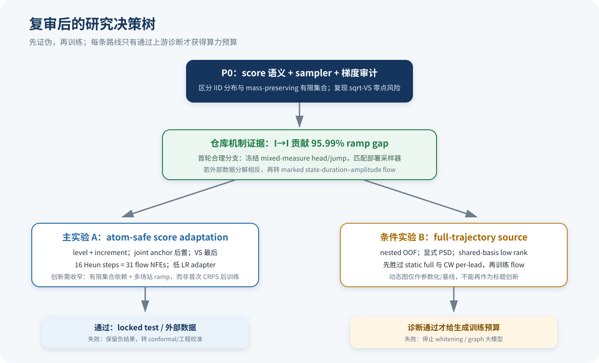
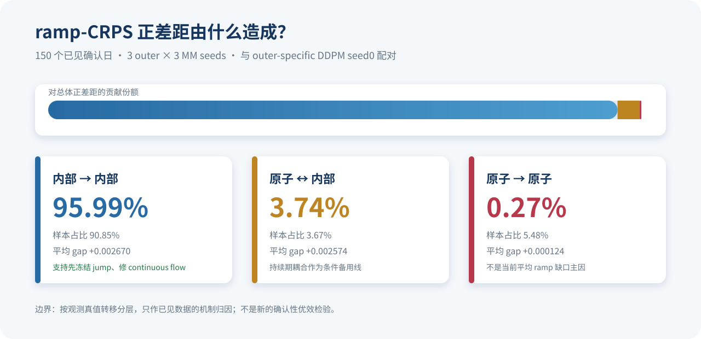
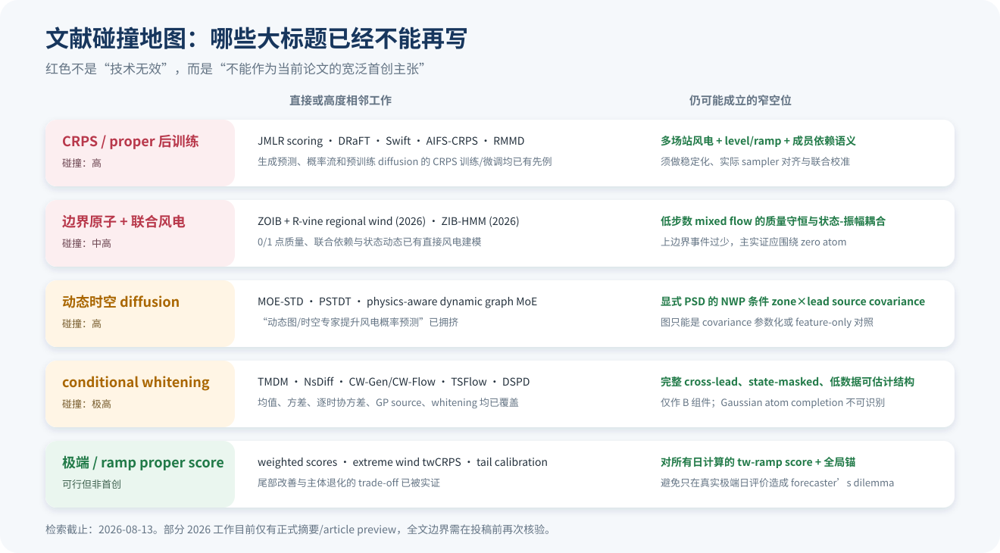

# 《MS-CADM 后续研究路线决策与实验蓝图》十分详细复审

**复审对象**：`reports/FUTURE_RESEARCH_ROADMAP.md`；由其生成的旧 HTML 展示文件已在仓库文档清理时移除。
**复审日期**：2026-08-13  
**复审性质**：内容红队审计、代码—报告交叉核验、定向文献调研、研究路线重排  
**检索边界**：以 2023–2026 年原始论文为主；遇到会直接否定“首次”主张的更早工作时向前追溯  
**输出定位**：这不是对原路线图的简单增补，而是一份可以据此修改立项、实验协议和论文主张的独立复审报告

> **复审后的核心结论**：原路线图的“先利用现有 MM-JDWind，而不是从头换大模型”这一总方向仍然正确；但优先级、估计对象、文献新颖性和若干实现细节需要实质性改写。最值得马上做的不是宽泛的“首次 proper-score 后训练”，而是：先明确有限场景集与 IID 分布两种评分语义，在与部署一致的 mass-preserving + Heun 采样器上，稳定地微调连续内部 flow，以 level 与 increment/ramp 评分修复已经确认的内部动态缺口。条件完整轨迹协方差只在 nested-OOF 诊断胜过静态和逐时协方差后立项；动态图、普通 whitening、固定 checkpoint CFG、Gaussian atom completion 和直接 decision-focused 训练均不应作为当前主贡献。

---

## 0. 先给决策：原文哪些保留，哪些降级，哪些删除

### 0.1 复审后的优先级

| 新优先级 | 路线 | 复审判定 | 为什么 | 下一道硬门 |
|---:|---|---|---|---|
| P0 | **A. sampler-matched、atom-safe 的 level–ramp score adaptation** | **有条件立即做** | 仓库确认 MM ramp-CRPS 劣于 DDPM；本次机制归因表明 `I→I` 贡献约 95.99% 的正差距，支持冻结 jump、先修连续 flow | 先通过 estimand/estimator 审计、`sqrt-VS` 复现、完整部署 sampler 的 3-seed finite gate |
| P1 | **B. NWP 条件的完整 zone×lead structured source correlation** | **诊断通过后才做** | 仍有“显式 PSD、完整 cross-lead、mixed-measure source geometry”的窄空位；但样本少、碰撞强、不可直接端到端解释 | nested OOF 必须同时胜过 diagonal、CW per-lead 和 static full；否则停止 |
| P2 | **C. atom-aware 联合轨迹 conformal certificate** | **低算力系统组件** | 可以为整个 `10×24` 轨迹给覆盖证书，不改生成器；但不能声称校准了 scenario law | 独立 selection/calibration；与 Bonferroni 同覆盖下区域更小；明确时间依赖假设 |
| P3 | **D. interior-only calibration** | **工程线保留** | 能修 coverage/interval score，且可冻结原子质量 | selection 与 calibration 分离；randomized PIT；CRPS/宽度非劣 |
| P4 | **E. state-duration–amplitude marked mixed flow** | **条件备用线** | 理论上能处理 zero run、进入/退出边界的振幅耦合；但当前平均 ramp gap 主要不是跨状态转移 | 只有外部数据或细分诊断显示跨状态贡献大时才升级 |
| P5 | **F. trajectory-wide separable whitening** | **只作 B 的高风险组件** | 完整 cross-lead 仍有空位，但普通 whitening 已被 CW-Gen/TSFlow 等高度覆盖，原子潜变量又不可识别 | B 的 correlation 诊断已通过，且 masked 方案胜过 source-only 才做 |
| Bonus | **G. threshold-weighted ramp score、signature score 诊断、OT-CFM 效率 pilot** | **小范围消融** | 各自能回答一个窄问题，但都不足以单独撑起主论文 | 必须有预注册停止门，不允许演化成无边界模块堆叠 |
| 删除/暂停 | **固定 checkpoint CFG、动态图主标题、Gaussian atom completion、full SB、decision-focused 2.0** | **当前 No-Go** | 要么实现前提不存在，要么新颖性直接碰撞，要么仓库已有明确负证据 | 只有新的外部证据或任务边界变化后再重开 |

### 0.2 原路线图最值得保留的部分

以下内容经过复审仍然扎实，应继续沿用：

1. E0–E4 的证据等级，以及“内部确认不等于外部验证”的边界；
2. 现有 150 个 MM 确认日期已经用于发现新问题，因此必须降级为 seen evidence；
3. calendar day 作为配对统计单位，不能把 240 个位置或 100 个成员当独立样本；
4. locked candidate、manifest、checkpoint hash、failure bundle 和 fail-closed 发布思想；
5. 把 continued original-loss training 作为同预算对照；
6. 对 head、jump、flow 的归因式冻结与 hash 审计；
7. DDPM 的跨区域联合指标只能作结构不对称的强参照，主要机制检验应对原生 joint flow；
8. 不从头堆更大模型，而是先利用已有最强结构和明确失败点。

### 0.3 原路线图必须改写的部分

最重要的不是措辞润色，而是以下科学边界：

- “proper-score 后训练”已经不是空白；2025–2026 年出现了 Swift、AIFS-CRPS 和 RMMD 等直接工作；
- “边界点质量 + 区域联合风电”也已有 2026 年 ZOIB + R-vine 的直接工作；
- “动态时空依赖 + 风电 diffusion/MoE”已被 MOE-STD、PSTDT 等覆盖；
- “conditional covariance / whitening / flow source”已被 TMDM、NsDiff、TSFlow、CW-Gen/CW-Flow 等密集覆盖；
- current mass-preserving ensemble 不是 IID，不能把 U-stat/fair estimator 写成无条件正确答案；
- 16 个 Heun integration steps 实际需要 31 次 flow network evaluation，不能再统称“16 NFE”；
- MM-JDWind 没有 condition dropout/null branch，固定 checkpoint 不能合法做 CFG；
- atom 位置的高斯 latent completion 不可由数据识别，除非另立并验证“删失潜变量”假设；
- 只在实际发生极端 ramp 的日期上评价普通 CRPS 会陷入 forecaster's dilemma；
- “coverage 必须进入 `[0.88,0.92]`”缺乏与有效样本量相匹配的统计依据。



---

## 1. 复审方法、证据等级与边界

### 1.1 本次实际审了什么

本次复审不是只读 HTML 表面文字，而是交叉核对了四层材料：

1. **路线文档层**：逐节检查原 Markdown/HTML 的优先级、公式语义、门槛、基线和论文主张；
2. **代码层**：核对 `mm_jdwind/training.py`、`training_v2.py`、`sampling.py`、`model.py` 中 sampler、loss、state、梯度和冻结行为；
3. **历史结果层**：核对 MM-JDWind、STGF、CR-MS-CADM、PS-DFSC 的报告、场景文件和 failure JSON；
4. **外部文献层**：定向检索 proper-score training/post-training、mixed discrete–continuous generation、ramp/extreme scoring、conditional source/whitening、动态时空风电、conformal trajectory 和 decision-focused diffusion。

### 1.2 本文的证据标签

| 标签 | 含义 | 例子 | 能支持什么 |
|---|---|---|---|
| R-CODE | 仓库代码直接事实 | Heun 调用次数、state allocation、VS 公式 | 实现层确定结论 |
| R-LOCK | 仓库冻结/确认结果 | 150 日、3 outer × 3 seeds 的 MM 结果 | 同域内部确认结论 |
| R-SEEN | 已见数据上的新增机制审计 | 本次 transition-attributed ramp gap | 路线选择与假设生成，不能冒充新 test |
| L-DIRECT | 研究问题和技术都直接碰撞 | RMMD 的 GenCast CRPS 后训练、ZOIB-R-vine 风电 | 否定宽泛首创 |
| L-ADJ | 相邻领域或部分模块 | AIFS-CRPS、Discrete Flow Models | 支持可行性或风险，不证明当前任务有效 |
| L-THEORY | 理论性质 | proper score 聚合、transformation、finite ensemble | 约束公式和主张 |
| L-PREVIEW | 只有官方摘要/article preview | 部分 2026 Elsevier 论文 | 可判断大方向碰撞，不能替代全文逐式核验 |

### 1.3 文献调研能证明什么，不能证明什么

文献证据被刻意分成三类：

- **技术可行性证据**：说明某种 loss、sampler 反传或 covariance 结构在别处能工作；
- **新颖性碰撞证据**：说明某个大标题已经不能再写成首次；
- **任务内有效性证据**：必须来自本仓库或未来公平实验，不能由天气/图像论文替代。

例如，AIFS-CRPS 证明小 ensemble 的 afCRPS 可以训练大规模随机天气模型，但它不证明 240 维 mixed-measure 风电 flow 的 ramp adapter 一定稳定；RMMD 证明预训练 diffusion 可以用 CRPS reward 后训练，但它主要优化边际 CRPS，不证明 level–increment 联合目标能修复跨区域 ramp。

### 1.4 时间与检索边界

检索截止 2026-08-13。以下情形会保守标注：

- arXiv v1 只称“预印本”，不写成正式同行评审结论；
- workshop 与主会分开写；
- 只有 publisher preview 时，不断言摘要没有展示的模块一定不存在；
- “未发现直接先例”只限定在本次检索范围，不写成绝对世界首创；
- 本地 CLDM 是机器翻译件，正式投稿前必须补英文原版。

---

## 2. 仓库事实审计：先把实现和历史证据说准

### 2.1 当前最稳的正结果是什么

MM-JDWind 的最清楚贡献仍然成立：相对 no-jump，同一连续生成 backbone 下引入 mixed-measure 与 mass-preserving state mechanism，稳定改善了 CRPS、coverage、Joint ES 和 zero-event 质量。与 250-step DDPM 比较时：

- CRPS 和 Joint ES 接近；
- MAE、区间锐度、zero Brier 等更好；
- ramp-CRPS 明显更差，差值 `+0.002527`，95% CI `[+0.002125,+0.002951]`；
- confirmation 的 one observed rate 约 `0.000139`，因此主要实证应围绕 zero atom，上边界只作机制完整性说明。

本次复审没有推翻 mixed-measure 结果；它缩窄的是“还能如何声称新颖”以及“下一步到底应修哪一部分”。

### 2.2 16 steps 不是 16 flow NFE

`integrate_rectified_flow()` 的 Heun 实现中：

```text
每个非末步：velocity(current) + velocity(proposal)  → 2 次 flow forward
最后一步：velocity(current)                         → 1 次 flow forward
```

所以：

```text
flow network evaluations = 2 × integration_steps - 1

4 steps  →  7 flow NFEs
8 steps  → 15 flow NFEs
16 steps → 31 flow NFEs
32 steps → 63 flow NFEs
```

此外，mass-preserving state 路径先运行 12 个 jump reveal steps，即 12 次 jump-network evaluation；head 还会运行一次。不同子网络的 NFE 不应粗暴相加成一个无解释数字，建议正式报告：

```text
integration steps = 16
flow NFEs         = 31
jump NFEs         = 12
head calls        = 1
member chunks     = ...
wall time         = ...
```

原文中所有“16 NFE flow 对 250-step DDPM”的表述都应改为“16 Heun steps / 31 flow NFEs”，然后再以相同硬件的 wall time 作最终效率比较。

### 2.3 旧 proper-score pilot 不是对新路线的干净反证

旧 `ensemble_proper_loss()` 同时做了：

```text
state sampler  = independent
flow sampler   = 4-step Euler
members        = 6
loss           = CRPS + 0.05 ES + 0.05 VS + 0.1 RampCRPS
trainable      = full flow
deployment     = mass-preserving states + 16-step Heun
```

结果是 87 个 flow 参数出现非有限值，所有 proper validation metrics 为 NaN，v2 协议因而正确地禁用了 proper stage。

这次失败至少混合了四个问题：

1. state distribution 与部署不一致；
2. Euler 4-step 与部署 Heun 16-step 不一致；
3. 四种分数一次性叠加，无法归因；
4. VS 使用 `sqrt(abs(delta))`，而 mixed-measure 产生大量精确相等/精确 0/1，`sqrt` 在 0 附近的导数奇异。

因此最准确的结论是：**旧组合协议失败**，而不是“所有 proper-score adaptation 不可行”。`sqrt-VS` 是强嫌疑根因，但在复现单项梯度触发前仍应写成“高可能机制”，不能假装已经因果证明。

### 2.4 原文对 fair score 的表述过于绝对

当前代码的 CRPS、ES 和 ramp-CRPS pair term 都包含 `M×M` 对角零项，是 V-statistic。它有两种完全不同的解释：

#### 解释 A：预测对象是一个底层 IID 条件分布

若成员是从同一底层分布独立同分布抽样，排除 self-pairs 的 U-stat/fair estimator 可无偏估计该底层分布的 CRPS/ES。此时有限 M 的 V-stat 会有 ensemble-size bias。

#### 解释 B：预测对象就是实际发布的有限等权场景集

若最终产品就是一个固定 `M=100` 的经验分布，那么包含 self-pairs 的 V-stat 正是这个经验分布本身的 CRPS/ES，不是“实现 bug”。它优化的是有限 support forecast，而不是某个不可见无限 ensemble 的无偏估计。

当前 mass-preserving state allocator 会：

- 把每个位置的 zero/one count 舍入为整数；
- 按 member-wise probability 排序分配这些状态；
- 因而使成员相互依赖且非 IID。

所以原文“训练必须优先 fair/U-stat”不能成立为通用规则。正确做法是先声明 estimand：

| 研究对象 | state/member 语义 | 训练 score | 可以做的理论主张 |
|---|---|---|---|
| 底层随机条件分布 | IID independent state/noise | fair/U-stat；或 afCRPS | 在 IID 假设下估计底层 score |
| 发布的有限质量守恒场景集 | mass-preserving、排序/配额耦合 | empirical/V-stat | 直接评分有限经验分布，不声称是底层分布的无偏估计 |

论文可以同时研究两者，但不能混用公式后仍声称同一个无偏性结论。

### 2.5 固定 checkpoint CFG 在当前实现中不成立

MM-JDWind 的 target-state absorbing mask 不是 classifier-free guidance 所需的 condition dropout。当前模型没有：

- null condition token；
- unconditional branch；
- 训练期随机移除 NWP condition 的协议；
- 可与 conditional output 正确配对的 unconditional velocity。

因此原文提出“固定 checkpoint、半天 inference sweep”不合法。CFG 若要做，必须重训，而且会改变校准目标；在当前密集研究路线中性价比很低，建议删除。

### 2.6 atom Gaussian completion 不可识别

当前 `MMJDWind.residual()` 在 atom state 处返回 0，是为了屏蔽/占位，不代表存在一个真实但未观测的连续 residual。把 atom 当作缺失值，再按 Gaussian conditional 分布补全，隐含了一个很强的反事实：

> 精确 0/1 是某个潜在连续功率被删失或截断后的观测。

但实际 exact zero 可能来自无风、停机、限电、故障、数据裁剪或归一化规则。若它是结构状态，就不存在唯一可识别的“本来应是多少”的 interior latent。因此：

- zero-fill 只能是有偏消融；
- Gaussian completion 不能作为正式默认方案；
- 更合理的是 state-masked covariance、变维 active-coordinate flow，或 marked discrete–continuous process；
- 外部数据必须先审计 exact zero/one 的物理语义。

### 2.7 coverage 窄门没有充分统计依据

原文要求 90% coverage 进入 `[0.88,0.92]`。若 calendar day 是推断单位，150 个近似独立日期下 0.9 比例的普通二项近似 95% 误差已约为 ±4.8 个百分点；时间相关会进一步降低有效样本量。若把 36,000 个 zone-hour 位置当独立样本，又会严重夸大精度。

建议替换为：

- 报 Coverage50/80/90 的逐日聚合；
- 使用 moving/stationary block CI；
- 主安全指标用 interval/Winkler score；
- coverage 用“相对 baseline 向名义值靠近且不过度放宽”的复合解释；
- 若需要硬门，门宽由开发数据上的有效样本量和 power analysis 预先决定。

---

## 3. 新增仓库机制证据：ramp gap 到底来自哪里

### 3.1 为什么必须做这个分解

原路线图默认：MM 的 atom mechanism 已经好，ramp 差距主要来自 continuous interior flow，所以冻结 head/jump 即可。这个假设在逻辑上合理，但原文没有直接证据，因为平均 ramp-CRPS 混合了：

- `I→I`：两个小时都在连续内部；
- `0→I`、`I→0`；
- `1→I`、`I→1`；
- `0→0`、`1→1` 及极少的 atom-to-atom 跨类变化。

若差距主要由 atom↔interior 产生，冻结 jump 可能永远修不好；若主要是 `I→I`，连续 flow adapter 才是机制匹配的首选。

### 3.2 本次只读审计协议

输入：

- MM：3 outer × 3 seeds 的 mass-preserving confirmation 场景；
- DDPM：每个 outer 的 seed0 confirmation 场景；
- 每个 outer 50 日、10 zone、24 小时、M=100；
- 按观测真值的相邻小时状态给每个 ramp 打标签；
- 对每个标签计算仓库定义一致的 empirical/V-stat ramp-CRPS 差；
- outer-specific DDPM 与三个 MM seeds 分别配对，因此 pooled 表中 DDPM observation 被按 MM seed 重复三次。

这是 R-SEEN 机制审计：可用于选择下一条路线，但不构成新的 locked-test 优效证据。

### 3.3 结果



| 观测转移大类 | 样本占比 | MM−DDPM 类内平均 gap | 对总体 gap 的贡献 | 占总体正差距份额 |
|---|---:|---:|---:|---:|
| `I→I` | 90.8522% | +0.00266962 | +0.00242541 | **95.99%** |
| atom↔`I` | 3.6696% | +0.00257410 | +0.00009446 | **3.74%** |
| atom→atom | 5.4783% | +0.00012403 | +0.00000679 | **0.27%** |
| 全部 | 100% | — | **+0.00252666** | 100% |

九个 outer-seed 配对的总体 gap 全部为正，范围约 `+0.002252` 至 `+0.002855`。

### 3.4 它支持什么

该结果直接支持：

1. 当前 GEFCom 同域 seen data 上，平均 ramp 缺口确实主要是连续内部段问题；
2. 首轮冻结 head/jump、只调 continuous flow 有机制依据；
3. state-duration–amplitude coupling 不应抢占首轮主实验预算；
4. 后训练的主要 primary endpoint 应保持 unconditional overall ramp-CRPS，而不是只看跨状态子集。

### 3.5 它不支持什么

该分解不能证明：

- jump transition probability 已完全校准；
- zero-run duration 和 atom onset timing 已经正确；
- 极端跨状态 ramp 不重要；
- 另一个风电数据域也会有同样的 95.99%；
- 只要优化 increment-CRPS 就必然修好依赖。

因此 marked state-duration 路线仍保留，但降为外部数据/细分诊断触发的备用线。完整数值与方法边界保存在 [`ramp_transition_attribution.json`](evidence/ramp_transition_attribution.json)。

---

## 4. 原路线逐项复审总表

| 原方向 | 原判定 | 复审判定 | 支撑它的证据 | 反证/碰撞 | 剩余可写空间 |
|---|---|---|---|---|---|
| proper ramp dynamics | P0 立即做 | **保留但收窄** | MM ramp gap；本次 `I→I` 归因；JMLR、AIFS-CRPS、RMMD 证明 score training 可行 | Swift/RMMD 已覆盖 CRPS flow/diffusion 微调；旧 pilot NaN | 多场站 wind、mixed measure、level–increment、有限集合依赖语义与稳定化 |
| stable trajectory score post-training | 与 A 合并 | **合并但先做 estimand 审计** | DRaFT/RMMD 支持 sampler 反传与参考正则 | 不是通用首创；mass-preserving 非 IID；signature score 已覆盖路径评分 | sampler-matched、atom-safe adaptation 的方法/负结果研究 |
| NWP dynamic dependence | P2 条件立项 | **只保留 explicit PSD source** | residual regime 差异、CW-Gen/TSFlow/Correlated Errors | MOE-STD/PSTDT/动态图风电密集；本地固定图失败 | 完整 zone×lead、state-masked、nested-OOF、source vs feature 因果消融 |
| full structured whitening | C 组件 | **明显降级** | CW-Gen 证明条件 whitening 有理论与经验价值 | CW-Gen/CW-Flow/TSFlow 高碰撞；atom completion 不可识别 | trajectory-wide separable masked whitening，且只能作为 B 组件 |
| interior calibration | 低风险工程线 | **保留** | coverage 84.5%、interval 尚有改善空间 | conformal/校准文献拥挤；易用变宽换覆盖 | atom-preserving system component，不作 dynamics 主创新 |
| regime/extreme | diagnose first | **保留诊断，进一步收窄** | ramp 尾部存在 | MOE 与极端概率预测密集；小类样本不足 | train-only tw-ramp score；NWP 可预测的二类 regime 最多 |
| structured CFG | 快速消融 | **删除当前 sweep** | 无 | 当前 checkpoint 不具备 CFG 前提；需重训 | 未来单独重训消融，不进入近期论文 |
| flow sampling efficiency | bonus | **保留但改计数** | 低 integration-step backbone | 16 steps 实为 31 flow NFEs；wall time 未证实比例加速 | quality–latency curve，不作首要创新 |
| decision-focused 2.0 | pause | **继续暂停** | 无安全候选 | 本地 12/12 candidate fail；DO-MUDiff 2026 直接碰撞 | 只有 exact-aligned surrogate 出现新证据才重开 |
| full SB/OT | 未主推 | **只做极小 pilot** | OT-CFM/SB 理论可降低路径复杂度 | 每个 condition 只有一个 target；跨日 OT 会错配 condition | NWP-neighbor OT 的效率消融，shuffled control 必须失败 |



---

## 5. 方向 A 复审：proper-score 后训练仍可行，但论文故事必须重写

### 5.1 可行性的正证据

以下文献共同说明“可微概率评分能够训练/微调生成预测模型”不是空想：

| 文献 | 实际做到什么 | 对本项目的支持 | 不能外推的部分 |
|---|---|---|---|
| [Pacchiardi et al., JMLR 2024](https://jmlr.org/papers/v25/23-0038.html) | 用 proper scoring-rule minimization 训练隐式生成网络，并给出 dependent-data 一致性结果 | proper score 可以成为非对抗生成训练目标 | 主要实验不是 240 维多步 mixed wind sampler 后训练 |
| [DRaFT, ICLR 2024](https://openreview.net/forum?id=1vmSEVL19f) | 穿过 diffusion sampler 优化可微 reward；比较 truncated backprop | 支持 adapter、reference、K-step 反传设计 | 图像 reward 不等于概率 proper score；长链有过优化/不稳风险 |
| [AIFS-CRPS, npj AI 2026](https://www.nature.com/articles/s44387-026-00073-7) | M=2/4、afCRPS、最多 12-step rollout；用 α=0.95 避免 fair-CRPS 退化 | 直接支持小 ensemble、低 LR、progressive rollout 和正项重排 | 不是 diffusion/flow 后训练；主要是 marginal CRPS |
| [Swift, 2025 preprint/workshop](https://arxiv.org/abs/2509.25631) | 对单步 consistency/probability-flow weather model 做 multi-step fair-CRPS finetuning | 已证明 probability-flow forecast 可用 CRPS 微调 | 不是现成 mixed-measure wind model；venue 必须写准确 |
| [RMMD, arXiv:2606.30414](https://arxiv.org/abs/2606.30414) | GenCast 59 NFE→8-step student，再用 2-sample CRPS reward 与 frozen reference 正则微调 | 是“预训练 diffusion/weather + CRPS post-training”的直接先例；也给稳定化思路 | 主要为逐变量/逐 lead marginal CRPS；截至检索日为预印本 |
| [NeuralGCM, Nature 2024](https://www.nature.com/articles/s41586-024-07744-y) | 用小 ensemble 的 CRPS 型目标训练长 rollout 随机天气模型 | 支持大规模多步 probabilistic training 可行 | 混合动力学天气模型，不是 wind flow post-training |

这些证据足以支撑“值得做稳定 pilot”，但已经否定以下宽泛主张：

- 首次用 proper score 训练生成网络；
- 首次对 probability-flow forecast 做 CRPS 微调；
- 首次对预训练 diffusion weather model 做 CRPS 后训练；
- 首次用小 ensemble proper score 训练多步随机模型。

### 5.2 当前剩余的新颖性到底在哪里

截至本次检索，没有发现与以下组合完全相同的直接工作：

```text
预训练多场站风电 mixed-measure joint flow
+ 最终部署 sampler 对齐
+ level 与 increment/ramp 的复合评分
+ 有限场景质量守恒导致的成员依赖语义
+ 冻结边界原子并验证 ramp/atom trade-off
```

这只能写成：

> “在本次检索范围内，尚未发现系统研究有限成员校正与质量守恒成员依赖条件下，level–increment/ramp scoring-rule adaptation 对预训练多场站风电 diffusion/flow 场景生成器作用的工作。”

不能写成绝对“世界首个”。

### 5.3 理论上必须守住的边界

#### 差分评分不识别原轨迹

`Delta(X)` 是非单射变换：给整条轨迹加同一个常数，增量完全不变。因此只对 increment 使用严格 proper score，也只会严格识别 increment distribution，不能识别 level 或完整 path law。

#### 逐位置 level CRPS 仍只识别边缘

对 240 个位置分别求 CRPS 再相加，可以识别各位置边缘分布，但不能唯一识别跨时、跨区联合依赖。

#### 组合严格性需要完整 outcome-space 锚

[Pic et al. 2025](https://ascmo.copernicus.org/articles/11/23/2025/) 支持：固定非负权重的 proper scores 之和仍 proper；若其中一个正权重分量在相同 outcome space 上严格 proper，合成可保持严格性。但需要：

- 权重非负并在 test 前固定；
- 分数定义在明确的同一预测对象上；
- 所需矩存在；
- normalization scale 为 train-only 固定正数；
- anchor/reference regularizer 单独标为工程正则，不能伪装成 proper score。

对于完整 `10×24` Euclidean trajectory，可用 full-trajectory ES 或 characteristic-kernel score 作 joint anchor。只用 level marginal CRPS + increment marginal CRPS 仍不能保证完整联合分布正确。

### 5.4 signature kernel 是有价值的诊断，不是当前首轮训练 loss

[Signature Kernel Scoring Rule, TMLR 2026](https://openreview.net/forum?id=LOLXpt4E5D) 已把严格 proper 的 path score 用于概率天气验证和训练，轨迹最长 15 steps。这会继续压缩“首次轨迹级评分训练”的新颖性。

同时该论文明确暴露了：

- 多次数值 Inf/NaN 或训练塌缩；
- 高维 path augmentation 的理论/数值伸缩问题；
- 需要经验 scaling，稳定性依赖 kernel bandwidth；
- dense signature 对 zero-inflated precipitation 等非稠密过程仍是开放问题。

MM-JDWind 恰有精确 0/1 atoms，因此 signature score 更适合：

1. 用 synthetic perturbation 做 finite-sample power test；
2. 作为冻结场景的诊断性 scorecard；
3. 若要训练，先研究 atom-aware marked/masked signature，而不是直接把 dense signature 加进 P0。

### 5.5 极端 ramp 不能只在真实极端日上评价

[Forecaster's Dilemma](https://arxiv.org/abs/1512.09244) 指出：按已实现的极端结果筛选样本再评价普通 forecast score，会产生反直觉和不诚实的模型排序。原文的“极端 ramp 日分层”可以保留为解释性诊断，但不能成为主优效检验。

更合理的是：

- 阈值只从 train 确定；
- 在**所有评价日期**上计算 threshold-weighted ramp CRPS、weighted ES/VS 或 event Brier；
- 同时保留 ordinary score，审计 body–tail trade-off；
- 不用 test truth 决定“这一天是否进入主评价”。

[Wessel et al., MWR 2025](https://journals.ametsoc.org/view/journals/mwre/153/8/MWR-D-24-0151.1.xml) 已证明 twCRPS 训练能改善极端风速，但会伤害分布主体；[Enforcing tail calibration, 2026](https://arxiv.org/abs/2506.13687) 又在 conditional generative models 上观察到尾部校准改善与整体校准/skill 退化的权衡。因此 extreme branch 必须与全局 level/ramp score 绑定，不应单独宣称全面改善。

### 5.6 方向 A 的复审判定

**科学价值：高。** 有明确仓库缺口、机制归因和可证伪 protocol。  
**通用新颖性：低到中。** proper-score post-training 大标题已经被直接占据。  
**任务组合新颖性：中。** 有机会来自 mixed-measure multi-zone wind、finite-set dependence 和 level–ramp joint adaptation。  
**工程风险：中高。** 旧 pilot 非有限、完整 Heun chain 反传昂贵、score/成员语义复杂。  
**最终判定：Conditional Go，作为第一研究实验，但必须使用第 9 节的新协议。**

---

## 6. 方向 B/C 复审：动态依赖与 whitening 必须合并、收窄并先诊断

### 6.1 为什么原“动态图/动态依赖”故事已经不够新

2026 年的直接碰撞比原路线图估计得更强：

| 工作 | 已覆盖内容 | 对原路线的影响 | 尚未完全覆盖的窄空位 |
|---|---|---|---|
| [MOE-STD, EPSR 2026](https://www.sciencedirect.com/science/article/pii/S0378779626007297) | 风电概率 diffusion；动态空间专家 MOSE；动态时间专家 MOTE；真实 offshore/inland farms | “probabilistic wind diffusion + dynamic spatial/temporal dependency” 已不能作主创新 | 公开摘要未声称显式 PSD source covariance；投稿前需全文复核 |
| [PSTDT, IEEE TSTE](https://doi.org/10.1109/TSTE.2025.3591920) | probabilistic wind-speed diffusion transformer；静态位置与动态空间 attention；时间依赖 | “动态图/attention + probabilistic wind diffusion” 更拥挤 | 未见完整 NWP-conditioned zone×lead source operator |
| [Zhao et al., IJEPES 2026](https://www.sciencedirect.com/science/article/pii/S0142061526002115) | physics-aware dynamic graph、CNN-Transformer、gated MoE、风电 | “physics-aware dynamic graph + MoE + wind” 已被直接占据 | 是点预测，不是联合概率 source |
| [GCGNet, ICLR 2026](https://openreview.net/forum?id=EO5jwQ5NCw) | future exogenous variables、temporal/channel graph、structure alignment | 动态 channel/temporal graph 也不是空白 | 主要不是 mixed-measure scenario source |
| [MSCGrapher, UAI 2025](https://proceedings.mlr.press/v286/yang25c.html) | 多尺度动态跨序列相关图 | “dynamic cross-series graph” 不是新颖点 | 确定性任务，未做联合概率 source |
| [LIFT, ICLR 2024](https://proceedings.iclr.cc/paper_files/paper/2024/hash/b52b07a239a7afa155ca25cf17a55074-Abstract-Conference.html) | local lead–lag dependence | lead-lag dynamic dependency 本身也有成熟工作 | 不直接生成 mixed-measure joint distribution |

再结合本地 STGF 相对 time-domain joint flow 的确认性负结果：CRPS 恶化 3.99%，Joint ES 与 adjacency VS 也变差。因此未来不应再写：

> “我们引入动态图来捕捉风电场之间动态相关性。”

这句话既缺新颖性，又没有仓库正证据。

### 6.2 conditional source / whitening 的直接碰撞

| 工作 | 已覆盖内容 | 与剩余方向的边界 |
|---|---|---|
| [TMDM, ICLR 2024](https://openreview.net/forum?id=2T0Qn9rP6N) | 条件均值作为 diffusion endpoint/prior | mean-only 已被覆盖，本地 residualization 也已做 |
| [NsDiff, ICML 2025](https://proceedings.mlr.press/v267/ye25i.html) | conditional mean、sliding variance、adaptive endpoint/schedule | diagonal variance 已被覆盖 |
| [CW-Gen, ICLR 2026](https://openreview.net/forum?id=GG01lCopSK) | conditional mean、逐提前期 multivariate covariance、whitening、CW-Diff/CW-Flow、理论充分条件 | 普通 conditional whitening 与 CW-Flow 领域迁移基本被撞完；其公开方法仍按 lead 分列，cross-lead source 是窄空位 |
| [TSFlow, ICLR 2025](https://proceedings.iclr.cc/paper_files/paper/2025/hash/ee1a1ecc92f35702b5c29dad3dc909ea-Abstract-Conference.html) | data-dependent/GP source、future-point temporal covariance、conditional flow matching、OT path | “correlated source + flow matching” 已被覆盖；多输出 NWP 条件完整 zone×lead 仍可能不同 |
| [DSPD, ICML 2023](https://proceedings.mlr.press/v202/bilos23a.html) | GP/OU correlated diffusion noise、完整时间 covariance | 时间相关噪声不是新意；其多变量 source 主要是重复的 time block |
| [Correlated Errors, NeurIPS 2024](https://proceedings.neurips.cc/paper_files/paper/2024/hash/619b8e3ead58dce90bc615f2a7d5d102-Abstract-Conference.html) | contemporaneous low-rank covariance、autocovariance、cross-lag error | 不能声称首次考虑 cross-lag；仍可区别于非自回归 mixed flow source |

还必须向前追溯：

- [Tan et al., IJEPES 2021](https://doi.org/10.1016/j.ijepes.2021.106955) 已在多风场场景生成中使用非可分离时空 covariance；
- [Li & Ludkovski 2024](https://arxiv.org/abs/2409.16308) 对大量风场和一天各小时建立完整 space×hour joint probability model；
- 多风场 vine-copula joint scenario 也已存在，例如 [IEEE TPWRS](https://doi.org/10.1109/TPWRS.2023.3298004)。

所以不能写“首次将完整时空协方差用于联合风电场景”。剩余可辩护问题只能是：

> **在现有 mixed-measure 十区域非自回归 joint flow 中，显式构造低数据可估计、PSD、NWP 条件的完整 zone×lead source correlation，并用 nested-OOF 与 source-vs-feature 对照证明它改善 cross-lead calibration 或低-step 运输。**

### 6.3 为什么只预测 correlation，而不是再预测 variance

当前 MM head 已有逐位置 location 和 scale。若 B 再输出完整 covariance，任何收益可能只是重复调了边际 variance，而不是学习新的 cross-dimension structure。

第一版更干净的参数化是：

```text
R(c) = correlation operator
Sigma(c) = diag(scale_head(c)) · R(c) · diag(scale_head(c))
```

或在标准化 residual 上直接使用：

```text
R(c) = D_fixed + B diag(s(c)) B^T
```

并规范化对角到 1。这样 B 的问题被收窄为“head 标准化后仍存在的条件 correlation”，避免与 CR-MS-CADM 的异方差结果重复。

### 6.4 统计可辨识性是最大风险

`p=240` 的任意对称 covariance 有 28,920 个唯一元素，而通用训练日约 481–581。更关键的是，每个 NWP condition 只有一条未来轨迹。因此任意神经网络逐日输出 full Cholesky 基本不可辨识。

可接受的低自由度形式包括：

```text
R(c) = diag(d) + B diag(s(c)) B^T
```

其中 `B` 在所有日期共享，只预测非负强度 `s(c)`；或：

```text
R(c) = D + sum_k w_k(c) B_k B_k^T,  w_k(c) >= 0
```

也可比较：

```text
R(c) = R_zone(c) ⊗ R_lead(c) + D
```

但必须承认：

- factor `B` 只在旋转意义下可辨识，单个 factor 不能强解释为特定物理机制；
- source 与高容量 flow 联合端到端也不可分解辨识；
- 因此 correlation estimator 应先 cross-fit、冻结，再训练同一 flow；
- 只有 source-vs-feature-only 控制才能部分说明收益来自 source geometry。

### 6.5 atom state 对 covariance 的影响不能忽略

同一个 condition 下，active interior coordinate set 会随 sampled state pattern `s` 变化。只用双方均 interior 的 observed pairs 估计 `R(c)`，不自动保证部署到任意 `s` 时正确。

至少要比较：

```text
B0  R(c)                     condition-only
B1  masked R(c, s)           state-mask aware
B2  R(c, shuffled_s)         state pairing control
B3  feature-only encoder     same encoder, source remains I
```

正式模型应在 active coordinates 上采样或应用 operator，不为 atom 位置虚构连续 latent truth。

### 6.6 B 的 nested-OOF 诊断协议

进入任何生成训练前，所有步骤都必须位于 outer train 内部：

1. 连续 time-blocked folds；
2. 每 fold 用其余块拟合 location/scale head；
3. 在 held-out fold 产生 OOF residual；
4. covariance basis 也只用 fold-train；
5. rank、shrinkage、eigenfloor 由 inner validation 选择；
6. conditional covariance head 在 fold-train 拟合；
7. held-out fold 评价 NLL、Mahalanobis calibration、whiteness 和 subspace stability；
8. 汇总所有 OOF predictions 后才决定是否进入 flow。

候选必须包括：

| 编号 | estimator | 科学问题 |
|---|---|---|
| B-D0 | diagonal / identity correlation | 标准化后是否还有结构 |
| B-D1 | CW-style per-lead block | cross-zone、无 cross-lead 的强基线 |
| B-D2 | temporal GP block | 仅时间相关是否足够 |
| B-D3 | static full shrinkage | 条件性是否必要 |
| B-D4 | static low-rank + diagonal | 低秩本身是否有效 |
| B-D5 | conditional shared-basis low-rank | 核心候选 |
| B-D6 | Kronecker + diagonal | 可分离结构是否更稳 |
| B-D7 | conditional covariance atoms | 少量 regime mixture 是否足够 |
| B-D8 | B-D5 + shuffled condition | NWP 配对是否真实有用 |

建议诊断 Go 条件不是武断固定一个百分比，而是同时满足：

- cross-lead off-block energy 在至少 2/3 outer train partitions 稳定存在；
- low-rank principal subspace 跨 fold 不发生灾难性旋转；
- conditional structured estimator 的 held-out NLL 与 cross-lead whiteness 同时胜过 B-D1 和 B-D3；
- condition number 与 eigenfloor 触发率受控；
- shuffled condition 丢失大部分 improvement；
- 改善量大于开发数据 power analysis 得出的最小可检测效应。

任何一项失败，都应停止大模型训练。

### 6.7 B 的生成实验最小矩阵

保持同一 MM-JDWind time-domain flow backbone，只换 source：

```text
G0  N(0, I)
G1  conditional diagonal
G2  CW per-lead cross-zone source
G3  temporal GP source
G4  static full low-rank source
G5  proposed conditional full structured source
G6  same covariance encoder as feature only, source = I
G7  G5 with shuffled condition
```

必须锁定相同：

- head/jump checkpoint；
- train/validation dates；
- trainable parameter count 或参数量匹配对照；
- integration steps、flow NFEs 与 optimizer updates；
- member count、state field、base random numbers；
- calibration protocol。

主要检验相对 G0、G2、G4 和 G6，而不是只对独立 DDPM。

### 6.8 whitening 的复审判定

若 B 诊断通过，whitening 可作为以下对照：

```text
source-only:      epsilon ~ N(0, R(c)), target coordinates unchanged
whitening-only:   z = W(c) r, source ~ N(0, I)
both:             structured source + transformed target
```

但原方案实质是 zone×time Kronecker/带状近似，应改名为 **trajectory-wide separable whitening**，而不是“任意 full 240×240 whitening”。

正式约束：

- active interior coordinates only；
- 无 Gaussian atom completion；
- PSD、eigenfloor、condition-number cap；
- OOF round-trip 与 whiteness；
- 必须显著胜过 source-only，才有资格成为贡献；
- 不能把 CW-Gen 的 KL sufficient condition 写成有限容量模型必然改善 CRPS/ES。

### 6.9 方向 B/C 的最终判定

**动态图主线：No-Go。** 只作 covariance 参数化或 feature-only baseline。  
**普通 CW-Flow for wind：No-Go。** 属于高碰撞领域迁移。  
**完整 zone×lead structured source：Conditional Go。** 有窄空位，但必须先通过 nested-OOF。  
**trajectory-wide separable whitening：高风险组件。** 只有 source route 已通过后才有预算。

---

## 7. mixed-measure 与 ramp 文献复审：还能新在哪里

### 7.1 “边界原子 + 联合风电”已经有直接先例

[Joint probability aggregation via R-vine and KAN, 2026](https://www.sciencedirect.com/science/article/pii/S2590123026008613) 明确使用 Zero–One Inflated Beta：

- 在 0/1 处放点质量；
- continuous interior 使用 Beta；
- R-vine 建模区域联合依赖；
- 使用 PIT/联合概率评价；
- publisher highlight 报告 Energy Score 改善。

因此不能再把“风电的 0/1 mixed distribution + regional dependence”本身写成首创。MM-JDWind 仍可区别于它的地方是：

- 一次生成完整多区域、多 lead trajectory；
- 离散 state field 与连续 rectified flow 联合；
- finite-M atom mass preservation；
- 低 integration-step sampler；
- 后续 state–amplitude 或 score adaptation。

若论文继续以 mixed measure 为核心，ZOIB-R-vine 至少应作为文献基线；能复现时最好加入模型对照。

### 7.2 mixed discrete–continuous flow 也不是通用空白

| 文献 | 已覆盖 | 对新方案的边界 |
|---|---|---|
| [Discrete Flow Models, ICML 2024](https://proceedings.mlr.press/v235/campbell24a.html) | CTMC 形式的 discrete flow，并与 continuous flow 组成 multimodal generation | 不能声称首次统一离散/连续 flow |
| [TabbyFlow, ICML 2025](https://proceedings.mlr.press/v267/guzman-cordero25a.html) | exponential-family variational flow matching，处理 mixed continuous/discrete tabular variables | 通用 mixed-type flow 已存在；风电时序结构仍不同 |
| [ZIB-HMM for wind-turbine icing, Wind Energy 2026](https://onlinelibrary.wiley.com/doi/full/10.1002/we.70110) | bounded zero-inflated state-dependent distribution、serial latent states、covariate-dependent transitions | 直接支持状态持续期/转移与连续分布耦合有风电价值 |

### 7.3 新备用方案：state-duration–amplitude marked mixed flow

当前 MM 把 state 与 continuous residual 分阶段生成，尚未显式建模：

- zero run duration；
- state age；
- 进入/离开 zero 的具体时刻；
- `0→I` 或 `I→0` 时 interior amplitude；
- 多区域同步进入/退出 atom；
- transition class 与 continuous velocity 的交互。

最小结构：

```text
M0 current MM-JDWind
M1 jump + duration/run-length head
M2 flow + transition-class/state-age embedding
M3 M1 + M2
M4 M3 with shuffled transition/age
```

评价：

- unconditional overall ramp-CRPS；
- transition Brier；
- zero-run length CRPS；
- onset/exit timing error；
- `I→I` 与 atom↔`I` contribution；
- overall CRPS/ES、zero Brier、finite atom counts。

然而，本次仓库归因显示 atom↔`I` 只解释约 3.74% 的平均正 gap，因此在当前数据上它是 **P4 备用线**。以下任一条件出现才升级：

1. 外部数据中 atom↔`I` 贡献显著更大；
2. zero-run duration 或 onset timing 明显失校准；
3. proper score adapter 修好 `I→I` 后，剩余 gap 集中到 transition；
4. 应用方明确更关心停机/恢复事件而非平均 ramp。

### 7.4 直接 ramp forecasting 的碰撞

generic ramp modeling 也不是新意：

- [IEEE TSTE 2025/2026](https://doi.org/10.1109/TSTE.2025.3585404) 已联合预测 wind power 与 ramp rate，并给概率结果；
- [IJEPES 2025 two-step ramp framework](https://www.sciencedirect.com/science/article/pii/S014206152500328X) 直接针对 day-ahead probabilistic wind forecasting and ramp events；
- 多个更早工作已做 ordinal ramp event、ramp timing/frequency 等。

所以可发表点不能只是“加入 ramp loss”，而必须是：

- score 对最终 joint sampler 生效；
- 保留 ensemble diversity；
- 与 mixed atom 兼容；
- 区分 finite-set 与 IID score；
- 有严格的 level/joint anchor 与 reward-hacking 审计。

---

## 8. 其他方向复审与新增系统路线

### 8.1 atom-aware 联合轨迹 conformal certificate

这条路线不改 scenario generator，而是在外层构造覆盖整个 `10×24` trajectory 的 prediction region。它的正确定位是“可靠性证书”，不是“把 scenario distribution 校准正确”。

直接相邻工作：

- [ConForME 2024](https://proceedings.mlr.press/v230/galvao-lopes24a.html)：multi-horizon conformal time-series forecasting；
- [Conformalized Adaptive Forecasting of Heterogeneous Trajectories, ICML 2024](https://proceedings.mlr.press/v235/zhou24l.html)：同时覆盖完整 trajectory 的 band；
- [MultiDimSPCI, ICML 2024](https://arxiv.org/abs/2403.03850)：多维时间序列 ellipsoidal prediction regions；
- [Conformal Predictions under Markovian Data, ICML 2024](https://icml.cc/virtual/2024/poster/33483)：量化时间依赖导致的 coverage gap；
- [Regional wind conformal predictive distribution, Applied Energy 2024](https://www.sciencedirect.com/science/article/pii/S0306261924002836)：风电概率预测已有 conformal 直接工作。

因此 generic conformal 不是论文主创新。可做的窄系统组件是 mixed atom/interior-aware nonconformity：

```text
score(y, scenarios)
  = atom-state violation component
  + active-interior standardized distance
  + max trajectory/ramp deviation component
```

协议：

1. selection 集只选一种 score 结构；
2. 冻结 scale、basis、atom rule；
3. 完全独立 calibration 集估 conformal quantile；
4. locked test 报 whole-trajectory coverage、区域体积/宽度、atom set size、ramp band；
5. 对比 marginal rectangle、Bonferroni、ConForME-like band、MultiDimSPCI-like ellipsoid；
6. 明确原 scenario CRPS/Brier 没有因 CP 自动得到校准。

这条线算力低、论文新颖性低到中、系统价值较高，适合作为主路线失败时仍可交付的可靠性组件。

### 8.2 interior-only calibration

原路线可以保留，但需修改：

- selection 集选择 global/zone/lead/NWP map；
- 冻结结构后，另一个 calibration 集拟合参数；
- test 只运行一次；
- mixed distribution 使用 randomized PIT/tie-aware rank；
- 报 Coverage50/80/90、interval score、width、zero reliability；
- 50–100 日不足以支持细粒度 zone×lead map，必须强 shrinkage；
- 不以 `[0.88,0.92]` 点门替代置信区间。

如果它成功，定位为：

> atom-preserving validation-only calibration layer

不能称为解决 dynamics，也不宜单独作为主论文。

### 8.3 extreme / regime

“先诊断后建模”仍正确，但建议进一步约束：

- 581 日中 10% 小类约 58 日，五折后每 fold 很少；
- 第一轮最多 `k=2` regime；
- truth-derived cluster 只能产生训练标签，部署 gate 必须由 NWP 预测；
- 最终仍以无条件 proper score 为主；
- MOE-STD 和大量 MoE literature 已使“多专家处理 regime”高度拥挤。

这条线更适合作为 B 的 covariance atoms 或 A 的 score weighting，不应单独堆三个大 adapter。

### 8.4 decision-focused

继续暂停，理由比原文更强：

1. 本地 PS-DFSC 的 12 个候选全部未通过安全门，最终严格 identity；
2. surrogate 与 exact SUC 的对齐尚未建立；
3. [DO-MUDiff, Energy 2026](https://www.sciencedirect.com/science/article/pii/S0360544226017846) 已直接把 wind diffusion、meteorological uncertainty 与 differentiable economic-dispatch information 合并。

若未来重启，必须先有：

- no-decision、weights-only、transport-only 消融；
- surrogate gain 与 exact realized cost 的稳定相关；
- 独立 locked test；
- 不牺牲 probability quality 的安全候选。

### 8.5 OT-CFM / Schrödinger Bridge

OT/SB 本身已有大量方法：

- [Diffusion Schrödinger Bridge Matching, NeurIPS 2023](https://proceedings.neurips.cc/paper_files/paper/2023/hash/c428adf74782c2092d254329b6b02482-Abstract-Conference.html)；
- [Simulation-Free SB, AISTATS 2024](https://proceedings.mlr.press/v238/tong24a.html)；
- [OT-CFM, TMLR](https://openreview.net/forum?id=HgDwiZrpVq)。

本项目的问题是：每个 NWP condition 只有一个 target trajectory。跨日期 minibatch OT 会把 residual 与错误 weather condition 配对，可能得到更直路径却学错 conditional law。

只建议一个明确封顶的效率 pilot：

```text
O0 independent coupling
O1 OT within NWP-neighbor strata
O2 condition-shuffled OT control
steps = 4 / 8 / 16
flow NFEs = 7 / 15 / 31
```

只有 `O1@8 steps` 相对 `O0@16 steps` 质量非劣、wall time 至少下降约 25%，且 O2 丢失收益，才继续。否则停止，不启动 full SB。

### 8.6 采样效率

采样效率仍可成为 bonus，但评价必须至少包括：

- integration steps；
- flow/jump/head 分网络调用数；
- M=100 单日 latency；
- 多日 batch throughput；
- member chunk 数；
- peak VRAM；
- warm-up 后重复计时；
- 同硬件、同 dtype；
- quality–time Pareto curve。

不能仅用“31 flow calls vs 250 denoiser calls”推断 wall-time 加速比，因为网络大小、jump、chunking 和 memory traffic 都不同。

---

## 9. 推荐主方案 A：可以直接开工的详细实验协议

### 9.1 精确研究问题

> 在保持 MM-JDWind 的 mixed-measure head、相关 jump 和 finite-M atom mass preservation 不变的前提下，能否通过与部署 sampler 对齐的稳定 score adaptation，改善连续内部 `10 zone × 24 h` 轨迹的 level–increment/ramp 分布，同时不牺牲边际、联合和 zero-event 质量？

这个问题比“proper score 是否有效”更窄，也更可证伪。

### 9.2 先定义两个 estimand，不允许混写

#### Track A-IID：底层条件随机分布

```text
state field: 每个 member 独立从 correlated jump sampler 生成
flow noise:  独立
forecast:    条件随机分布的 Monte Carlo ensemble
score:       fair/U-stat 或 afCRPS
```

注意：这里应使用“成员间独立、成员内 state field 相关”的 correlated sampler，而不是旧 pilot 的逐位置 independent state sampler。这样保留单场景的时空 state dependence，同时满足跨成员 IID 的近似前提。

#### Track A-SET：实际发布的有限质量守恒场景集

```text
state field: mass-preserving count + rank allocation
flow noise:  各 member 独立，但 state allocation 使成员整体依赖
forecast:    固定 M 的等权经验分布
score:       empirical/V-stat score of this finite forecast
```

这条 track 与当前部署对象最一致。它不声称 V-stat 是某个无限底层分布 CRPS 的无偏估计，而是直接优化发布场景集的 score。

#### 为什么两条都要做

- A-IID 回答“底层 stochastic model 是否改善”；
- A-SET 回答“实际交给调度/评估的 M 个场景是否改善”；
- 两者结果一致时主张更稳；
- 只在 A-IID 改善、mass-preserving 部署不改善时，说明 sampler mismatch 仍是核心问题；
- 只在 A-SET 改善时，应把贡献写成 finite-set adaptation，不能泛化到底层 distribution。

### 9.3 推荐 score 结构

#### Level empirical CRPS

对每个 `(zone, lead)` 的功率 ensemble 计算 CRPS，再平均。A-IID 用 afCRPS/fair 版本；A-SET 用经验分布 V-stat。

#### Increment empirical CRPS

```text
Delta X[z,t] = X[z,t] - X[z,t-1]
```

对每个增量位置计算相同语义的 CRPS。它保留 pairwise diversity term，不会像逐样本 L1 那样把每个 member 都拉向唯一 truth。

#### Joint anchor

稳定后使用 full path ES，或对 train-fixed scaling 后的 augmented path：

```text
Phi(X) = concat(a · X, b · Delta X)
```

计算 Energy Score。因为 `Phi` 中保留完整 `X`，该映射是单射；它比只对 `Delta X` 评分更适合作为完整 outcome-space joint anchor。`a,b>0` 必须由 train scale 固定，不能按 batch/test 自适应。

#### Lagged VS

只在其他分数完全稳定后加入：

- 首选 `p=1`；
- 或使用经过理论/数值审计的 smooth distance；
- 不再首轮使用裸 `sqrt(abs(delta))`；
- A-IID 与 A-SET 分别使用对应的 underlying-distribution estimator 或 empirical forecast definition；
- VS 只补充依赖敏感性，不作严格性锚。

#### Reference regularizer

可选：

```text
L_ref = mean ||v_theta - stopgrad(v_frozen)||²
```

或 adapter parameter norm。它用于防止 drift/mode collapse，必须单列为 regularizer，不纳入“proper score 合成仍严格 proper”的理论表述。

### 9.4 推荐 loss 阶梯

不要一开始四项全加。顺序如下：

```text
A0  no update：score/gradient/sampler audit
A1  level score only
A2  level + lambda_delta · increment score
A3  A2 + reference regularizer
A4  A3 + small joint ES anchor
A5  A4 + lagged VS（仅若有独立证据表明仍存在依赖缺口）
```

极端分支在 A3 稳定后才运行：

```text
T0 ordinary increment score
T1 ordinary + low-weight tw-ramp score at train P90/P95 threshold
T2 ordinary + event Brier diagnostic
```

不要直接固定 `0.2/0.3` 作为唯一阈值；仓库的旧分位可用于 planning，但最终 threshold 必须由每个外层 train 独立冻结。

### 9.5 数值安全设计

#### 可训练参数

优先级：

1. flow output layer；
2. rank-4 adapter；
3. rank-8 adapter；
4. adapter + last axial block；
5. full flow 只在前四者都无信号、且完整安全审计通过后尝试。

head 与 jump 必须：

- `requires_grad=False`；
- 前后 state-dict hash 相同；
- 固定 condition/state RNG 下输出逐字节一致；
- zero/one analytic probability 不变。

#### Sampler

首轮科学实验必须匹配部署：

```text
state_mode        = mass_preserving（A-SET）或 correlated IID（A-IID）
jump_steps        = 12
flow_steps        = 16
integrator        = Heun
flow NFEs         = 31
```

4-step Euler 只用于复现旧失败，不作为新主实验训练 proxy。

若完整链显存不足：

1. 先做 gradient checkpointing；
2. 降低 member chunk/batch；
3. 再将 truncated K=1/5 作为明确独立消融；
4. 不把 truncated 结果写成“完全对最终 sampler 对齐”。

#### Member 数

```text
M=4    只作 unit/gradient debug
M=8    小型 IID pilot
M=16   建议的 SET pilot 起点，减轻 atom count 过粗
M=100  最终部署评价
M=200  sampling-noise sensitivity（只在必要时）
```

mass-preserving 在小 M 下有很粗的 count resolution；所以必须报告 `M_train→M_eval` transfer，而不能直接援引天气论文“M=2/4 可训练”作为充分依据。

#### 精度、学习率与 guard

- 初始阶段模型和 score reduction 都用 FP32；
- 参考 AIFS-CRPS 的后期量级，首选 LR `{5e-7, 1e-6, 3e-6}`，不从 `1e-5` 起步；
- gradient norm clip 预审 `{0.1,0.2,0.5}`，只锁一个值进入 pilot；
- 每 step 检查 generated ensemble、loss components、gradients、parameters 是否 finite；
- 一次 nonfinite 即保存 batch、state/noise RNG、score components、parameter/gradient snapshot；
- 回滚到 latest safe checkpoint；同一配置重复 nonfinite 直接终止；
- validation 固定 paired state/noise seeds，训练仍使用随机 samples；
- score component scale 只从 train/selection 固定，禁止 batch z-score。

### 9.6 A0：在任何参数更新前做 6 组审计

| 审计 | 比较 | 目的 |
|---|---|---|
| A0-1 | current sqrt-VS vs `p=1` vs smoothed | 定位零点梯度是否触发 Inf/NaN |
| A0-2 | 4-step Euler vs 16-step Heun | 量化 sampler mismatch 的 loss/gradient 差 |
| A0-3 | independent-position vs correlated-IID vs mass-preserving | 量化 state semantics 对 score 的影响 |
| A0-4 | V-stat vs U-stat vs afCRPS α=.95 | 区分 finite-set score、IID unbiasedness 与退化风险 |
| A0-5 | M=4/8/16 | 梯度方差、atom resolution、显存和 wall time |
| A0-6 | output-only/rank4/rank8/last-block | 参数范围与 gradient concentration |

每组至少在 200 个 batch 上记录：

- component mean/SD；
- gradient norm P50/P90/P99/max；
- component gradient cosine similarity；
- nonfinite count；
- member duplication rate；
- peak VRAM 与 batch wall time；
- zero-count resolution；
- validation score Monte Carlo variance。

只有无 nonfinite 且 P99/max 不表现出未受控爆炸的组合进入 A1。

### 9.7 最小训练矩阵

| 编号 | state/estimand | trainable | objective | 回答的问题 |
|---|---|---|---|---|
| A-F0 | frozen deployment | none | none | 当前基线 |
| A-C0 | deployment | same as candidate | continued flow-MSE | 收益是否只是多训练 |
| A-I1 | correlated IID | adapter | level afCRPS | IID score pipeline 是否稳定 |
| A-I2 | correlated IID | adapter | level + increment afCRPS | IID ramp 目标是否有效 |
| A-S1 | mass-preserving set | adapter | level empirical CRPS | deployment-set score 是否稳定 |
| A-S2 | mass-preserving set | adapter | level + increment empirical CRPS | 核心候选 |
| A-S3 | mass-preserving set | adapter | A-S2 + reference | drift 是否被抑制 |
| A-S4 | mass-preserving set | adapter | A-S3 + augmented-path ES | joint anchor 是否必要 |
| A-X | shuffled state/noise pairing | adapter | winner objective | 改善是否依赖正确 sampler pairing |

pilot 阶段不同时做所有 rank/LR 的笛卡尔积。建议：

1. A0 锁定一个参数范围、一个 LR、一个 clip；
2. 先跑 A-C0/A-I1/A-S1；
3. pipeline 稳定后跑 A-I2/A-S2；
4. 只给 A-S2 winner 加 reference/joint；
5. 最多一个候选进入 locked test。

### 9.8 评价卡

#### 一个主要优效终点

```text
overall unconditional ramp-CRPS
```

不按 realized extreme 子集筛选。

#### 关键非劣终点

- marginal CRPS；
- full-trajectory Joint ES；
- zero-event Brier/reliability；
- interval score 或 coverage–width 组合。

#### 独立诊断

- signed up/down ramp；
- train-threshold tw-ramp CRPS；
- event Brier；
- daily maximum ramp timing/magnitude；
- ramp run length；
- ACF、PSD/high-frequency energy；
- cross-zone same-time 与 cross-lag covariance；
- randomized PIT/tie-aware rank；
- spread–skill；
- pairwise distance/duplication；
- `I→I`、atom↔`I`、atom→atom attribution；
- zero-run duration/onset；
- sampler steps/NFE/wall time/VRAM。

优化过的分数之外必须有独立指标，防止 reward hacking。

### 9.9 Go/No-Go 不应再写成一串未经 power 审计的 1% 门

推荐 gatekeeping：

1. **数值门**：3/3 pilot seeds，所有 batch 0 nonfinite，无静默 skip；
2. **主要优效门**：paired day/block CI 的 ramp-CRPS 上界小于 0，且 point improvement 超过开发数据预注册的最小实际重要差异；
3. **关键非劣门**：marginal CRPS、Joint ES、zero Brier 分别使用单侧 CI 与开发数据确定的 margin；
4. **校准解释门**：改善不能主要来自 interval 无差别变宽或 member collapse；
5. **复现门**：各 outer/seed effect 全部报告，至少方向不由单一 outer 驱动；
6. **estimand 门**：A-IID 与 A-SET 分开报告，主张只覆盖实际成功的对象；
7. **确认门**：现有 150 日只用于开发/机制审计，最终结论需 new locked block 或外部数据。

原文的 3% 可保留为 provisional planning value，但正式 margin 应先在 seen development differences 上做 power/MDE 分析再锁定。

### 9.10 失败结果如何解释

| 观察 | 最合理解释 | 下一步 |
|---|---|---|
| A-IID 改善，A-SET 不改善 | mass-preserving set 改变了目标或 M-transfer 失败 | 研究 set-aware allocation；不宣称部署成功 |
| A-SET 改善，A-IID 不改善 | finite forecast quantization/配额优化有效 | 写 finite-set adaptation，不泛化到底层分布 |
| level 改善、ramp 不变 | score pipeline 可用，但动态瓶颈不由 marginal level 解决 | 进入 increment/augmented-path，不堆 graph |
| ramp 改善、Joint ES 变差 | 依赖或整体 path 被破坏 | 加小 joint anchor/降低 ramp 权重；只允许预注册一次迭代 |
| ramp 改善、width 暴涨 | 通过无差别增宽获益 | No-Go 或加强 reference；不能包装成功 |
| tw-ramp 改善、ordinary 变差 | 典型 body–tail trade-off | 只作风险偏好版本，不能声称全面提升 |
| p=1 稳定、sqrt-VS 爆炸 | 旧 NaN 机制得到强支持 | 永久禁用裸 sqrt-VS training |
| output-only/低 LR 仍反复 NaN | score path 或 sampler 的系统不稳定 | 停止后训练，转 B/C 或外层 calibration |

### 9.11 可写与不可写的论文主张

可以写，前提是结果真实支持：

> “We study sampler-matched level–increment scoring-rule adaptation for a pre-trained mixed-measure multi-zone wind scenario flow, explicitly distinguishing IID distributional estimation from dependent mass-preserving finite-ensemble forecasts.”

可以写得更保守：

> “在本次检索范围内，这是首批系统研究有限成员校正与成员依赖如何影响多场站风电生成模型 level–ramp 后训练的工作之一。”

不可写：

- first proper-score generative training；
- first CRPS fine-tuning of a diffusion/flow forecast；
- first ramp-aware wind scenario generator；
- level CRPS + increment CRPS guarantees the full joint path law；
- fair score is always correct for mass-preserving members；
- 16 NFE sampler；
- all metrics outperform DDPM，除非新确认逐项支持。

---

## 10. 统一统计协议的修订版

### 10.1 先声明发布对象和随机性来源

每篇结果必须明确 estimand 是：

1. 单个 model seed；
2. 三个 independently trained models 的 mixture；
3. 单模型生成的 IID ensemble；
4. mass-preserving finite set；
5. 多 model seed 合并出的 M=100 scenario set。

这些对象的 score、seed averaging 和 CI 解释不同。

### 10.2 日期不确定性与训练随机性分开报告

推荐：

- 对每个 outer、每个 model seed 先形成逐日 paired difference；
- 每 seed 单独给 day/block CI；
- 再报告跨 seed mean、SD、min/max 和方向；
- pooled summary 可以有，但不能声称单一 day-bootstrap 已包含训练随机性；
- 不把 9 个 outer-seed 当 9 个独立日期。

### 10.3 时间依赖

固定 7 日 block 没有自动正确性。建议：

- 在 selection 阶段根据 paired difference ACF/有效样本量预选 block；
- locked report 同时报 3/7/14 日 moving-block 或 stationary-bootstrap sensitivity；
- block length 在 test 前锁定；
- 20,000 次重采样不能弥补错误的 block 假设。

### 10.4 多重比较

- 每条路线一个 primary superiority endpoint；
- 关键 safety endpoints 用 gatekeeping non-inferiority，而不是对十几个指标各做 1% 硬门；
- A/B 若共用一次 locked test，对 primary hypotheses 做 Holm 或预注册层级检验；
- pilot 的 winner CI 只作探索，不当确认性 p-value；
- 外部数据如果被用来选权重，就不能同时声称是 untouched confirmation。

### 10.5 score power 先于 score preference

[Regions of Reliability, ICML 2023](https://icml.cc/virtual/2023/poster/23762) 表明：proper 并不保证有限样本下有足够 discrimination power。对 ES、VS、signature、tw-ramp 等都应先做 synthetic perturbation power study：

```text
mean bias
variance/spread error
cross-zone correlation error
cross-lead lag error
ramp tail underprediction
atom probability error
```

在当前日期数、M、维度下估计每个 score 识别这些 perturbations 的 rejection/power region，再决定 primary/diagnostic 地位。原文任意给 “≥3%” 的门应由这一分析校准。

### 10.6 mixed distribution 的校准指标

- analytic zero/one probability reliability；
- Brier decomposition；
- randomized PIT 或 tie-aware rank；
- interior-only PIT；
- zero-run/transition calibration；
- Coverage50/80/90 与 interval score；
- finite-M atom count resolution；
- one atom 因极少只作保守描述。

### 10.7 数据角色

```text
Train              parameters, basis, score scales, thresholds
Head validation    checkpoint early stopping
Selection           rank/LR/loss/adapter/model choice
Calibration         frozen transform or conformal quantile only
Locked test         one-shot evaluation
External domain     only “external” if never used for choice
```

若数据不足，宁可称 rolling-origin internal validation，也不要复用 seen 150 日后仍称“新确认”。

---

## 11. 最小但足够公平的基线与评价矩阵

### 11.1 主方案 A 的必需内部基线

1. frozen MM-JDWind mass-preserving；
2. 同预算 continued flow-MSE；
3. level-only score adaptation；
4. level + increment；
5. 有/无 reference；
6. 有/无 joint anchor；
7. correlated-IID vs mass-preserving SET；
8. V/U/afCRPS 语义消融；
9. strong DDPM；
10. 若实现成本可控，加一个 inference-time loss guidance 对照，排除无需训练也能取得同样收益。

### 11.2 方向 B 的必需内部基线

1. identity source；
2. conditional diagonal；
3. CW per-lead block；
4. temporal GP；
5. static full low-rank；
6. conditional full structured；
7. same encoder feature-only；
8. shuffled condition/state；
9. source-only vs whitening-only；
10. same backbone、same budget、same NFE。

### 11.3 文献级外部基线如何控制成本

pilot 不应把十个外部模型全部重跑。确认阶段建议按“最相邻一篇 + 本地强基线”选择：

| 主张 | 最相邻外部基线 | 本地强基线 |
|---|---|---|
| proper score adaptation | RMMD/Swift 思想实现或同等 reference/truncated control | frozen、continued-MSE、DDPM、MM |
| conditional source | CW-Gen/CW-style、TSFlow-style GP | identity/diagonal/static full MM flow |
| mixed joint wind | ZOIB-R-vine 或一个 multi-farm vine copula | MM no-jump/mass-preserving、DDPM |
| state-duration | ZIB-HMM 或 duration-aware categorical baseline | current jump、shuffled transition |
| conformal trajectory | ConForME/MultiDimSPCI-like | marginal/Bonferroni bands |

模型无法公平复现时，明确标为 literature comparison，不把不同数据表格数值强行横比。

### 11.4 统一指标表

| 维度 | 主指标 | 独立诊断 | 常见作弊方式 |
|---|---|---|---|
| 边际 | CRPS、MAE | RMSE、quantile score | 收缩到均值 |
| 动态 | overall ramp-CRPS | tw-ramp、timing、run、PSD | 全局变宽、只顾 tail |
| 联合 | full path ES | signature/kernel power probe | 高维 ES 不敏感 |
| 依赖 | lagged VS | covariance/ACF/cross-lag error | 只拟合同期相关 |
| atom | zero Brier/reliability | duration、transition、counts | 舍入掩盖小概率 |
| 校准 | interval score、Coverage50/80/90 | randomized PIT/rank | 无差别增宽 |
| 多样性 | pairwise distance | duplication、effective scenarios | mode collapse |
| 效率 | wall time、throughput | steps、分网络 NFEs、VRAM | 只报名义 steps |
| 稳定 | nonfinite count | grad quantiles、seed SD | 静默 skip/rollback 不报告 |

---

## 12. 复审后的“可以研究的新方案”总览

### 12.1 方案 A：有限集合语义下的 sampler-matched level–ramp adaptation

**可行性**：最高。  
**证据**：明确 ramp gap；`I→I` 归因；AIFS/RMMD/Swift 可行性。  
**风险**：直接新颖性碰撞、NaN、成员依赖、M-transfer。  
**论文级空位**：finite-set mass preservation 与 IID proper-score semantics 的系统比较。

### 12.2 方案 B：mixed-measure full-trajectory condition-structured source flow

**可行性**：未知，必须先诊断。  
**证据**：条件 covariance/GP source 有理论基础；仓库 residual regime 差异。  
**风险**：样本不足、source/flow 不可分解、CW/TSFlow/动态图碰撞。  
**论文级空位**：显式 PSD 的 NWP-conditioned complete zone×lead source，与 per-lead/static/feature-only 的可证伪对照。

建议标题：

> **Condition-Structured Full-Trajectory Source Flow for Mixed-Measure Joint Wind Scenarios**

不要在标题使用 Graph-Conditionally Whitened。

### 12.3 方案 C：atom-aware trajectory conformal certificate

**可行性**：高、算力低。  
**证据**：trajectory/multidimensional CP 已成熟。  
**风险**：新颖性较低、时间依赖假设、小样本区域巨大。  
**价值**：可形成可靠性组件或组会/系统成果，不改变 scenario law。

### 12.4 方案 D：state-duration–amplitude marked flow

**可行性**：条件。  
**证据**：ZIB-HMM、DFM、TabbyFlow；结构上解释 state/continuous separation 的缺口。  
**当前反证**：本地平均 ramp gap 只有约 3.74% 来自 atom↔interior。  
**触发条件**：外部数据 transition contribution 大、duration 明显失校准、A 修完 interior 后剩余 gap 转移。

### 12.5 方案 E：threshold-weighted ramp scoring

**可行性**：高，作为 A 的子实验。  
**证据**：weighted score 理论和极端风速实证。  
**风险**：body–tail trade-off；generic novelty 已被覆盖。  
**正确位置**：所有日期上的 secondary proper score，不是 truth-only extreme subset。

### 12.6 方案 F：signature score as diagnostic / atom-aware extension

**可行性**：诊断高、训练低。  
**证据**：TMLR 2026 的严格 proper path score。  
**风险**：数值不稳、高维 scaling、zero-inflated open problem。  
**潜在高风险创新**：marked/masked signature kernel for mixed atom–continuous wind paths；需先做理论与 toy simulation，不能直接塞入主模型。

### 12.7 方案 G：NWP-neighbor OT-CFM

**可行性**：只作效率 pilot。  
**证据**：OT-CFM/SB。  
**风险**：conditional pairing 错误。  
**硬停止**：8-step 不能以 ≥25% wall-time 优势达到 16-step 非劣，立即停止。

---

## 13. 详细文献证据卡：每篇究竟支撑什么

### 13.1 proper score、有限 ensemble 与 post-training

| 文献 | venue/status | 核心事实 | 对本项目的作用 | 引用时的禁止外推 |
|---|---|---|---|---|
| [Pacchiardi et al., Probabilistic Forecasting with Generative Networks via Scoring Rule Minimization](https://jmlr.org/papers/v25/23-0038.html) | JMLR 25(45), 2024 | adversarial-free scoring-rule minimization；prequential construction；dependent-data consistency；ES/kernel U-stat | 理论/方法基础；本地已有 PDF [`01_JMLR...`](../literature/core/01_JMLR_Scoring_Rule_Minimization.pdf) | 不能写成已验证 240D 多场站多步后训练；其 WeatherBench 任务边界更窄 |
| [Pic et al., Proper scoring rules based on aggregation and transformation](https://ascmo.copernicus.org/articles/11/23/2025/) | ASCMO 2025 | transformation preserves propriety for transformed target；nonnegative aggregation；strictness conditions | 约束 level/ramp/joint score 组合；本地 [`03_Proper...`](../literature/core/03_Proper_Scoring_Aggregation_Transformation.pdf) | 非单射差分不保证原 path strict；VS common-shift blind spot仍在 |
| [Allen et al., Weighted scoring rules](https://epubs.siam.org/doi/abs/10.1137/22M1532184) | SIAM/ASA JUQ 2023 | threshold/transform weighted CRPS、ES、VS；kernel construction | extreme ramp 应用所有 case 的 proper weighted score | 不能只在 truth-extreme subset 上算普通 score |
| [Marcotte et al., Regions of Reliability](https://proceedings.mlr.press/v202/marcotte23a.html) | ICML 2023 | proper score 在有限样本可能 discrimination power 很低；系统 power analysis | 要求先做 score power/MDE | 不能因“proper”就假定当前 150 日能识别 1% 差异 |
| [Ferro, Fair scores for ensemble forecasts](https://rmets.onlinelibrary.wiley.com/doi/10.1002/qj.2270) | QJRMS 2014 | finite ensemble fair correction 与成员抽样假设 | 区分 IID 与依赖 member | 不能把 IID fair correction 原样用于排序/配额耦合成员 |
| [AIFS-CRPS](https://www.nature.com/articles/s44387-026-00073-7) | npj Artificial Intelligence 2:18, 2026 | M=2/4；afCRPS α=.95；fair CRPS degeneracy；正项重排；12-step rollout；LR 1e-6/5e-7 | 数值设计最直接相邻证据 | afCRPS 不是“完全 fair 且无任何偏差”；主要约束边缘而非联合 path |
| [Swift](https://arxiv.org/abs/2509.25631) | 2025 preprint/workshop；另有 2026 journal 版本 | probability-flow/consistency weather model 的 multi-step CRPS finetuning | 直接碰撞“首次 probability-flow CRPS 微调” | workshop 不能写成 NeurIPS 主会；不是 mixed wind post-training |
| [RMMD](https://arxiv.org/abs/2606.30414) | arXiv v1, 2026-06 | GenCast 59 NFE→8-step；2-sample CRPS reward；frozen reference/moment regularization | 最直接碰撞“预训练 diffusion + CRPS post-training”；支持 reference | 截至检索日不是正式同行评审；主要是 marginal CRPS |
| [DRaFT](https://openreview.net/forum?id=1vmSEVL19f) | ICLR 2024 | full/truncated differentiable reward fine-tuning；长链与 reward overoptimization 风险 | K=1/5/full、adapter、anchor 设计；本地 [`02_DRaFT...`](../literature/core/02_DRaFT_Diffusion_Differentiable_Rewards.pdf) | 图像 reward 不证明概率校准 |
| [Flow Matching Reward Fine-Tuning](https://openreview.net/forum?id=2IoFFexvuw) | ICLR 2025 | flow model reward fine-tuning | flow 后训练也不是空白 | 不是 forecasting proper score |
| [Signature Kernel Scoring Rule](https://openreview.net/forum?id=LOLXpt4E5D) | TMLR accepted 2026 | strictly proper path score、WeatherBench diagnostic/training、最长 15 steps；报告 numerical instability | 轨迹联合诊断与高风险新方向 | 不可直接假定适合 240D exact-atom wind；其 zero-inflated 类问题仍开放 |

### 13.2 extreme、tail 与 ramp

| 文献 | 核心结果 | 支撑 | 风险边界 |
|---|---|---|---|
| [Forecaster's Dilemma](https://arxiv.org/abs/1512.09244) | outcome-conditioned extreme subset evaluation 可产生错误排名 | 主评价改为所有 case 的 weighted proper score | truth-stratified 表只作解释 |
| [Wessel et al., extreme wind speed twCRPS](https://arxiv.org/abs/2407.15900) | twCRPS training 改善 extreme wind，存在 body–tail trade-off；pooling/weighted training 可缓解 | T branch 可行 | 不是 wind-power ramp generator，不能作直接成功保证 |
| [Enforcing tail calibration](https://arxiv.org/abs/2506.13687) | UK wind speed；EMOS/DRN/conditional generative models；tail penalty/twCRPS 改善 tail，可能伤整体 calibration | 强制报告整体与 tail trade-off | generic tail calibration 已有直接工作，不是新颖点 |
| [Wind power and ramp rate forecasting](https://doi.org/10.1109/TSTE.2025.3585404) | 同时预测 power 与 ramp rate，含概率结果 | ramp 是合理独立对象 | 不能宣称首次做 probabilistic ramp |
| [Two-step day-ahead ramp framework](https://www.sciencedirect.com/science/article/pii/S014206152500328X) | day-ahead wind probabilistic forecast considering ramp events | 直接领域碰撞 | 不是 final-sampler proper adaptation，仍留窄空间 |

### 13.3 mixed measure、边界状态与联合风电

| 文献 | 核心结果 | 对本项目的意义 |
|---|---|---|
| [ZOIB + R-vine + KAN regional wind](https://www.sciencedirect.com/science/article/pii/S2590123026008613) | 0/1 点质量 + continuous Beta + regional R-vine；2026 direct wind | mixed boundary + joint dependence 不能单独作首创；需加入文献/模型基线 |
| [ZIB-HMM wind-turbine icing](https://onlinelibrary.wiley.com/doi/full/10.1002/we.70110) | bounded inflated observation + latent serial states + covariate-dependent transition/density | 支持 duration/transition–amplitude coupling 有物理统计价值 |
| [Discrete Flow Models](https://proceedings.mlr.press/v235/campbell24a.html) | discrete CTMC flow + multimodal continuous/discrete co-generation | mixed discrete–continuous flow 不是通用首创 |
| [TabbyFlow](https://proceedings.mlr.press/v267/guzman-cordero25a.html) | exponential-family variational flow matching for heterogeneous variables | marked mixed flow 必须突出时序/风电/质量守恒，而非 mixed type 本身 |
| [ICGDM wind scenario generation](https://doi.org/10.1016/j.epsr.2025.111779) | 改进条件生成 diffusion 的风电场景 | 直接风电 diffusion 基线；本地 [`1-s4...pdf`](../literature/core/1-s4.0-S0378779625003712-main.pdf) |
| [MS-CADM original](https://doi.org/10.1016/j.epsr.2026.112753) | multi-scale condition-adaptive diffusion；NWP 条件；风电场景 | 原始复现对象；结论承认 fine-grained dependency 与 sampling 仍有挑战 |

### 13.4 conditional source、covariance 与动态依赖

| 文献 | 核心事实 | 作用/边界 |
|---|---|---|
| [CW-Gen](https://openreview.net/forum?id=GG01lCopSK) | conditional mean/covariance、whitening、CW-Diff/CW-Flow、终端 KL sufficient condition | 最关键 whitening 碰撞；本地 [`08_CW_Gen.pdf`](../literature/core/08_CW_Gen.pdf)。剩余空位必须是完整 cross-lead、mixed-state |
| [NsDiff](https://proceedings.mlr.press/v267/ye25i.html) | non-stationary conditional mean/variance endpoint 与 uncertainty schedule | diagonal endpoint 已覆盖；本地 [`07_NsDiff.pdf`](../literature/core/07_NsDiff.pdf) |
| [TSFlow](https://proceedings.iclr.cc/paper_files/paper/2025/hash/ee1a1ecc92f35702b5c29dad3dc909ea-Abstract-Conference.html) | GP/data-dependent source、conditional flow matching、OT | correlated source + flow 直接相邻；需要全文 |
| [DSPD](https://proceedings.mlr.press/v202/bilos23a.html) | GP/OU correlated diffusion process | 时间 covariance source 不是新意 |
| [Correlated Errors](https://proceedings.neurips.cc/paper_files/paper/2024/hash/619b8e3ead58dce90bc615f2a7d5d102-Abstract-Conference.html) | low-rank contemporaneous + autocovariance/cross-lag errors | cross-lag 不可声称首次；本地 [`09_Multivariate...`](../literature/core/09_Multivariate_Forecasting_Correlated_Errors.pdf) |
| [MOE-STD](https://www.sciencedirect.com/science/article/pii/S0378779626007297) | dynamic spatial/temporal experts inside wind probabilistic diffusion | 动态图/专家主线直接碰撞；当前依据 publisher preview，需全文 |
| [PSTDT](https://doi.org/10.1109/TSTE.2025.3591920) | spatio-temporal probabilistic wind-speed diffusion transformer | dynamic spatio-temporal diffusion 拥挤 |
| [Physics-aware dynamic graph MoE wind](https://www.sciencedirect.com/science/article/pii/S0142061526002115) | dynamic graph、physical/data experts、wind point forecast | graph + physics + MoE 不是新意；但非联合概率 source |
| [Tan et al. non-separable spatio-temporal covariance](https://doi.org/10.1016/j.ijepes.2021.106955) | multi-wind-farm scenario covariance | full spatio-temporal wind covariance 不能宣称首次 |

### 13.5 conformal 与 decision-focused

| 文献 | 已覆盖 | 对当前路线的定位 |
|---|---|---|
| [ConForME](https://proceedings.mlr.press/v230/galvao-lopes24a.html) | multi-horizon conditional conformal forecasting | trajectory certificate 强基线 |
| [Heterogeneous Trajectories CP](https://proceedings.mlr.press/v235/zhou24l.html) | whole-path simultaneous bands | generic trajectory coverage 已覆盖 |
| [MultiDimSPCI](https://arxiv.org/abs/2403.03850) | ellipsoidal regions for multivariate time series | 240D region 强基线 |
| [Markovian CP](https://icml.cc/virtual/2024/poster/33483) | correlation-induced coverage gap、K-split | 不可无视 time dependence |
| [Regional wind conformal forecast](https://www.sciencedirect.com/science/article/pii/S0306261924002836) | CQR/CPS/SCDRF for regional wind | generic wind conformal 已直接碰撞 |
| [DO-MUDiff](https://www.sciencedirect.com/science/article/pii/S0360544226017846) | wind diffusion + NWP uncertainty + differentiable ED information | decision-focused diffusion 不再是空位；结合本地负结果继续暂停 |

---

## 14. 原 HTML/Markdown 的精确勘误清单

以下不是“建议优化”，而是发布下一版前应逐项修正的内容。

| 原位置 | 当前内容/问题 | 严重性 | 建议替换 |
|---|---|---:|---|
| 一句话结论、§1 | 直接断言冻结原子、修 continuous ramp 是当前首选 | 中 | 加入本次 transition attribution 证据与 seen-data 边界；现在可以保留，但不再写成未经验证假设 |
| §1 priority 与正文 §4–8 | 路线字母含义前后错位 | 高 | 全文采用新 A–G 命名，配置和目录同步 |
| §5、§11 | 标题各重复一次 | 低 | 删除重复 heading，避免 TOC 双条目 |
| 全文 `16 NFE` | 实际是 16 Heun steps / 31 flow NFEs | 高 | 全局改名，并另报 12 jump NFEs |
| §1、§9 CFG | 称已有 condition mask，可固定 checkpoint sweep | 高 | 删除；target-state mask 不等于 condition dropout；CFG 必须重训 |
| §3 proper collision=中 | 漏掉 Swift、AIFS-CRPS、RMMD | 高 | 调为高；将新意收窄到 wind level–ramp + finite-set dependence |
| §3 dynamic/ramp collision=中 | 漏掉 direct wind ramp 与 2026 spatio-temporal diffusion | 中高 | 调为中高/高，删除 generic ramp/graph 首创 |
| §4.4 score 组合 | 建议 `zscore()`，未明确 scale 固定 | 中 | 只允许 train-only fixed positive scale；batch/test normalization 禁止 |
| §4.4 strictness | 只写至少 `w_es>0` | 中 | 加入相同 outcome space、有限矩、差分非单射、marginal CRPS 不识别 joint 等条件 |
| §4.5 failure | 将多项组合描述为一般性“不稳” | 中 | 明确 state/sampler mismatch 与裸 sqrt-VS 零点奇异是关键嫌疑，需单项复现 |
| §4.6 sampler | 一处要求部署一致；配置又写 train=8/eval=16 | 高 | 主科学实验锁 16 Heun steps；若 truncated/8-step，作为显式 mismatch/迁移消融 |
| §4.6 members | 直接引用 M=4/8 | 中 | 区分 IID 与 mass-set；后者小 M atom count resolution 很粗，建议 M=16 pilot |
| §4 extreme 分层 | 可能把 realized extreme 子集当效果证据 | 高 | truth-stratification 只作解释；主评价用所有 case 的 train-threshold weighted score |
| §4 Go 门 | 一个主改善 + 多个 1% 门，无 power/multiplicity 依据 | 中高 | 一个 primary、少数单侧 NI、MDE/power、gatekeeping |
| §5 OOF | 只强调 residual OOF | 高 | basis、rank、covariance head、shrinkage 全部 nested OOF |
| §5 covariance | 同时重新预测 diagonal variance | 中 | 第一版锁 head scale，主要预测 correlation |
| §5 source | 忽略 sampled state pattern | 高 | 加 masked `R(c,s)`、state-shuffled 与 feature-only controls |
| §6 标题 | “完整/full whitening”但实质为 separable/Kronecker | 中 | 改名 trajectory-wide separable whitening |
| §6.4 | Gaussian latent completion 作为正式方案 | 高 | 删除，除非另立 censoring hypothesis；改 masked/marked flow |
| §7 coverage | `[0.88,0.92]` 狭窄点门 | 中高 | block CI、interval score、effective sample/power-based margin |
| §7 calibration | selection 与 mapping calibration 未完全分开 | 高 | selection→freeze structure→untouched calibration→test |
| §10.3 | seed 平均后 day bootstrap，容易被误读为含训练随机性 | 中 | 每 seed effect/CI + 跨 seed SD；day CI 只量化日期 |
| §10.3 | 固定 7-day block | 中 | ACF/ESS 预选并报 3/7/14 sensitivity |
| §10.5 | “训练必须优先 fair/U-stat” | 高 | 先声明 IID underlying distribution 或 dependent finite set；分别选 estimator |
| §10.5 | 未指出 mass-preserving member dependence | 高 | 加 count/rank allocation 破坏 IID 的理论边界 |
| §11 外部基线 | 列表过长，容易变成不公平数值拼表 | 低中 | pilot 用最相邻 1 篇 + 本地强基线；确认再扩展 |
| §12 外部数据 | 未强制审计 exact zero/one 物理来源 | 高 | 加停机/限电/故障/裁剪/舍入/归一化审计 |
| §14 config | `fair_pairwise=true` + mass-preserving + train8/eval16 | 高 | 配置新增 `estimand`、`score_semantics`；主结果 sampler 一致 |
| §14 sampler tests | “4/8/16 NFE” | 中 | 改为 steps 及 7/15/31 flow NFEs |
| §15 预算 | 20–60 GPU h 未计 31 flow calls、9 fit 和淘汰候选 | 中 | 用真实 50-step benchmark 外推，不先承诺绝对小时 |
| §17 title | mixed measure + proper ramp dynamics 表述过宽 | 中高 | 加 finite-set/member-dependence 或 sampler-matched 限定；引用 ZOIB-R-vine/RMMD |
| §19 文献 | 缺 RMMD、AIFS-CRPS、Swift、signature、ZOIB-R-vine、MOE-STD、ZIB-HMM、CP | 高 | 使用本复审第 13 节补齐 |
| §21 final recommendation | 直接说用 fair ramp-CRPS-only | 高 | 改为先定义 estimand；A-SET 用 empirical score，A-IID 用 afCRPS；level anchor 先于 ramp-only |

### 14.1 修订后的配置骨架

```json
{
  "protocol_revision": "mm_jdwind_score_adaptation_pilot_v2",
  "source_checkpoint": ".../flow_best.pt",
  "estimand": "finite_mass_preserving_set",
  "score_semantics": "empirical_v_stat",
  "freeze": {
    "head": true,
    "jump": true,
    "flow_backbone": true,
    "trainable": "rank4_adapter_and_output"
  },
  "sampling": {
    "state_mode": "mass_preserving",
    "jump_steps": 12,
    "flow_steps": 16,
    "flow_method": "heun",
    "expected_flow_nfe": 31,
    "train_members": 16,
    "eval_members": 100
  },
  "score": {
    "level_weight": 1.0,
    "increment_weight": 0.0,
    "joint_energy_weight": 0.0,
    "variogram_weight": 0.0,
    "scale_source": "train_only_locked",
    "reduction_dtype": "float32"
  },
  "optimizer": {
    "learning_rate": 0.000001,
    "gradient_clip": 0.2,
    "amp": false
  },
  "safety": {
    "abort_on_nonfinite": true,
    "rollback_to_latest_safe": true,
    "save_failure_bundle": true,
    "verify_frozen_hashes": true
  }
}
```

另建一份 A-IID 配置：

```text
estimand       = underlying_iid_distribution
state_mode     = correlated
score_semantics= afCRPS_alpha_0.95 或 U-stat
```

不要用同一配置开关隐式切换而不改变实验 identity。

---

## 15. 建议补齐的全文文献清单

### 15.1 最高优先级：直接决定新颖性

| 优先级 | 论文 | 为什么必须读全文 | 当前状态 |
|---:|---|---|---|
| 1 | MOE-STD, EPSR 2026, DOI `10.1016/j.epsr.2026.113436` | 确认其 dynamic modules 是否仅在 denoiser feature，还是已有显式 source/covariance | 当前仅依据 publisher preview |
| 2 | CW-Gen camera-ready / supplement | 精确核验 per-lead independence、理论条件和 CW-Flow 实验 | 本地已有 PDF，需逐式复核 supplement |
| 3 | TSFlow, ICLR 2025 | source GP、OT coupling、conditional flow 的 exact implementation | 当前未在 core 目录 |
| 4 | RMMD, arXiv:2606.30414 | CRPS reward、reference regularization、2-sample 实现和 GenCast setup | 当前未在 core 目录 |
| 5 | AIFS-CRPS 及 supplement | afCRPS 正项重排、退化、M=2/4、rollout training | 当前未在 core 目录 |
| 6 | ZOIB-R-vine regional wind, DOI `10.1016/j.rineng.2026.109822` | mixed boundary + joint wind 的最直接 baseline | 当前未在 core 目录 |
| 7 | ZIB-HMM wind icing, DOI `10.1002/we.70110` | duration/transition 与 state-dependent continuous distribution | 当前未在 core 目录 |
| 8 | Signature Kernel Score TMLR 2026 + code | 路径 score 的 strictness、scaling、NaN 与 zero-inflation 边界 | 当前未在 core 目录 |

### 15.2 条件 source 方向进入生成训练前必须补

- PSTDT，DOI `10.1109/TSTE.2025.3591920`；
- Zhao et al. dynamic graph MoE，DOI `10.1016/j.ijepes.2026.111769`；
- Tan et al. 2021 non-separable spatio-temporal covariance；
- Li & Ludkovski 2024 full space×hour wind joint model；
- DSPD、TSFlow；
- 一个可复现 multi-wind-farm vine-copula scenario baseline。

### 15.3 当前本地已有、足以启动 A0 的核心 PDF

- [`01_JMLR_Scoring_Rule_Minimization.pdf`](../literature/core/01_JMLR_Scoring_Rule_Minimization.pdf)；
- [`02_DRaFT_Diffusion_Differentiable_Rewards.pdf`](../literature/core/02_DRaFT_Diffusion_Differentiable_Rewards.pdf)；
- [`03_Proper_Scoring_Aggregation_Transformation.pdf`](../literature/core/03_Proper_Scoring_Aggregation_Transformation.pdf)；
- [`04_Variogram_Based_Proper_Scoring_Rules.pdf`](../literature/core/04_Variogram_Based_Proper_Scoring_Rules.pdf)；
- [`07_NsDiff.pdf`](../literature/core/07_NsDiff.pdf)；
- [`08_CW_Gen.pdf`](../literature/core/08_CW_Gen.pdf)；
- [`09_Multivariate_Forecasting_Correlated_Errors.pdf`](../literature/core/09_Multivariate_Forecasting_Correlated_Errors.pdf)；
- [`2407_Transformer_Modulated_Dif.pdf`](../literature/core/2407_Transformer_Modulated_Dif.pdf)；
- [`7497_Diffusion_based_Decoupled.pdf`](../literature/core/7497_Diffusion_based_Decoupled.pdf)；
- [`ICGDM 2025`](../literature/core/1-s4.0-S0378779625003712-main.pdf)；
- CLDM 机器翻译件仅作定位，不宜正式逐句引用。

---

## 16. 12 周执行顺序与停止树

### 16.1 前四周：只给主路线 A 最小预算

| 周 | 任务 | 产物 | 停止点 |
|---:|---|---|---|
| 1 | 固化本次 transition attribution；实现 estimator/estimand unit tests；复现 sqrt-VS | `score_semantics_audit.md`、failure bundle | 无法明确 A-IID/A-SET 或仍有 silent NaN，停止训练 |
| 2 | 16-step Heun no-update gradient audit；M=4/8/16；output/rank4 | gradient/VRAM/wall-time table | 低 LR/output-only 仍有 nonfinite，A No-Go |
| 3 | A-C0、A-I1、A-S1，3 seeds 短 pilot | stability + continued-training control | pipeline 不稳定或 level score 与 final sampler 方向不一致，停止 |
| 4 | A-I2、A-S2；只锁一个 adapter/LR | ramp pilot report | overall ramp 无信号或只靠 width 变宽，降级/停止 |

### 16.2 第五至八周：确认 A，平行只做 B 的离线诊断

| 周 | A 线 | B 线 | 决策 |
|---:|---|---|---|
| 5 | winner + reference | nested OOF residual/basis pipeline | A drift 能否控制；B 是否存在稳定 cross-lead energy |
| 6 | winner + joint ES；tw-ramp 仅一档 | diagonal/per-lead/static-full estimator | A joint 非劣；B static 是否已足够 |
| 7 | 3-seed development confirmation | conditional/shared-basis/shuffled | B conditional 是否胜过 static/CW |
| 8 | 锁定唯一 A candidate | B Go/No-Go review | A 进入新 test；B 仅诊断全过才训练 |

### 16.3 第九至十二周：只推进通过硬门的路线

```text
A 通过
  → new locked rolling block 或外部 data
  → 完整 scorecard + wall-time + paper claim audit

A 失败、B 诊断通过
  → B source-only 最小生成矩阵

A/B 都失败
  → atom-aware conformal certificate + interior calibration
  → 输出高质量负结果与可靠性组件

外部 data 显示 atom↔I gap 大
  → 启动 state-duration–amplitude pilot

任何时候都不自动启动 CFG、full SB 或 decision-focused
```

### 16.4 算力预算原则

不预先写“20–60 GPU 小时”。先运行一个真实 benchmark：

```text
50 optimizer steps
× M=16
× 16 Heun steps / 31 flow NFEs
× chosen adapter
```

测量 wall time、VRAM、data overhead 后，再乘：

- candidate count；
- seeds；
- outer fits；
- early-stop validation；
- failure/retry allowance。

候选上限：A0 后最多 6 个训练 identity；A winner 只 1 个进入 locked test；B 诊断阶段不训练 flow。

---

## 17. 论文主张审计表

| 候选主张 | 当前证据 | 复审判定 | 达成条件 |
|---|---|---|---|
| MM-JDWind 有效处理 zero atom | 本地 E3；two-chain evidence | **可保留** | 对 one atom 保守；外部数据审计物理语义 |
| MM ramp gap 是 continuous interior 问题 | 本次 seen attribution 95.99% | **可作路线依据** | 不能称新 confirmation；外部域需复核 |
| proper score post-training 是新方法 | Swift/RMMD/AIFS direct collision | **禁止** | 无 |
| finite-set/member-dependence aware wind adaptation 是新问题 | 未发现直接同组合 | **可谨慎主张** | 完整文献再核验；A-IID/A-SET 公平实证 |
| dynamic graph improves wind scenarios | 本地负结果 + 2026 collision | **禁止当前主张** | 新模型必须胜过同 backbone 且 graph 只作参数化 |
| conditional full-trajectory source is useful | 尚无仓库证据 | **假设** | nested OOF + source-vs-feature + locked generation |
| full spatio-temporal covariance for wind is first | Tan 2021 等反证 | **禁止** | 无 |
| atom latent Gaussian completion 合理 | 无可识别假设 | **禁止默认** | 明确 censoring model + sensitivity + external semantics |
| tw-ramp improves extremes without trade-off | 文献明确有 trade-off | **禁止** | 必须同时报告 ordinary/body/global calibration |
| conformal calibrates scenario distribution | CP 只保证集合覆盖 | **禁止** | 只能称 prediction-region coverage certificate |
| 16 NFE flow 高效 | 实际 31 flow NFEs | **修正后再评** | 同硬件 wall-time Pareto |

---

## 18. 最终推荐

### 18.1 现在最值得做的唯一训练实验

> 从确认过的 MM-JDWind checkpoint 出发，冻结 mixed-measure head 与 jump；把研究对象明确成 A-IID 和 A-SET 两条；先在 16-step Heun / 31-flow-NFE 的最终 sampler 上做无更新 gradient audit，再以低学习率 rank-4 adapter 分别运行 level-only 与 level+increment score adaptation。A-IID 使用 correlated member-wise IID state fields 和 afCRPS/U-stat，A-SET 使用 mass-preserving state set 和 empirical/V-stat score。三 seed 全程 finite 后，才加入 reference 和小权重 augmented-path ES；VS 最后且不使用裸 `sqrt(abs(.))`。

这条路线得到本次 `I→I` 贡献 95.99% ramp gap 的仓库机制证据支持，也与现有 backbone 和失败记录最贴合。

### 18.2 第二路线只做离线诊断

> 在 outer train 内构建完整 nested-OOF residual、basis 和 covariance estimator competition。只有 NWP-conditioned full zone×lead correlation 同时胜过 CW per-lead 与 static full，并通过 shuffled/condition-number/subspace stability 门，才训练 structured-source flow。动态图只能作为 operator parameterization 或 feature-only control。

### 18.3 可靠交付的后备路线

若 A 数值或效果 No-Go，优先做：

1. atom-aware whole-trajectory conformal certificate；
2. selection/calibration 分离的 interior-only calibration；
3. 完整负结果与 score-semantics benchmark。

这些结果不如一个新生成模型标题华丽，但更容易形成可信、可复现、不会被直接文献否定的研究产物。

### 18.4 一句话论文定位

如果 A 成功，最安全的定位不是：

> Proper-score trained wind diffusion

而是：

> **Finite-Ensemble-Aware Level–Ramp Adaptation of Mixed-Measure Joint Flows for Multi-Zone Wind Scenarios**

中文可写：

> **面向有限场景集与爬坡动态的多区域风电混合测度联合流适配**

核心贡献顺序应是：

1. 区分 IID 分布与 mass-preserving finite-set forecast 的评分语义；
2. sampler-matched、atom-safe 的稳定 adaptation；
3. level–ramp–joint 的可审计 trade-off；
4. 外部数据或新 locked blocks 的严格验证。

---

## 19. 仓库证据索引

- 原路线图：[`FUTURE_RESEARCH_ROADMAP.md`](FUTURE_RESEARCH_ROADMAP.md)；
- 原独立 HTML 为 Markdown 路线图的生成展示文件，已在仓库文档清理时移除；
- 综合证据报告：[`COMPREHENSIVE_RESEARCH_REPORT.md`](COMPREHENSIVE_RESEARCH_REPORT.md)；
- MM 研究报告：[`MM_JDWIND_RESEARCH_REPORT.md`](../MM_JDWIND_RESEARCH_REPORT.md)；
- 旧 proper failure：[`proper_failure.json`](../outputs/mm_jdwind_development/outer1/runs/seed0/proper_failure.json)；
- locked v2 trainer：[`training_v2.py`](../mm_jdwind/training_v2.py)；
- proper loss：[`training.py`](../mm_jdwind/training.py)；
- sampler/NFE/state allocation：[`sampling.py`](../mm_jdwind/sampling.py)；
- mixed residual/reconstruct：[`model.py`](../mm_jdwind/model.py)；
- 本次 ramp transition attribution：[`ramp_transition_attribution.json`](evidence/ramp_transition_attribution.json)；
- STGF 报告：[`STGF_FLOW_RESEARCH_REPORT.md`](../STGF_FLOW_RESEARCH_REPORT.md)；
- CR-MS-CADM 报告：[`CR_MSCADM_EXPERIMENT_REPORT.md`](../CR_MSCADM_EXPERIMENT_REPORT.md)。

---

## 20. 复审结论的可信度声明

本报告中最确定的部分是：

- 代码级 NFE、state allocation、loss 与 sampler mismatch；
- 仓库冻结结果与本次 seen-data ramp attribution；
- RMMD/AIFS-CRPS/Swift/CW-Gen/ZOIB-R-vine 等对宽泛新颖性的直接碰撞；
- Gaussian atom completion 的识别问题；
- finite-set 与 IID score estimand 的区分。

仍需全文或新实验确认的部分是：

- MOE-STD 是否暗含公开摘要未展示的 explicit source covariance；
- 当前 581 日 residual 是否足以支持稳定 conditional full-trajectory correlation；
- A-SET 在 M=16 train 到 M=100 deploy 的迁移；
- `sqrt-VS` 是否确为旧 87-parameter NaN 的直接触发，而非仅一个共因；
- 外部风电数据的 exact zero/one 物理语义与 transition attribution。

因此本报告给出的不是“保证会发论文”的答案，而是一条更难被已有文献或实验漏洞直接否定的研究路径。
