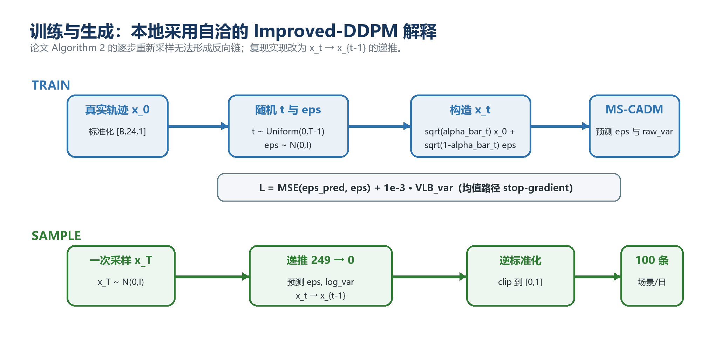
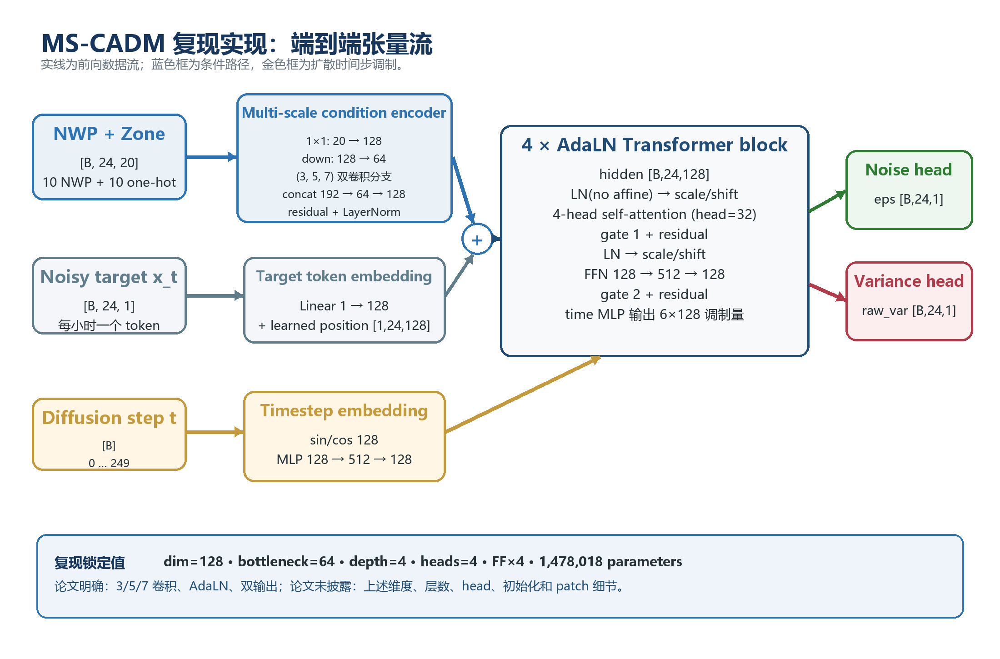
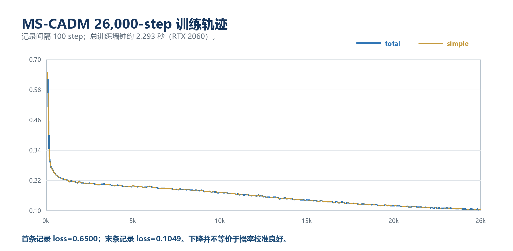
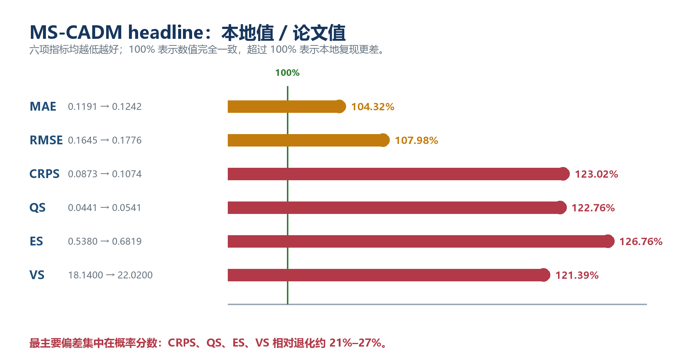

# MS-CADM 原论文复现：组会讲稿

> 建议时长：15–20 分钟  
> 适合听众：了解机器学习或电力系统，但不要求熟悉扩散模型  
> 复现对象：Zhang et al., *Wind power scenario generation via multi-scale condition adaptive diffusion model*, Electric Power Systems Research 255 (2026) 112753

## 使用方式

- 15 分钟版本：主讲第 1、2、3、4、7、8、9、10、11、12、14 页；第 5、6、13 页口头带过。
- 20 分钟版本：完整讲完 14 页，备份材料只用于回答问题。
- 制作幻灯片时，每个“第 N 页”可直接作为一页；“屏幕上放什么”是页面正文，“怎么讲”是演讲者备注。
- 如果听众偏电力系统，重点讲第 1、2、7、10、11、14 页；如果偏机器学习，重点补充第 3–6、8、12、13 页。

---

## 先记住这一句话

我们完整重建了论文的数据、训练、场景生成、评价和机组组合实验链路；方法可以运行，部分定性结论能够复现，但核心数值没有复现。最明显的问题是生成场景过于集中：论文方法的点预测尚可，但对不确定性的估计明显不足。

这句话也是整场汇报的主线：

> 这次复现不是简单回答“代码能不能跑”，而是回答“论文的实验结论在公开信息下能不能再次得到”。

---

# 第一部分：论文想解决什么问题

## 第 1 页：研究背景——为什么不能只预测一条曲线？

### 屏幕上放什么

日前风电预测通常要回答两个不同的问题：

- 点预测：明天每小时大约发多少电？
- 场景预测：明天可能出现哪些完整的 24 小时变化轨迹？各自有多大可能？

例如，两套模型的平均预测可能完全相同，但一套模型认为明天很稳定，另一套模型认为明天可能发生大幅爬坡。对机组启停和备用安排来说，这两种判断会产生完全不同的决策。

### 怎么讲

可以先用一句生活化的类比：

> 点预测像天气预报只说“明天平均 20°C”；场景预测还会告诉我们，明天可能一直稳定在 20°C，也可能早晨 10°C、下午 30°C。这两种情况的平均值一样，但准备方式完全不同。

这里的输出不是一个数，而是每个预测日的 100 条、每条 24 小时的风功率轨迹。

### 过渡句

> 所以论文的目标不是把一条曲线预测准，而是让一组曲线既围绕真实值，又具有合理的宽度和时间相关性。

---

## 第 2 页：论文任务——输入和输出分别是什么？

### 屏幕上放什么

```text
未来 24 小时数值天气预报（NWP）
    + 风电区域编号
               ↓
           MS-CADM
               ↓
每个区域、每个预测日生成 100 条 24 小时风功率场景
```

输入条件共有 20 维：

- 10 个逐小时气象特征：不同高度的风速分量、风速、风能代理和风向；
- 10 维区域 one-hot，用于区分十个风电区域。

每个训练样本对应“某个区域的某一天”：

- 条件形状：`24 × 20`；
- 目标形状：`24 × 1`；
- 测试输出：每个样本生成 `100 × 24`。

### 怎么讲

需要强调一个容易误解的地方：论文虽然使用十个区域，但正式模型把每个“区域—日期”当作独立样本，再用区域编号共享一个模型。它不是一次生成 `10 区域 × 24 小时` 的联合空间场景，因此实验主要验证时间相关性，不能据此证明模型学到了区域间联合相关性。

---

## 第 3 页：论文方法——扩散模型在这里做什么？

### 屏幕上放什么

扩散模型可以用两个方向理解：

```text
训练：真实风功率曲线 → 逐步加噪 → 接近随机噪声
生成：随机噪声 + 天气条件 → 逐步去噪 → 一条可能的风功率曲线
```

训练时，不需要真的执行完整加噪链。随机选择一个噪声等级 `t`，直接构造：

\[
x_t=\sqrt{\bar\alpha_t}x_0+\sqrt{1-\bar\alpha_t}\,\epsilon
\]

模型的主要任务是根据带噪曲线 `x_t`、天气条件 `c` 和噪声等级 `t`，预测加入的噪声 `ε`。



*图 1：训练阶段学习识别噪声，生成阶段从一次随机初始化开始连续去噪。*

### 怎么讲

不需要推导公式，只解释三个符号：

- `x₀` 是真实的 24 小时风功率曲线；
- `xₜ` 是被污染后的曲线；
- `ε` 是加入的随机噪声。

网络学会识别噪声后，生成阶段就能从一条随机噪声开始，反复去噪得到新场景。初始噪声不同，就会得到不同但符合相同天气条件的轨迹。

---

# 第二部分：MS-CADM 有什么特别之处

## 第 4 页：模型结构——四个核心设计

### 屏幕上放什么

```text
24 小时 NWP 条件 ─→ 多尺度条件编码 CE ─┐
                                          ├─→ 4 层 AdaLN Transformer ─→ 噪声 + 方差
带噪风功率曲线 ────→ 每小时一个 token ───┘
                             ↑
                       扩散时间步 t
```

论文包含四个主要机制：

| 模块 | 直观作用 |
|---|---|
| 多尺度条件嵌入 CE | 用 3/5/7 时间窗口提取短、中、较长尺度的天气变化 |
| AdaLN Transformer | 用扩散时间步调节每层网络，让模型知道“当前噪声有多大” |
| Learned Variance, LV | 除了预测去噪方向，也学习每一步应该保留多少随机性 |
| Random Condition Masking, RCM | 训练时随机遮掉部分条件，减少模型对单一条件特征的依赖 |



*图 2：本地重实现的实际张量流。蓝色为天气条件，金色为扩散时间步调制。*

### 怎么讲

把四项贡献压缩成一句话：

> CE 负责读懂天气，Transformer 负责理解全天联系，AdaLN 告诉网络当前去噪到了哪一步，LV 和 RCM 分别处理随机性与鲁棒性。

不建议在主讲阶段解释所有层数和通道数；这些放到备份页即可。

---

## 第 5 页：为什么要做多尺度条件编码？

### 屏幕上放什么

风电变化具有不同时间尺度：

- 很短的窗口可以感知局部阵风和快速爬坡；
- 中等窗口可以感知上午到下午的变化；
- 较长窗口可以感知一天中的整体趋势。

本地实现使用三个平行卷积分支：

```text
天气条件 ─┬─ kernel 3 ─┐
          ├─ kernel 5 ─┼─ 融合 ─→ 每小时 128 维条件表示
          └─ kernel 7 ─┘
```

### 怎么讲

这里不要说“大尺度卷积一定更好”，因为消融实验只能提供单次、方向性的支持。更准确的说法是：不同卷积窗口为模型提供不同大小的时间感受野，然后让网络自己融合。

---

## 第 6 页：AdaLN 为什么比直接拼接时间步更自然？

### 屏幕上放什么

模型同时面对两类条件：

- 天气条件回答：“今天可能是什么样的风功率？”
- 扩散时间步回答：“当前曲线被噪声破坏到了什么程度？”

MS-CADM 不把二者简单混在一起。天气条件进入序列表示；时间步则控制 Transformer 每一层的缩放、平移和残差门：

\[
h \leftarrow h + g_t\cdot F\big((1+s_t)\operatorname{LN}(h)+b_t\big)
\]

### 怎么讲

一句话解释公式即可：

> 时间步像一个旋钮：噪声很大时，网络采取更强的重建动作；接近最终曲线时，网络做更细的修正。

---

# 第三部分：我们怎样复现

## 第 7 页：数据和实验协议

### 屏幕上放什么

数据来自 GEFCom2014 Wind：

| 项目 | 数量 |
|---|---:|
| 风电区域 | 10 |
| 每个区域的完整日期 | 731 天 |
| 每天时间长度 | 24 小时 |
| 训练/验证/测试 | 631/50/50 天 |
| 每个测试样本的场景数 | 100 |

预处理步骤：

1. 合并官方训练和测试文件；
2. 按公开参考协议处理缺失目标；
3. 从风速分量派生风速、风能代理和风向；
4. 按天整理成 24 小时序列；
5. 标准化器只在训练集上拟合；
6. 生成后逆标准化并裁剪到 `[0,1]`。

### 怎么讲

这一页的重点不是预处理细节，而是“没有用测试集拟合标准化器”和“十个区域使用同一组日期划分”。这保证不同模型之间比较的样本完全一致。

---

## 第 8 页：什么是严格复现，什么是合理补全？

### 屏幕上放什么

论文明确给出的设置：

- Adam，学习率 `1e-4`；
- batch size 256；
- 训练 26,000 步；
- 每个样本生成 100 条场景；
- 多尺度编码、AdaLN、学习方差和条件遮蔽。

论文没有给出的关键设置：

- Transformer 宽度、深度和注意力头数；
- 卷积通道数、Patchify 方式和位置编码；
- 扩散噪声日程；
- 方差参数化与 VLB 损失权重；
- 条件遮蔽概率及遮蔽粒度；
- 10/20/50/100 步如何从 250 步模型中抽取；
- 单区域实验到底选择哪个区域；
- QRGBM、NF、DDPM 等基线的完整参数；
- 机组组合中的场景数、风场映射和若干求解设置。

### 怎么讲

这是汇报中非常关键的一页。建议明确使用以下措辞：

> 我们复现的是论文公开的方法思想和实验链路，不是作者未公开代码的逐行复制。所有无法由论文唯一确定的地方，都采用标准扩散模型实践并写入配置文件。

本地主要补全为：模型维度 128、4 层 Transformer、4 个注意力头、250 步 cosine diffusion、VLB 权重 `10⁻³`、条件遮蔽概率 0.1。



*图 3：训练损失稳定下降，但训练损失下降并不等价于概率区间已经校准。*

---

## 第 9 页：怎样判断数据和评分代码是否可信？

### 屏幕上放什么

我们用可以对齐的基线反向检查整个评价链路：

| 模型 | 来源 | MAE | CRPS | ES |
|---|---|---:|---:|---:|
| RAND | 论文 | 0.2583 | 0.1692 | 0.9615 |
| RAND | 本地 | 0.2587 | 0.1687 | 0.9593 |
| VAE | 论文 | 0.1244 | 0.0880 | 0.5482 |
| VAE-reference | 本地 | 0.1236 | 0.0877 | 0.5456 |

### 怎么讲

RAND 和参考行为 VAE 几乎逐项对齐论文，这说明以下环节大概率没有整体性错误：

- 日期划分；
- 数据逆标准化；
- 场景数量和张量维度；
- MAE、CRPS、ES 等指标公式。

需要补一句科学边界：论文的 RAND 会从正在评价的数据中重采样，存在信息泄漏，因此它只能作为“评价口径校验器”，不能作为无泄漏的实际预测基线。

### 过渡句

> 既然简单基线能对齐，而 MS-CADM 对不齐，问题就更可能来自模型和采样的未公开细节，而不是整条数据管线都写错了。

---

# 第四部分：复现结果

## 第 10 页：核心结果——数值没有复现

### 屏幕上放什么

六项指标都是越低越好：

| 指标 | 论文 MS-CADM | 本地 MS-CADM | 相对退化 |
|---|---:|---:|---:|
| MAE | 0.1191 | 0.1242 | 4.3% |
| RMSE | 0.1645 | 0.1776 | 8.0% |
| CRPS | 0.0873 | 0.1074 | 23.0% |
| QS | 0.0441 | 0.0541 | 22.8% |
| ES | 0.5380 | 0.6820 | 26.8% |
| VS | 18.14 | 22.02 | 21.4% |



*图 4：绿色竖线代表完全对齐；概率分数的偏差显著大于点预测误差。*

最重要的观察：

- MAE、RMSE 只退化约 4%–8%；
- 描述概率分布质量的 CRPS、ES、VS 退化约 21%–27%。

### 怎么讲

这意味着模型生成的平均轨迹不算太差，但“这一组场景是否正确表达不确定性”存在明显问题。

不要只说“复现失败”。更准确的表述是：

> 方法实现与实验链路复现成功，但论文 headline 数值和领先排名没有复现。

---

## 第 11 页：主要问题——场景太窄，严重欠覆盖

### 屏幕上放什么

名义 90% 预测区间，理论上应覆盖约 90% 的真实观测：

| 模型 | 实际覆盖率 | 90% 区间平均宽度 |
|---|---:|---:|
| DDPM | 86.67% | 0.488 |
| VAE-reference | 81.98% | 0.409 |
| NF | 77.91% | 0.352 |
| MS-CADM | **35.95%** | **0.120** |


*图 5–6：上图直观看单个预测日，下图检查全部测试样本和多个名义覆盖水平。两者都显示 MS-CADM 系统性欠覆盖。*

### 怎么讲

预测区间越窄并不一定越好。只有在保持正确覆盖率的前提下，窄区间才代表模型更精确。

MS-CADM 的区间很窄，但只有约 36% 的真实点落在名义 90% 区间内。可以把它理解为：模型对自己的平均判断过于自信，生成的 100 条场景彼此太相似。

这一现象也解释了为什么 MAE 尚可，而 CRPS、ES 和 VS 明显变差。

---

## 第 12 页：哪些定性结论仍然复现了？

### 屏幕上放什么

### 1. 采样步数存在边际收益递减

| 去噪步数 | 相对时间 | CRPS |
|---:|---:|---:|
| 10 | 0.21× | 0.1116 |
| 20 | 0.40× | 0.1105 |
| 50 | 1.00× | 0.1092 |
| 100 | 2.00× | 0.1085 |
| 250 | 4.95× | 0.1080 |

从 50 增加到 250 步，时间约变为 5 倍，但 CRPS 只改善约 1.1%。因此“50 步是速度和质量的合理折中”这一趋势得到了复现。

### 2. CE、AdaLN 和 RCM 有方向性贡献

| 变体 | CRPS | 相对完整模型 |
|---|---:|---:|
| 完整模型 | 0.1143 | — |
| 去掉 CE | 0.1190 | +4.2% |
| 去掉 AdaLN | 0.1192 | +4.3% |
| 去掉 RCM | 0.1194 | +4.5% |
| 去掉 LV | 0.1142 | −0.1% |

### 怎么讲

这里需要保持克制：消融只运行了单个随机种子，没有误差条，因此只能说“方向上支持”，不能说已经证明稳定有效。

学习方差 LV 的贡献没有复现；而且这组消融采用 DDIM 采样，方差头并不直接参与 DDIM 更新，所以也不能把它当作对 LV 机制最充分的检验。

---

# 第五部分：怎样解释和评价这次复现

## 第 13 页：为什么没有完全复现？

### 屏幕上放什么

目前最合理的原因不是单一 bug，而是多项不可识别细节叠加：

1. 网络容量没有公开：层数、宽度、注意力头数都可能影响表达能力；
2. 噪声日程没有公开：linear/cosine 会改变不同噪声区间的学习难度；
3. 条件遮蔽定义不清：整样本遮蔽和逐特征遮蔽效果不同；
4. 学习方差实现不清：方差范围和损失权重会影响场景离散度；
5. 缩步采样规则没有公开：不同 DDIM/随机采样设置会改变分布；
6. 基线实现和训练轮次没有完整披露，模型排名容易改变。

论文中还存在若干内部不一致：

- 反向采样伪代码按字面会在每一步重新采样噪声，导致去噪链断裂；
- alpha 符号在不同公式中含义不一致；
- Table 1 的 MS-CADM 数值等于 Table 3 的 250 步结果，但正文推荐 50 步；
- 机组组合部分同时出现“随机 7 天”和“100 天平均”；
- 单区域实验没有说明区域编号。

### 怎么讲

建议用“不可识别”而不是“论文写错了”：公开信息不能唯一确定一套实现，所以多个看似合理的重实现都可能产生不同结果。

---

## 第 14 页：最终结论

### 屏幕上放什么

### 复现成功的部分

- 数据处理、训练、生成、评分、消融和下游决策链路均可运行；
- RAND 和参考 VAE 与论文接近，评价管线可信；
- 多尺度 CE、AdaLN、RCM 的作用获得部分方向性支持；
- 50 步以后收益递减的趋势得到复现；
- 所有正式配置、检查点、场景和结果表均已归档。

### 没有复现的部分

- MS-CADM 的绝对指标和相对领先排名；
- 论文所暗示的可靠概率区间；
- 学习方差带来的明显收益；
- 论文 Table 5 的机组组合数值及最优结论；
- 十区域联合空间相关性——原模型输出定义本身没有覆盖这一点。

### 最终评价

> 这套 MS-CADM 重实现已经可以作为“可运行、可审计、可比较”的研究基线，但不能称为原论文数值的精确复现。复现揭示的关键问题是：在一套明确且合理的工程解释下，模型表现出严重欠离散，而论文缺失的训练和采样细节足以改变最终结论。

### 收尾讲法

> 对我们后续研究最有价值的，不是证明这篇论文一定对或一定错，而是获得了一条透明的基线：后续任何改进，都可以明确回答它改善的是点预测、概率校准、联合结构，还是最终调度决策。

---

# 备份材料

## 备份 1：六个指标分别在看什么？

| 指标 | 易懂解释 | 更关注什么 |
|---|---|---|
| MAE | 场景平均值与真实值平均差多少 | 点预测中心 |
| RMSE | 与 MAE 类似，但更惩罚大误差 | 极端点误差 |
| CRPS | 生成分布离真实值有多远 | 单小时概率分布 |
| QS | 不同分位数预测是否准确 | 分位数与区间 |
| ES | 把整条 24 小时曲线作为向量评分 | 全天联合轨迹 |
| VS | 不同时刻之间的差分结构是否合理 | 时间依赖和爬坡结构 |

所有六项指标都是越低越好。MAE/RMSE 好，不代表 CRPS/ES/VS 一定好；模型可能平均值正确，但场景太窄或时间结构错误。

---

## 备份 2：论文结果与本地完整 Table 1

| 模型 | 来源 | MAE | RMSE | CRPS | QS | ES | VS |
|---|---|---:|---:|---:|---:|---:|---:|
| RAND | 论文 | 0.2583 | 0.3012 | 0.1692 | 0.0855 | 0.9615 | 23.21 |
| RAND | 本地 | 0.2587 | 0.3008 | 0.1687 | 0.0852 | 0.9593 | 23.17 |
| QRGBM | 论文 | 0.1314 | 0.1759 | 0.1036 | 0.0524 | 0.6255 | 20.09 |
| QRGBM+ECC | 本地 | 0.1227 | 0.1655 | 0.0857 | 0.0433 | 0.5370 | 17.12 |
| WGAN | 论文 | 0.1331 | 0.1789 | 0.0979 | 0.0495 | 0.6052 | 19.87 |
| WGAN-reference | 本地 | 0.1293 | 0.1771 | 0.0966 | 0.0489 | 0.5930 | 18.60 |
| VAE | 论文 | 0.1244 | 0.1677 | 0.0880 | 0.0445 | 0.5482 | 17.87 |
| VAE-reference | 本地 | 0.1236 | 0.1670 | 0.0877 | 0.0443 | 0.5456 | 17.72 |
| NF | 论文 | 0.1267 | 0.1753 | 0.0907 | 0.0458 | 0.5671 | 18.54 |
| Conditional RealNVP | 本地 | 0.1171 | 0.1641 | 0.0851 | 0.0430 | 0.5322 | 16.95 |
| DDPM | 论文 | 0.1281 | 0.1815 | 0.0981 | 0.0486 | 0.5985 | 19.61 |
| WaveNet DDPM | 本地 | 0.1201 | 0.1607 | 0.0805 | 0.0406 | 0.5065 | 15.87 |
| MS-CADM | 论文 | 0.1191 | 0.1645 | 0.0873 | 0.0441 | 0.5380 | 18.14 |
| MS-CADM | 本地 | 0.1242 | 0.1776 | 0.1074 | 0.0541 | 0.6820 | 22.02 |

注意：本地 QRGBM、NF 和 DDPM 是明确声明的合理强化重构，不是作者未公开基线代码的复制。因此它们超过论文结果说明“模型排名对基线实现敏感”，不能直接解释为原论文计算错误。

---

## 备份 3：本地模型的具体配置

| 项目 | 本地值 |
|---|---:|
| 条件维度 | 20 |
| 序列长度 | 24 |
| 模型宽度 | 128 |
| 多尺度瓶颈宽度 | 64 |
| Transformer 层数 | 4 |
| 注意力头数 | 4 |
| 参数量 | 1,478,018 |
| 扩散步数 | 250 |
| 噪声日程 | cosine |
| VLB 权重 | 0.001 |
| 条件遮蔽概率 | 0.1 |
| 训练步数 | 26,000 |
| batch size | 256 |
| 学习率 | 0.0001 |

---

## 备份 4：RTS-24 机组组合为什么不能直接对表？

论文披露了 IEEE RTS-24、12 台机组、3375 MW 火电、6 个风场共 1200 MW，以及失负荷和弃风罚金，但没有充分披露：

- K-Means 最终保留多少个代表场景；
- GEFCom 十个区域如何映射到六个风场；
- 选取了哪些测试日；
- 备用约束、网络版本、求解器和最优性设置；
- 到底统计 7 天还是 100 天。

因此本地只能让所有模型使用同一个公开重构协议做公平比较，不能宣称数值复现论文 Table 5。在本地七日实验中，MS-CADM 总成本排第 5，与论文最优结论不一致；但由于协议无法对齐，不应把该差异完全归因于场景模型。

---

## 备份 5：常见提问与回答

### Q1：为什么 RAND 和 VAE 对上了，还不能断言 MS-CADM 论文结果有问题？

RAND 和 VAE 对齐可以较强地验证数据与评分口径，但不能确定作者的 MS-CADM 私有实现。网络宽度、噪声日程、掩码方式、方差损失和采样参数都可能显著影响场景离散度。因此正确结论是“公开信息不足以重现其数值”，而不是“已经证明论文结果错误”。

### Q2：为什么 MAE 不差，覆盖率却只有 36%？

MAE主要看 100 条场景的平均值。即使 100 条曲线几乎重合，只要它们的平均曲线接近真实值，MAE仍可能不错；但区间会非常窄，真实值稍有波动就落在区间外。因此点预测准确和概率校准准确是两件事。

### Q3：为什么不继续调参，直到对上论文？

如果查看测试结果后不断调参直到数值接近，会把测试集变成调参集，而且无法证明找回的是作者实现。复现应优先保持协议透明和假设可审计，而不是以“对表”为唯一目标。

### Q4：本地 DDPM 为什么比论文 MS-CADM 还好？

本地 DDPM 是基于公开能源任务结构构建的强化重构，论文没有公开其 DDPM 基线结构与完整调参过程。这个结果说明基线强弱会改变排名，不代表所有 DDPM 都天然优于 MS-CADM。

### Q5：复现结果还有统计不确定性吗？

有。headline 和消融主要是单个训练种子，论文也没有报告重复运行或误差条。因此四位小数的模型排名不应被解释为稳定显著差异。现有结果足以识别 36% 对 90% 这类大幅校准问题，但不足以对很小的指标差异作强因果判断。

### Q6：这次复现最大的收获是什么？

一是得到了一套从数据到决策完整且可审计的基线；二是发现概率分布质量不能由 MAE 或少数示例图替代；三是确认模型排名对未公开的训练、采样和基线细节非常敏感。

---

## 备份 6：材料和代码位置

- 正式配置：`repro_configs/paper.json`
- 正式实现：`repro/`
- 训练与评价入口：`repro_scripts/`
- 完整专题报告：`reports/MSCADM_PAPER_REPRODUCTION_REPORT.md`
- 正式结果：`outputs/full_reproduction/`
- 原始论文：`1-s2.0-S0378779626000465-main.pdf`
- 完成审计：`outputs/full_reproduction/completion_audit.json`

推荐的论文写作措辞：

> 我们根据论文公开的多尺度条件编码、AdaLN 时间步调制、噪声/方差双头和条件遮蔽机制，并结合标准 Improved-DDPM/DiT 实践，构建了可执行的 MS-CADM 重实现。数据和评分口径通过 RAND 与参考行为 VAE 交叉验证；该重实现未达到原文报告数值，并表现出显著欠覆盖，因此本文将其作为透明、受控的研究基线，而不将其表述为作者实现的精确复制。
